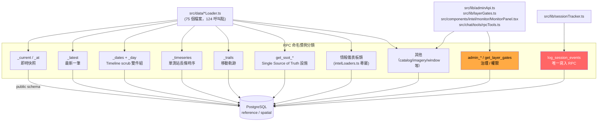

# API Surface — Mini Taiwan Pulse

> 產出時間：2026-07-12 · 基於 `.trace/_context/recon.md`、`entry_points.md`、`integrations.md`
> 本專案為純前端 SPA（無自建 REST/GraphQL server），「API surface」實指：前端呼叫的 Supabase RPC 清單、繞過 supabase-js 的直連 fetch、BYOK LLM 介面、npm scripts、Auth/Authorization 機制、錯誤處理慣例。
>
> 續篇：[`API_SURFACE_part2.md`](./API_SURFACE_part2.md)（npm scripts / Auth & Authorization / Error handling 詳表）

---

## 0. 統計摘要

- `grep -rn "supabase\.rpc(" src/data | wc -l` → **124** 處呼叫（`src/data/*Loader.ts` 內）
- `src/data/` 外另有 **7** 處 `supabase.rpc(...)` 呼叫（`MonitorPanel.tsx`、`chat/tools/rpcTools.ts`、`lib/layerGates.ts`、`lib/adminApi.ts` ×4）
- 去除重複命名（同一 RPC 名稱在多處呼叫，如 `get_news_events_day_clustered_v2` 出現 2 次、`get_ssot_realtime_facility_output`/`get_ssot_facility_output_24h` 等）後，**src/data/ 內相異 RPC 名稱數：約 113 個**
- 加計 admin/監控/gate 類 RPC（`get_layer_gates`、`admin_*` ×4、`get_prison_population_window`）與 chat RPC 白名單（`src/chat/tools/rpcTools.ts` 內獨有的 `get_waste_facility_counts`、`get_waste_disposal_point_counts`）後，**全 repo 相異 RPC 名稱總數：約 121 個**（`get_x` 為 `staticRpc.ts` 內部型別佔位符範例，非真實 RPC，計數已排除）
- 繞過 supabase-js 的直連 PostgREST fetch：**2 處**（`satelliteLoader.ts`、`sessionTracker.ts`）

---

## 1. Supabase RPC 清單

### 1.1 分類總覽圖

### 1.2 命名慣例小結

| 後綴模式 | 語意 | 典型呼叫方式 |
|---|---|---|
| `_current` | 當下即時快照（LIVE 圖層，例如公車/停車位） | 無日期參數或極少參數 |
| `_at` | 指定時間點查詢 | 帶 timestamp 參數 |
| `_latest` | 最新一筆（通常對應尚未接入 timeline 的簡單層） | 通常無參數 |
| `_dates` + `_day` | Timeline scrub 雙件組：`_dates` 先列有資料的日期供 UI 畫密度條，`_day` 拉單日資料 | `_dates()` → `_day({ target_date })` |
| `_timeseries` | 單一測站 / 物件的長條時序（折線圖用） | 帶 station_id + 起訖日 |
| `_trails` | 移動軌跡（公車/船舶/飛機拖尾） | 帶時間窗參數 |
| `get_ssot_*` | Single Source of Truth 電廠/設施資料（多來源整併） | `energyLoader.ts` 專屬前綴 |
| `admin_*` | 後台治理（僅 owner tier 可呼叫，DB 端 RLS 擋非授權） | `adminApi.ts` 專屬 |
| `get_x`（非真實 RPC） | `staticRpc.ts:9` 型別簽名範例，非實際呼叫的 RPC 名稱 | — |

一律 `get_` 前綴 = 唯讀（符合 CLAUDE.md「前端禁止直打 `realtime.*`，一律經 `public` RPC wrapper」原則）。全 repo **唯一非 `get_`／`admin_` 開頭、真正執行寫入的 RPC** 是 `log_session_events`（`src/lib/sessionTracker.ts:68` 呼叫、`src/lib/supabase.ts:57` 的 `WRITE_RPC_DENYLIST` 特別排除 retry，避免重送造成重複寫入）。

### 1.3 RPC 總表（依 `src/data/` 呼叫點，124 處，按檔案分組）

> 欄位「參數」僅列呼叫時實際傳入的 object key（⚠️ 未逐一核對 DB 端完整簽名，僅依呼叫端程式碼推斷），「用途推測」依 RPC 名稱 + loader 檔名 + 呼叫情境判斷。

#### a1AccidentRealtimeLoader.ts / alertsLoader.ts

| RPC | 呼叫檔案:行 | 參數（推測） | 用途推測 |
|---|---|---|---|
| `get_a1_accidents_by_bbox` | `a1AccidentRealtimeLoader.ts:28` | bbox 座標 | A1 類重大交通事故即時查詢（依地圖可視範圍） |
| `get_active_alerts` | `alertsLoader.ts:151` | 無/篩選條件 | 目前生效中的告警清單 |
| `get_alert_series_24h` | `alertsLoader.ts:203` | 無 | 過去 24h 告警數量時序（折線圖） |
| `get_alert_summary` | `alertsLoader.ts:112` | 無 | 告警總覽統計（儀表板卡片） |

#### airportPaxLoader.ts / airspaceLoader.ts

| RPC | 呼叫檔案:行 | 用途推測 |
|---|---|---|
| `get_airport_hourly_pax` | `airportPaxLoader.ts:15` | 機場逐時旅客量 |
| `get_flight_dates` | `airspaceLoader.ts:63` | 空域歷史資料可查日期清單 |
| `get_flight_trails` | `airspaceLoader.ts:79` | 飛機軌跡拖尾 |

#### aqiImageryLoader.ts / aqiStationsLoader.ts

| RPC | 呼叫檔案:行 | 用途推測 |
|---|---|---|
| `get_aqi_imagery_frames_batch` | `aqiImageryLoader.ts:59` | AQI 影像圖層批次幀資料 |
| `get_aqi_stations_at` | `aqiStationsLoader.ts:63` | 指定時間點 AQI 測站資料 |
| `get_aqi_stations_latest` | `aqiStationsLoader.ts:73` | 最新 AQI 測站快照 |

#### busLoader.ts（公車，見 `docs/bus-layer-design.md`）

| RPC | 呼叫檔案:行 | 用途推測 |
|---|---|---|
| `get_bus_current` | `busLoader.ts:73` | 公車即時位置（LIVE） |
| `get_bus_dates` | `busLoader.ts:117` | 公車歷史可查日期 |
| `get_bus_trails` | `busLoader.ts:133` | 公車拖尾軌跡（progress-based） |
| `get_bus_intercity_current` | `busLoader.ts:225` | 公路客運（城際）即時位置 |
| `get_bus_intercity_dates` | `busLoader.ts:256` | 城際客運歷史可查日期 |
| `get_bus_intercity_trails` | `busLoader.ts:277` | 城際客運拖尾軌跡 |

#### cwaImageryLoader.ts（CWA 衛星/雷達影像，見 integrations.md §3.2）

| RPC | 呼叫檔案:行 | 用途推測 |
|---|---|---|
| `get_cwa_imagery_list` | `cwaImageryLoader.ts:170` | 取得可用影像 frame 清單（manifest） |
| `get_cwa_imagery_frame` | `cwaImageryLoader.ts:214`, `:90` | 取單一 frame metadata（含 R2 CDN URL） |

#### dataCatalogLoader.ts

| RPC | 呼叫檔案:行 | 用途推測 |
|---|---|---|
| `get_data_catalog_for_layer` | `dataCatalogLoader.ts:88` | 單一 layer 的資料來源說明（供 UI 顯示資料出處） |
| `get_data_catalog_by_theme` | `dataCatalogLoader.ts:119` | 依主題分類的資料目錄 |

#### disasterAlertLoader.ts / erHospitalLoader.ts

| RPC | 呼叫檔案:行 | 用途推測 |
|---|---|---|
| `get_disaster_alert_dates` | `disasterAlertLoader.ts:73` | 災害告警歷史可查日期 |
| `get_disaster_alerts_day` | `disasterAlertLoader.ts:91` | 單日災害告警資料 |
| `get_er_hospital_latest` | `erHospitalLoader.ts:83` | 急診 59 院即時量能快照 |
| `get_er_hospital_24h` | `erHospitalLoader.ts:122` | 急診量能 24h 時序 |

#### fireLoader.ts / fossilFuelLoader.ts / freewayLoader.ts

| RPC | 呼叫檔案:行 | 用途推測 |
|---|---|---|
| `get_fire_events_by_year` | `fireLoader.ts:44` | 按年份查火災事件 |
| `get_fire_event_years` | `fireLoader.ts:77` | 有資料的年份清單 |
| `get_fossil_fuel_infrastructure` | `energyLoader.ts:743` | 化石燃料基礎設施點位 |
| `get_fossil_fuel_layers` | `fossilFuelLoader.ts:204` | 化石燃料圖層批次資料 |
| `get_freeway_dates` | `freewayLoader.ts:43` | 國道壅塞歷史可查日期 |
| `get_freeway_congestion_day` | `freewayLoader.ts:88` | 單日國道壅塞資料 |

#### groundwaterLoader.ts / h3Loader.ts

| RPC | 呼叫檔案:行 | 用途推測 |
|---|---|---|
| `get_groundwater_day` | `groundwaterLoader.ts:34` | 單日地下水位資料 |
| `get_groundwater_latest` | `groundwaterLoader.ts:66` | 最新地下水位快照 |
| `get_groundwater_timeseries` | `groundwaterLoader.ts:89` | 單測站地下水位時序 |
| `get_h3_demographics_yearly` | `h3Loader.ts:256` | H3 六角格人口統計（單年） |
| `get_h3_demographics_years` | `h3Loader.ts:280` | 有資料的年份清單 |

#### iotWraRiverLoader.ts / iotWraStructureLoader.ts / precipRasterLoader.ts

| RPC | 呼叫檔案:行 | 用途推測 |
|---|---|---|
| `get_iot_wra_day` | `iotWraRiverLoader.ts:39` | 水利署 IoT 河川感測單日資料 |
| `get_iot_wra_latest` | `iotWraStructureLoader.ts:57` | 水利署 IoT 構造物感測最新快照 |
| `get_latest_precipitation_raster` | `precipRasterLoader.ts:60` | 最新降雨網格 raster |
| `get_precipitation_raster_frames` | `precipRasterLoader.ts:82` | 降雨網格 raster 幀序列（動畫用） |

#### lightningLoader.ts / livestockLoader.ts

| RPC | 呼叫檔案:行 | 用途推測 |
|---|---|---|
| `get_lightning_recent` | `lightningLoader.ts:28` | 近期閃電事件 |
| `get_lightning_window` | `lightningLoader.ts:55` | 指定時間窗閃電事件 |
| `get_lightning_day` | `lightningLoader.ts:84` | 單日閃電事件 |
| `get_livestock_farms` | `livestockLoader.ts:23` | 畜牧場點位 |
| `get_livestock_slaughterhouses` | `livestockLoader.ts:33` | 屠宰場點位 |

#### intelLoaders.ts（情報儀表板，見 `docs/intel-panel-status.md`）

| RPC | 呼叫檔案:行 | 用途推測 |
|---|---|---|
| `get_source_health` | `intelLoaders.ts:51` | 資料源健康狀態（uptime/延遲儀表板） |
| `get_news_trending` | `intelLoaders.ts:79` | 熱門新聞事件 |
| `get_pressure_index_now` | `intelLoaders.ts:139` | 即時「壓力指數」綜合指標 |
| `get_signals_timeline` | `intelLoaders.ts:175` | 情報訊號時間軸 |
| `get_market_index_now` | `intelLoaders.ts:220` | 即時市場指數 |
| `get_pla_activity_latest` | `intelLoaders.ts:283` | 解放軍動態最新快照（軍事情報類） |
| `get_public_health_weekly` | `intelLoaders.ts:377` | 公衛週報資料 |
| `get_yt_live_videos` | `intelLoaders.ts:359` | YouTube 直播清單（新聞現場） |

#### microSensorsLoader.ts / newsEventsLoader.ts

| RPC | 呼叫檔案:行 | 用途推測 |
|---|---|---|
| `get_micro_sensors_latest` | `microSensorsLoader.ts:49` | 微型感測器（空品micro sensor）最新快照 |
| `get_news_event_dates` | `newsEventsLoader.ts:145` | 新聞事件歷史可查日期 |
| `get_news_events_day_clustered_v2` | `newsEventsLoader.ts:174`, `:215` | 單日新聞事件（已做地理聚類，v2 版本） |

#### nuclearLoader.ts / energyLoader.ts（能源，含 SSOT 系列）

| RPC | 呼叫檔案:行 | 用途推測 |
|---|---|---|
| `get_nuclear_radiation_status` | `nuclearLoader.ts:28` | 核能輻射即時狀態 |
| `get_nuclear_radiation_at` | `nuclearLoader.ts:44` | 指定時間點輻射值 |
| `get_nuclear_radiation_day` | `nuclearLoader.ts:85` | 單日輻射時序 |
| `get_power_dashboard` | `energyLoader.ts:52` | 電力儀表板總覽統計 |
| `get_ssot_facility_output_24h` | `energyLoader.ts:126` | SSOT 設施 24h 發電量 |
| `get_ssot_power_plants_with_output` | `energyLoader.ts:94` | SSOT 電廠 + 即時出力整併資料 |
| `get_ssot_facilities_primary_operating` | `energyLoader.ts:235` | SSOT 主要營運中設施 |
| `get_ssot_realtime_facility_output` | `energyLoader.ts:237` | SSOT 設施即時出力 |
| `get_ssot_facilities_offshore_zones` | `energyLoader.ts:253` | SSOT 離岸風場區塊 |
| `get_ssot_facilities_planned` | `energyLoader.ts:264` | SSOT 規劃中設施 |
| `get_ssot_facilities_historical` | `energyLoader.ts:275` | SSOT 歷史（已除役）設施 |
| `get_ssot_facilities_secondary_small` | `energyLoader.ts:286` | SSOT 次要/小型設施 |
| `get_ssot_facilities_osm_supplement` | `energyLoader.ts:297` | SSOT 資料不足時 OSM 補充來源 |
| `get_power_plant_output_24h` | `energyLoader.ts:376` | 電廠 24h 出力時序 |
| `get_ssot_facility_provenance` | `energyLoader.ts:358` | SSOT 設施資料來源溯源（多來源整併證據鏈） |
| `get_osm_substations` | `energyLoader.ts:464` | OSM 變電所點位 |
| `get_osm_power_lines` | `energyLoader.ts:502` | OSM 電力線路 |
| `get_osm_power_towers` | `energyLoader.ts:515` | OSM 電塔點位 |
| `get_osm_power_plants_static` | `energyLoader.ts:632` | OSM 電廠靜態點位 |

#### parkingLoader.ts

| RPC | 呼叫檔案:行 | 用途推測 |
|---|---|---|
| `get_parking_segments_current` | `parkingLoader.ts:136` | 路邊停車格即時佔用 |
| `get_parking_lots_current` | `parkingLoader.ts:184` | 路外停車場即時剩餘車位 |
| `get_parking_segments_day` | `parkingLoader.ts:282` | 路邊停車格單日歷史 |
| `get_parking_lots_day` | `parkingLoader.ts:335` | 路外停車場單日歷史 |
| `get_parking_dates` | `parkingLoader.ts:371` | 停車資料歷史可查日期 |

#### rainGaugeLoader.ts / reservoir*.ts / riverLevelLoader.ts

| RPC | 呼叫檔案:行 | 用途推測 |
|---|---|---|
| `get_rain_gauge_day` | `rainGaugeLoader.ts:42` | 單日雨量站資料 |
| `get_rain_gauge_timeseries` | `rainGaugeLoader.ts:67` | 單測站雨量時序 |
| `get_reservoir_context` | `reservoirContextLoader.ts:99` | 水庫上下游關聯脈絡資料 |
| `get_reservoir_watershed_rivers` | `reservoirContextLoader.ts:143` | 水庫集水區河川資料 |
| `get_reservoir_status_day` | `reservoirStatusLoader.ts:57` | 單日水庫狀態（蓄水率等） |
| `get_reservoir_timeseries` | `reservoirOpsLoader.ts:65` | 水庫營運時序 |
| `get_river_water_level_day` | `riverLevelLoader.ts:36` | 單日河川水位 |
| `get_river_water_level_timeseries` | `riverLevelLoader.ts:60` | 單測站河川水位時序 |

#### roadCongestionLoader.ts / roadEventsLoader.ts

| RPC | 呼叫檔案:行 | 用途推測 |
|---|---|---|
| `get_road_congestion_dates` | `roadCongestionLoader.ts:83` | 一般道路壅塞歷史可查日期 |
| `get_road_congestion_day` | `roadCongestionLoader.ts:100` | 單日道路壅塞資料 |
| `get_road_events_dates` | `roadEventsLoader.ts:71` | 道路事件（施工/事故）歷史可查日期 |
| `get_road_events_day` | `roadEventsLoader.ts:89` | 單日道路事件資料 |

#### satellite*.ts

| RPC | 呼叫檔案:行 | 用途推測 |
|---|---|---|
| `get_satellite_catalog` | `satelliteCatalogLoader.ts:69` | 衛星型錄清單 |
| `get_satellite_maneuvers_recent` | `satelliteManeuversLoader.ts:46` | 近期衛星軌道機動事件 |
| `get_satellite_tle_history` | `satelliteHistoryLoader.ts:49` | 衛星 TLE 歷史軌跡 |
| `get_satellite_tle_pair` | `satelliteHistoryLoader.ts:64` | 指定時間點 TLE pair（軌道推算輸入） |

#### shipLoader.ts / touristShuttleLoader.ts

| RPC | 呼叫檔案:行 | 用途推測 |
|---|---|---|
| `get_ship_dates` | `shipLoader.ts:69` | 船舶歷史可查日期 |
| `get_ship_trails` | `shipLoader.ts:85` | 船舶拖尾軌跡 |
| `get_tourist_shuttle_current` | `touristShuttleLoader.ts:77` | 觀光接駁車即時位置 |
| `get_tourist_shuttle_dates` | `touristShuttleLoader.ts:109` | 觀光接駁車歷史可查日期 |
| `get_tourist_shuttle_trails` | `touristShuttleLoader.ts:130` | 觀光接駁車拖尾軌跡 |

#### temperatureLoader.ts / floodSensorLoader.ts（UWSG 淹水感測）

| RPC | 呼叫檔案:行 | 用途推測 |
|---|---|---|
| `get_temperature_dates` | `temperatureLoader.ts:50` | 溫度網格歷史可查日期 |
| `get_temperature_grid_info` | `temperatureLoader.ts:69` | 溫度網格 metadata（解析度/範圍） |
| `get_temperature_frames` | `temperatureLoader.ts:70` | 溫度網格幀序列 |
| `get_uswg_latest` | `floodSensorLoader.ts:41` | 淹水感測最新快照 |
| `get_uswg_day` | `floodSensorLoader.ts:84` | 單日淹水感測資料 |
| `get_uswg_timeseries` | `floodSensorLoader.ts:112` | 單測站淹水感測時序 |

#### wicTaipeiLoader.ts（台北下水道/抽水站）

| RPC | 呼叫檔案:行 | 用途推測 |
|---|---|---|
| `get_taipei_sewer_latest` | `wicTaipeiLoader.ts:35` | 台北下水道最新快照 |
| `get_taipei_sewer_timeseries` | `wicTaipeiLoader.ts:122` | 下水道時序 |
| `get_taipei_evacuate_latest` | `wicTaipeiLoader.ts:68` | 疏散資訊最新快照 |
| `get_taipei_evacuate_timeseries` | `wicTaipeiLoader.ts:152` | 疏散資訊時序 |
| `get_taipei_pumb_latest` | `wicTaipeiLoader.ts:100` | 抽水站最新快照 |
| `get_taipei_pumb_timeseries` | `wicTaipeiLoader.ts:138` | 抽水站時序 |

#### wasteLoader.ts / wasteScheduleLoader.ts

| RPC | 呼叫檔案:行 | 用途推測 |
|---|---|---|
| `get_waste_current` | `wasteLoader.ts:129` | 垃圾車即時位置 |
| `get_waste_stops` | `wasteLoader.ts:157` | 垃圾車停靠站點 |
| `get_waste_trails` | `wasteLoader.ts:353` | 垃圾車拖尾軌跡 |
| `get_waste_trails_day` | `wasteLoader.ts:373` | 單日垃圾車拖尾 |
| `get_waste_trails_matched_day` | `wasteLoader.ts:393` | 單日已比對路網的垃圾車拖尾（map-matched） |
| `get_waste_schedule_day` | `wasteScheduleLoader.ts:88` | 單日垃圾車排程表 |

#### youbikeH3Loader.ts

| RPC | 呼叫檔案:行 | 用途推測 |
|---|---|---|
| `get_youbike_h3_dates` | `youbikeH3Loader.ts:41` | YouBike H3 密度快照歷史可查日期 |
| `get_youbike_h3_snapshots` | `youbikeH3Loader.ts:55` | 單日 YouBike H3 密度快照 |

#### staticRpc.ts（型別佔位，非真實 RPC）

`staticRpc.ts:9` 的 `get_x` 是函式簽名範例中的型別佔位符（`staticRpc<T>(name: string)` 的 doc-comment 範例），非實際存在的 RPC；`staticRpc.ts:32` 的 `supabase.rpc(name)` 是**泛型 fallback 呼叫**，`name` 由呼叫端傳入真實 RPC 名稱（見 §1.4）。

### 1.4 `src/data/` 外的 RPC 呼叫（7 處）

| RPC | 呼叫檔案:行 | 用途 |
|---|---|---|
| `get_prison_population_window` | `src/components/intel/monitor/MonitorPanel.tsx:183` | 監獄人口密度時間窗查詢（情報監控面板專用，未走 loader 層） |
| `<白名單內 name>` | `src/chat/tools/rpcTools.ts:113` | BYOK chat agent 的 tool-calling RPC 執行器 `callWhitelistedRpc(name, params)`；`RPC_WHITELIST`（`rpcTools.ts:17-93`）明確列出 9 支可被 LLM 呼叫的薄唯讀 RPC（含 `get_data_catalog_by_theme`/`get_data_catalog_for_layer`/`get_fire_event_years`/`get_fire_events_by_year`/`get_h3_demographics_yearly`/`get_h3_demographics_years`/`get_source_health`/`get_news_trending`，另加 2 支未見於 `src/data/` 的獨立 RPC：`get_waste_facility_counts`、`get_waste_disposal_point_counts`），每支各帶 zod 參數 schema + 給 LLM 看的 description；白名單外的 `name` 一律回 `{ ok: false, error: "未授權的 RPC" }`，**零新增 DB 暴露面**（檔頭註解：全部走 `public` schema 既有 anon RPC） |
| `get_layer_gates` | `src/lib/layerGates.ts:54` | 取得 owner-gated layer 清單（見 §5） |
| `admin_list_members` | `src/lib/adminApi.ts:56` | 後台：列出會員清單 |
| `admin_set_member_tier` | `src/lib/adminApi.ts:61` | 後台：調整會員 tier |
| `admin_list_audit` | `src/lib/adminApi.ts:66` | 後台：列出稽核紀錄 |
| `admin_list_gated_layers` | `src/lib/adminApi.ts:71` | 後台：列出鎖定圖層設定 |
| `admin_set_layer_gate` | `src/lib/adminApi.ts:82` | 後台：調整圖層鎖定設定 |

`admin_*` 系列（`src/lib/adminApi.ts`）為 owner tier 專屬後台治理介面，DB 端以 RLS + `SECURITY DEFINER` 限制非 owner 呼叫會被拒（見 §5）。

---

## 2. 直接 PostgREST fetch（繞過 supabase-js）

| 檔案 | 呼叫方式 | 為何繞過 |
|---|---|---|
| `src/data/satelliteLoader.ts:14-62` | 原生 `fetch(`${SUPABASE_URL}/rest/v1/satellite_classified?select=...`, { headers: { apikey, Authorization } })` | 效能/快取考量，不需 supabase-js 的 query builder 開銷；本身有 `localStorage` 6h 快取（`satelliteLoader.ts:17-18,34-50`）降低請求頻率。**代價**：不經 `resilientFetch`，沒有全域併發上限/30s timeout/retry，失敗時純靠快取兜底（見 §7） |
| `src/lib/sessionTracker.ts:51` | `fetch(`${url}/rest/v1/rpc/log_session_events`, { keepalive: true, ... })`（`flushViaBeacon`） | 模擬 `navigator.sendBeacon` 語意但避開其 JSON payload CORS 限制；頁面卸載（`visibilitychange`/`pagehide`）時需要「保證送出但不阻塞卸載」的語意，supabase-js 的 Promise-based `.rpc()` 不保證能在卸載前完成。失敗走 `.catch(() => {})` 完全靜默吞錯（分析事件遺失可接受） |

兩者皆為**刻意的效能/語意權衡**，非疏漏：`satelliteLoader` 用快取彌補韌性缺口，`sessionTracker` 用「分析資料容忍遺失」原則接受靜默失敗。

---

## 3. BYOK LLM 介面

### 3.1 支援 Provider

`src/chat/providers.ts:14-34` 的 `createChatModel(provider, model, apiKey)`：

| Provider | SDK | 特殊處理 |
|---|---|---|
| `anthropic` | `@ai-sdk/anthropic` `createAnthropic` | 額外帶 `headers: { "anthropic-dangerous-direct-browser-access": "true" }`（Anthropic API 預設拒絕瀏覽器直連 CORS，此 header 明確要求允許） |
| `openai` | `@ai-sdk/openai` `createOpenAI` | 無特殊 header |
| `google` | `@ai-sdk/google` `createGoogleGenerativeAI` | 無特殊 header |

三者皆透過 Vercel AI SDK（`ai` ^7.0.11）統一介面封裝，上層 `src/chat/agent.ts`（⚠️ 未展開細節）用同一套 `LanguageModel` 型別呼叫，不需依 provider 分支處理串流/tool-calling 邏輯。**全部瀏覽器直連（BYOK），不經任何自建 proxy**（`providers.ts:1-2` 檔頭註解明講），key 只在此處交給官方 SDK。

安全邊界靠 nginx CSP `connect-src` 白名單收斂（`https://api.anthropic.com` / `https://api.openai.com` / `https://generativelanguage.googleapis.com`，見 integrations.md §6.3），而非後端攔截。

### 3.2 API Key 管理（`src/lib/keyVault.ts`）

三層瀏覽器儲存（`keyVault.ts:1-12` 檔頭註解）：

| 層級 | 儲存位置 | 生命週期 | 何時寫入 |
|---|---|---|---|
| L1 | module 記憶體（`Map<ChatProviderId, string>`） | 分頁/App 存活期間 | 永遠寫（`set()` 呼叫時） |
| L2 | `sessionStorage` | 分頁存活期間 | 使用者選擇 `persist === "session"` 時額外寫 |
| L3 | `localStorage` | 永久（需使用者主動刪除） | 使用者選擇 `persist === "local"` 時額外寫 |

`keyVault.set()` 切換 persist 選項時會**清除舊持久層**（避免同一 provider 的 key 同時留在 session 與 local 兩處），`get()` 依 L1→L2→L3 順序查找，任一層取到即回傳。**鐵則（`keyVault.ts:8` 註解）：key 值絕不進 `console.log` / 錯誤訊息 / telemetry**，所有 `catch` 一律靜默（不印出可能夾帶 key 的 error 物件）。⚠️ 本文件依 CLAUDE.md 安全鐵則要求，不揭露任何真實金鑰內容或使用者實際存放的 key 值。

### 3.3 如何切換 Provider

⚠️ 未逐行追蹤 UI 切換流程（`src/chat/` 內 provider 選擇元件不在本次追蹤範圍），依型別介面推斷：`ChatProviderId`（`src/chat/types.ts`，⚠️ 未讀取原始碼）為聯合型別 `"anthropic" | "openai" | "google"`，UI 端切換時呼叫 `keyVault.set(provider, key, persist)` 存入對應 provider 的 key，再呼叫 `createChatModel(provider, model, key)` 建立當次對話使用的 model 實例。`keyVault.presence()`（`keyVault.ts:82-88`）回傳三個 provider 各自「是否已有 key」的布林 map，供 UI 顯示哪些 provider 可用。

---

## 4. npm scripts / CLI 介面

見 [`API_SURFACE_part2.md`](./API_SURFACE_part2.md) §1。

## 5. Authentication & Authorization

見 [`API_SURFACE_part2.md`](./API_SURFACE_part2.md) §2。

## 6. Error handling pattern

見 [`API_SURFACE_part2.md`](./API_SURFACE_part2.md) §3。

---

## 7. 相關文件連結

- [`CLAUDE.md`](../CLAUDE.md) — 第 2 條「資料來源管理」（禁打 `realtime.*`）、第 3 條「Loading UI 規範」
- [`docs/development-rules.md`](../docs/development-rules.md) — 資料來源分工完整版
- [`docs/supabase_rpc_audit.md`](../docs/supabase_rpc_audit.md) — RPC 效能盤點，追蹤哪些 RPC 已套 pre-aggregate pattern
- [`docs/features/owner-gated-layers/`](../docs/features/owner-gated-layers/) — Phase 2 分層 gating 系統完整設計
- [`docs/features/byok-chat/`](../docs/features/byok-chat/) — BYOK 多 LLM 聊天功能完整設計
- `.trace/_context/integrations.md` — 本文件延伸自其 §1（Supabase 整合）、§4（BYOK LLM）
