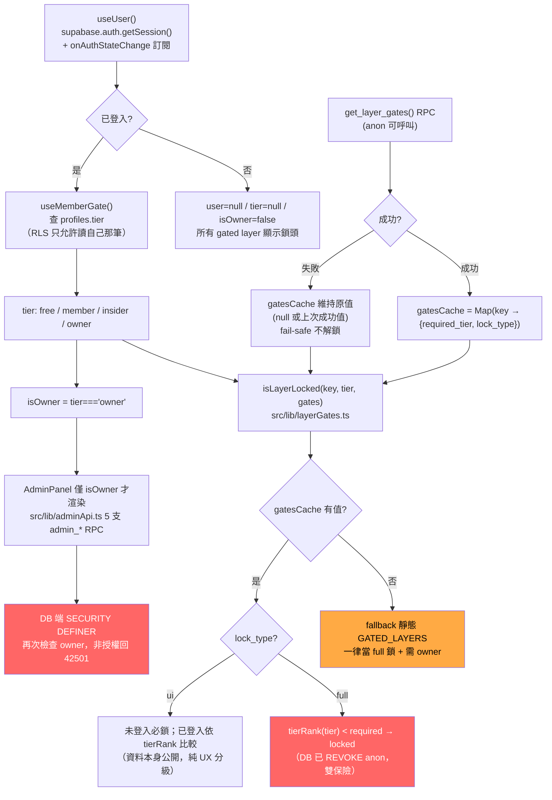

# API Surface (續) — npm scripts / Auth & Authorization / Error Handling

> 承接 [`API_SURFACE.md`](./API_SURFACE.md)。本檔涵蓋原規格 §4-6。

---

## 1. npm scripts / CLI 介面

`package.json:6-19`，共 12 支 script：

| Script | 指令 | 用途 | 執行環境 |
|---|---|---|---|
| `dev` | `vite` | 啟動 dev server（固定 port 3721，`strictPort: true`，`vite.config.ts:30-32`） | 瀏覽器 SPA |
| `build` | `tsc -b && vite build` | **先跑 TypeScript project references 編譯驗證，成功才 build**；CI（`.github/workflows/ci.yml`）本質上就是跑這支 | 瀏覽器 SPA bundle |
| `preview` | `vite preview` | 本地預覽 production build | 瀏覽器 SPA |
| `test` | `vitest run` | 一次性跑完 `src/**/*.test.ts`（17 個測試檔，`vitest.config.ts` 限定範圍） | Node（`environment: "node"`） |
| `test:watch` | `vitest` | watch 模式跑測試 | Node |
| `fetch:flights` | `tsx scripts/fetch/fetch-flights.ts` | 獨立於前端 app 的外部 API 抓取腳本（不隨 SPA bundle 出貨） | Node（tsx） |
| `fetch:tracks` | `tsx scripts/fetch/fetch-tracks.ts` | 同上，軌跡類外部資料抓取 | Node（tsx） |
| `s3:upload` | `tsx scripts/deploy/upload-to-s3.ts` | 大型靜態檔上傳 S3（通用） | Node（tsx），需 `SUPABASE_SERVICE_ROLE_KEY`/AWS 憑證 |
| `s3:upload:ships` | `tsx scripts/deploy/upload-ships-to-s3.ts` | 船舶資料專用 S3 上傳 | Node（tsx） |
| `s3:upload:rail` | `tsx scripts/deploy/upload-rail-to-s3.ts` | 鐵道資料專用 S3 上傳（消費 `rail:bundle` 產出的 `rail_bundle.json`） | Node（tsx） |
| `rail:bundle` | `python3 scripts/preprocess/bundle-rail-data.py` | Python 前處理，打包鐵道排班資料 | Python 3 |
| `pillars:generate` | `python3 scripts/preprocess/generate-station-pillars.py` | Python 前處理，產生車站光柱視覺化用的座標資料 | Python 3 |

**慣例觀察**：
- `build` 是唯一「品質關卡」script，把 TS 型別檢查與打包綁在一起，對應 CLAUDE.md「commit 前必跑 `npx tsc -b`（禁用 `--noEmit`）」規則的自動化版本。
- `fetch:*` / `s3:upload:*` / `rail:bundle` / `pillars:generate` 都是**離線資料管線腳本**，不在瀏覽器執行、不進 bundle，執行環境是本機或 CI 手動觸發（⚠️ 未見 GitHub Actions 排程呼叫這些 script，`.github/workflows/ci.yml` 只跑 `build` + `test`，推測資料管線由開發者手動或姊妹 repo `data-collectors` 的排程負責）。
- 沒有 `lint` script（⚠️ 未見 ESLint/Prettier 設定檔於 `package.json` scripts 中被引用，型別檢查由 `tsc -b` 承擔部分角色，但不含 style/lint 規則檢查——這點超出本次「API surface」範疇，未深入查證是否有獨立 lint 流程）。
- **兩類 script 依賴不同的環境變數集合**（依 CLAUDE.md 環境變數表交叉比對）：`dev`/`build`/`preview`/`test` 這組「前端 SPA」script 只需要 `VITE_*` 前綴變數（`VITE_SUPABASE_URL`/`VITE_SUPABASE_ANON_KEY`/`VITE_MAPBOX_TOKEN`/`VITE_DATA_SOURCE`/`VITE_IMAGERY_CDN_BASE` 等），build time inline 進 bundle；`s3:upload:*`/`fetch:*` 這組「Node script」則需要 `SUPABASE_SERVICE_ROLE_KEY`（CLAUDE.md 明確標註「禁止進 bundle」）與 AWS 憑證，兩組變數**不應混用**——`VITE_*` 前綴變數若誤放 service role key 會直接被打包進公開的瀏覽器 bundle，這是本專案環境變數表刻意區分前綴的安全考量。
- `test` / `test:watch` 兩支共用同一份 `vitest.config.ts`，差異僅在是否 watch，CI 只用 `test`（一次性），本地開發較常用 `test:watch`。

---

## 2. Authentication & Authorization

### 2.0 判斷鏈總覽圖

真正的安全邊界（紅色節點 N / R）永遠在 DB 端；前端的 `isLayerLocked()` / `isOwner` 判斷（其餘節點）只決定 UI 顯示行為，即使被繞過，DB 端仍會擋下非授權存取。

### 2.1 Auth 機制（`src/lib/auth.ts`）

- **Provider**：僅 Google OAuth（`signInWithGoogle()`，`auth.ts:12-18`），呼叫 `supabase.auth.signInWithOAuth({ provider: "google", options: { redirectTo: window.location.origin } })`。
- **Session 持久化**：不在 `auth.ts` 內手動管理，依賴 `src/lib/supabase.ts` 建立 client 時 supabase-js v2 的預設行為（`persistSession` / `autoRefreshToken` / `detectSessionInUrl`，`auth.ts:7-8` 註解明講）——OAuth 回跳後 `detectSessionInUrl` 自動從 URL fragment 解析 session，不需前端額外程式碼處理 callback。
- **`useUser()` hook**（`auth.ts:31-57`）：初始用 `supabase.auth.getSession()` 取一次（`loading` 狀態避免 UI 閃「未登入」再跳回已登入），之後訂閱 `supabase.auth.onAuthStateChange` 保持同步，`unmount` 時 `sub.subscription.unsubscribe()`。
- **`useMemberGate()` hook**（`auth.ts:67-101`）：登入後額外查 `profiles.tier`（`supabase.from("profiles").select("tier").eq("id", user.id).maybeSingle()`，`auth.ts:80-84`），依 migration 270 的 RLS policy 只允許使用者讀自己那筆 row。`isOwner = tier === "owner"` 是舊版鎖頭邏輯與後台入口共用的捷徑。
- **Redirect URL 設定為外部平台設定**（非程式碼可追蹤）：`.claude/memory/BACKLOG.md` BC-4a 提及需在 Supabase Dashboard 手動設定 Redirect URLs + Google Cloud Console，本 repo 程式碼不含這部分設定。

### 2.2 分層 Gating（`src/lib/layerGates.ts`，Phase 2 治理系統）

- **權威來源**：公開 RPC `get_layer_gates()`（anon 可呼叫，**只回 layer key 清單，不含地理資料本體**，`layerGates.ts:9`），取代 Phase 1 寫死在前端的 `GATED_LAYERS` Set。
- **Tier 等級**（`layerGates.ts:17`）：`free`(0) < `member`(1) < `insider`(2) < `owner`(3)，數值越高權限越大，用 `tierRank()` 轉換比較。
- **兩種鎖型**（`layerGates.ts:26-33`，migration 278 引入）：
  | `lock_type` | DB 端狀態 | 未登入行為 | 已登入行為 |
  |---|---|---|---|
  | `full` | 已 `REVOKE anon`，機密資料 | 上鎖 | `tierRank(tier) < required` 才鎖 |
  | `ui` | 未 `REVOKE`，資料本身公開 | 一律上鎖（引導登入） | `tierRank(tier) < required` 才鎖 |

  `full` 與 `ui` 唯一差異在「未登入且 `required=free`」情境：`ui` 仍會鎖（純 UX 引導登入），`full` 這種情境下實際上不會出現（DB 已擋，anon 根本拿不到資料）。**真正的資料保護永遠在 DB grant/RLS，前端 `lock_type` 只決定「顯示行為」**（`layerGates.ts:92-93` 註解明講）。
- **Fail-safe 設計**（`layerGates.ts:36-71`）：`gatesCache` module-level cache，初始 `null`；`loadLayerGates()` 失敗時**不清空既有 cache**，`isLayerLocked()` 在 `gates === null`（尚未載入/失敗）時一律 fallback 回靜態 `GATED_LAYERS` Set 並視為 `full` 鎖需 `owner` tier（`layerGates.ts:113`）——**絕不因 RPC 失敗而意外解鎖**，這是本檔案的核心安全設計原則。
- **後端拒絕的辨識**（`layerGates.ts:117-121`）：`isAccessDenied(err)` 檢查 `err.code === "42501"`（PostgreSQL insufficient_privilege）或訊息含 `42501|access denied|permission denied`，視為「無權限」靜默處理（不噴 error toast、不 retry）——對應鎖定 RPC 對非授權者回 403 的情境。

### 2.3 後台治理 API（`src/lib/adminApi.ts`）

`src/lib/adminApi.ts:1-7` 檔頭註解直接寫明：「Owner-only 治理後台 RPC 薄封裝（Phase 2，migration 276）。全部 `SECURITY DEFINER` + owner 守門；非 owner 呼叫回 403 / 42501。前端入口已 owner-only（`AdminPanel` 僅 `isOwner` 渲染），這裡不再重複守門。」

5 支 `admin_*` RPC 均為薄封裝（僅組參數呼叫 `supabase.rpc`，不含權限判斷邏輯）：

| 函式 | RPC | 參數 | 用途 |
|---|---|---|---|
| `listMembers()` | `admin_list_members` | 無 | 列出會員清單（`adminApi.ts:55-58`） |
| `setMemberTier(target, tier)` | `admin_set_member_tier` | `p_target`、`p_tier` | 調整會員 tier（`adminApi.ts:60-63`） |
| `listAudit(limit, onlyDenied)` | `admin_list_audit` | `p_limit`（預設 200）、`p_only_denied`（預設 false） | 列出稽核紀錄，含 `granted` 欄位可篩僅看被拒紀錄（`adminApi.ts:65-68`） |
| `listGatedLayers()` | `admin_list_gated_layers` | 無 | 列出所有鎖定圖層設定（`adminApi.ts:70-73`） |
| `setLayerGate(key, tier, enabled, lockType?)` | `admin_set_layer_gate` | `p_layer_key`、`p_required_tier`、`p_enabled`、`p_lock_type`（可省略） | 調整圖層鎖定設定；`p_lock_type` 省略時 DB 端 `COALESCE` 不改該欄，屬宣告性欄位不動 DB grant（`adminApi.ts:75-89`） |

**權限檢查完全在 DB 端**（本 repo 只看得到「呼叫哪支 RPC」）：`admin_*` 系列應為 `SECURITY DEFINER` + 內部檢查 `auth.uid()` 對應 `profiles.tier = 'owner'`（⚠️ 未讀取 `gis-platform` repo 的 migration 原始碼，此為依 CLAUDE.md 安全模式 + 命名慣例 + 檔頭註解的合理推斷，非直接驗證）。非 owner 呼叫任一 `admin_*` RPC 時，DB 端拒絕並回傳 Postgres 權限錯誤（`code: "42501"`），前端統一用 `unwrap<T>()` helper（`adminApi.ts:50-53`）把 `{ data, error }` 轉成「有值就回傳、有 error 就 throw」，錯誤訊息格式固定為 `${ctx}: ${error.message}`（`ctx` 即 RPC 名稱字串），方便除錯時從錯誤訊息直接定位是哪支 RPC 失敗。
- **稽核可觀測性**：`AuditRow`（`adminApi.ts:21-30`）欄位含 `rpc_name` / `user_tier` / `required_tier` / `granted`，代表 DB 端每次治理相關 RPC 呼叫（含被拒絕的）都留有紀錄，`listAudit(limit, true)` 可專門查「哪些呼叫被拒絕」，是本專案唯一具備「權限檢查歷史可回溯」的介面。

### 2.4 RLS 安全模式在前端呼叫的體現（總結）

依 CLAUDE.md P0 安全鐵則與本次追蹤結果，前端呼叫層體現 RLS 安全模式的具體方式：

1. **前端只用 anon key**（`src/lib/supabase.ts:3-4`），未見任何 `.schema("realtime")` 或 `.from("realtime.xxx")` 呼叫（`grep -rn "realtime\." src/data` 無匹配，integrations.md §1.3 已驗證）。
2. **RLS policy 本身不在本 repo**（在 `gis-platform` migration），前端能看到的只有「呼叫哪個 RPC 名稱」這一層——安全邊界完全落在 Postgres function 的 `SECURITY DEFINER` + RLS policy，前端程式碼**無法**、也不應該假設自己是安全邊界。
3. **寫入操作被壓縮到單一 RPC**（`log_session_events`），業務資料一律唯讀（`get_*` 前綴），把「前端誤寫壞資料」的風險面收斂到最小。
4. **分層 gating 的「顯示行為」與「資料保護」明確分離**（見 §2.2）：前端 `isLayerLocked()` 只決定 UI 是否顯示鎖頭/引導登入，不假設這就是安全邊界——即使前端邏輯被繞過（例如直接呼叫鎖定 RPC），DB 端 RLS/REVOKE 仍會擋下非授權存取，回傳 42501，前端用 `isAccessDenied()` 靜默處理。
5. **BYOK LLM key 不經自建後端**（`src/chat/providers.ts`），沒有「我方 server 持有使用者 LLM key」的風險面，key 生命週期完全在瀏覽器（`keyVault.ts` 三層儲存）與官方 LLM SDK 之間，CSP `connect-src` 白名單是唯一的網路層防線。

---

## 3. Error Handling Pattern

### 3.1 總表：Supabase RPC 呼叫失敗時的前端處理

| 情境 | 機制 | 代表案例 |
|---|---|---|
| **標準 loader 失敗** | `error` 非 null 直接 `throw new Error(...)`，不吞錯，交由上層（React hook / `loadingRegistry`）呈現錯誤態 | `src/data/erHospitalLoader.ts:83-86`：`if (error) throw new Error(\`get_er_hospital_latest: ${error.message}\`)` |
| **網路層韌性（跨所有 loader 共用）** | `src/lib/supabase.ts` 的 `resilientFetch`：全域併發上限 8、30s timeout、5xx/429/`TypeError` 最多 retry 2 次（backoff 500ms/1500ms + jitter） | 所有經 `supabase.rpc()`/`supabase.from()` 的呼叫（透過 `global: { fetch: resilientFetch }` 注入） |
| **寫入類 RPC 例外** | `WRITE_RPC_DENYLIST = ["log_session_events"]` 明確排除 retry，避免重送造成分析事件重複寫入 | `src/lib/supabase.ts:57` |
| **座標 join 類降級（部分失敗）** | `try/catch` 包住輔助性 `fetch`（非主資料），失敗時 `console.warn` + 回傳空 `Map`，讓主資料仍可顯示但無座標比對 | `src/data/erHospitalLoader.ts:58-75` 的 `loadCoordMapUncached()` |
| **靜態化 RPC 雙層 fallback** | `staticRpc()` 先打 CDN 靜態 JSON 快照，404/網路失敗（`try { fetch } catch {}` 吞例外）→ fallthrough 改打原本 `supabase.rpc(name)` | `src/data/staticRpc.ts:23-33` |
| **owner-gated RPC 403** | `isAccessDenied(err)` 辨識 code `42501` 或訊息關鍵字，視為「無權限」靜默處理，不噴 error toast、不 retry | `src/lib/layerGates.ts:117-121` |
| **gating 資料載入失敗（fail-safe）** | 不清空既有 cache，`gates === null` 時一律 fallback 靜態 `GATED_LAYERS`，維持鎖定（絕不因失敗而解鎖） | `src/lib/layerGates.ts:66-70, 96-114` |
| **BYOK LLM 呼叫失敗** | ⚠️ 未追蹤 `src/chat/agent.ts` 內部錯誤處理細節，依 Vercel AI SDK 慣例推測由 SDK 層拋出並在 Chat UI 顯示錯誤訊息，不涉及 Supabase 的 retry 機制 |  |
| **chat RPC 白名單拒絕** | 白名單外 `name` 直接回 `{ ok: false, error: "未授權的 RPC：${name}（僅允許白名單內的查詢）" }`，不呼叫 Supabase | `src/chat/tools/rpcTools.ts:102-105`（`callWhitelistedRpc()`） |
| **chat RPC 參數驗證失敗** | zod `safeParse` 失敗時回 `{ ok: false, error: "參數不符：..." }`（拼接 zod issues 的 `message`），同樣不呼叫 Supabase | `src/chat/tools/rpcTools.ts:106-109` |
| **chat RPC 白名單內呼叫失敗** | 通過白名單 + zod 驗證後才真的 `supabase.rpc(name, params)`，一樣包 `withLoading()`（`chat-rpc:${name}` 這個 id 出現在 loadingRegistry），失敗回 `{ ok: false, error: error.message }`，成功則用 `capToolResult()` 截斷過大結果集後回給 LLM | `src/chat/tools/rpcTools.ts:110-118` |

**§4.4（`API_SURFACE.md` §1.4）補充**：`RPC_WHITELIST`（`rpcTools.ts:17-93`）目前實登記 9 支 RPC（`get_data_catalog_by_theme`/`get_data_catalog_for_layer`/`get_fire_event_years`/`get_fire_events_by_year`/`get_h3_demographics_yearly`/`get_h3_demographics_years`/`get_waste_facility_counts`/`get_waste_disposal_point_counts`/`get_source_health`/`get_news_trending`，共 10 支——`API_SURFACE.md:331` 記載為 9 支，本檔核對 `rpcTools.ts` 原始碼後實際數量為 10 支，⚠️ 兩檔數字有出入，以本檔逐一列舉為準）；每支皆帶 zod schema（`RpcSpec.params`）+ 給 LLM 看的 `description` 欄位，這個 `description` 本身就是「LLM 何時該呼叫哪支工具」的 prompt engineering 介面，屬於本文件 §1（BYOK LLM）與 §3（RPC 清單）的交集地帶。

### 3.1a 抽查 5 個 `*Loader.ts` 的典型寫法（依「資料是否為使用者當下操作的主資料」分層）

抽查 `busLoader.ts` / `freewayLoader.ts` / `parkingLoader.ts` / `energyLoader.ts` / `erHospitalLoader.ts` / `newsEventsLoader.ts` 後歸納出三種模式：

1. **主資料 RPC → throw，不吞錯**：`if (error) throw new Error(...)` 是壓倒性多數寫法。`energyLoader.ts` 內近 20 支 SSOT / OSM 相關 RPC 呼叫（`:54,96,128,239,255,266,277,288,299,361,378,398,466,504,517,610,622,634,721,733,745,757,769,798` 等）全部同一句式；`freewayLoader.ts:45,90`、`parkingLoader.ts:138,186,284,337,373`、`newsEventsLoader.ts:147,181` 同款。
2. **hook 層包一層 `.catch()`，刻意不清空已顯示資料**：`useFreewayLayer.ts:151-168` 呼叫 `fetchFreewayDay(dateStr).then(...).catch((err) => console.warn(\`[Freeway] load ${dateStr} failed:\`, err))`——失敗時**不清空 `activeDayRef.current`**，代表上一輪成功資料仍留在畫面上，只是新日期沒切換成功；`busLoader.ts` 內多支 RPC（`:79,120,138,231,259,284`）採「`error` 非 null 時 `console.warn` + 回傳空陣列」而非 throw，同樣是「寧可顯示舊/空資料也不讓整個 hook 拋錯中斷」的降級策略。
3. **輔助性資料（非主資料本體）→ 靜默降級 + 累計計數警告**：`parkingLoader.ts:157-160`（即時資料）與 `:294`（單日歷史資料）對逐筆 `geom` 欄位 `JSON.parse` 失敗都採「`try { geometry = JSON.parse(r.geom) } catch { badGeom++; continue; }`，跳過該筆但不中斷整批」，迴圈結束後才用 `:172`／`:314` 的 `if (badGeom > 0) console.warn(...)` 統一印一次警告（避免主控台被逐筆錯誤訊息灌爆）；`busLoader.ts:29,48-49` 對路線 geojson `fetch` 失敗（`if (!r.ok) throw`，外層 `.catch((err) => console.warn(...))`）同屬此類：路線線條缺了不影響公車點位本身能否顯示。

**共通結論**：全專案沒有統一的「error boundary」或全域錯誤攔截 UI；策略依資料重要性分層——主資料失敗多半讓錯誤浮出（throw 或至少 warn），但**極少在 hook 層因單次失敗清空使用者已看到的畫面**，這與 `loadingRegistry`（CLAUDE.md 規則 3）作為使用者感知載入/失敗狀態的主要 UI 管道彼此呼應：使用者感知到的是「載入中」→「完成」/「失敗但保留舊資料」，而非「畫面整個消失重來」。

### 3.2 直接 fetch（不經 supabase-js）失敗處理

| 檔案 | 處理方式 | 備註 |
|---|---|---|
| `src/data/satelliteLoader.ts:52-61` | 僅檢查 `resp.ok`，失敗 `throw new Error` 帶 status code，**沒有 retry**（未經 `resilientFetch`） | 失敗時上層依賴 `localStorage` 6h 快取兜底（快取存在則不受單次失敗影響） |
| `src/lib/sessionTracker.ts:60` | `flushViaBeacon()` 用 `.catch(() => {})` 完全靜默吞錯 | 刻意設計：分析事件遺失可接受，不應影響主體驗；與「業務資料 RPC 不容忍吞錯」原則形成對比 |

### 3.3 明確**未見**的機制

依本次程式碼追蹤範圍：

- **沒有 per-RPC circuit breaker**（例如連續失敗 N 次後短暫停止呼叫某支 RPC）
- **沒有 exponential backoff 之外的 jitter 策略差異化**（所有 RPC 共用 `resilientFetch` 同一組 backoff 常數）
- **沒有離線 queue / background sync**（網路離線時失敗即失敗，不會排隊等恢復連線後重送）
- **沒有前端層級的 RPC 呼叫速率限制**（除 `resilientFetch` 的全域併發上限 8 外，無 per-RPC throttle；`rpcDebounce.ts` ⚠️ 存在於 `src/lib/` 但本次未展開其作用範圍，依檔名推測是特定高頻互動場景〔如拖曳 timeline〕的 debounce 工具，非通用錯誤處理機制）

錯誤處理策略整體呈現「**集中式韌性層（`resilientFetch`）兜底 + 各 loader 依資料重要性選擇 throw-and-surface 或 warn-and-degrade**」的兩層設計，而非每個 loader 各自實作差異化重試邏輯。

---

## 相關文件連結

- [`API_SURFACE.md`](./API_SURFACE.md) — 主文件（RPC 總表 / 直連 fetch / BYOK LLM 介面）
- [`CLAUDE.md`](../CLAUDE.md) — Git workflow、環境變數表
- [`docs/features/owner-gated-layers/`](../docs/features/owner-gated-layers/) — Phase 2 分層 gating 完整設計文件
- `.trace/_context/integrations.md` §5 — 失敗處理章節延伸來源
