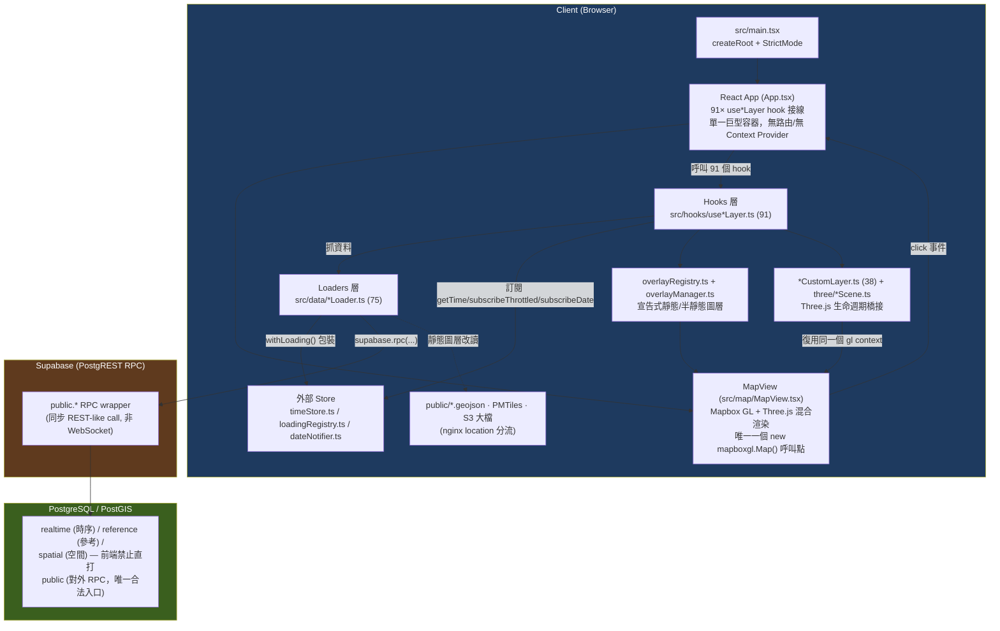
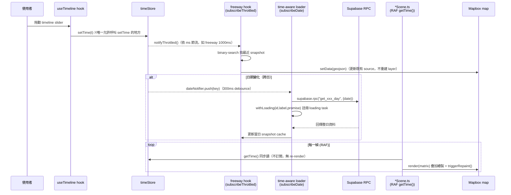
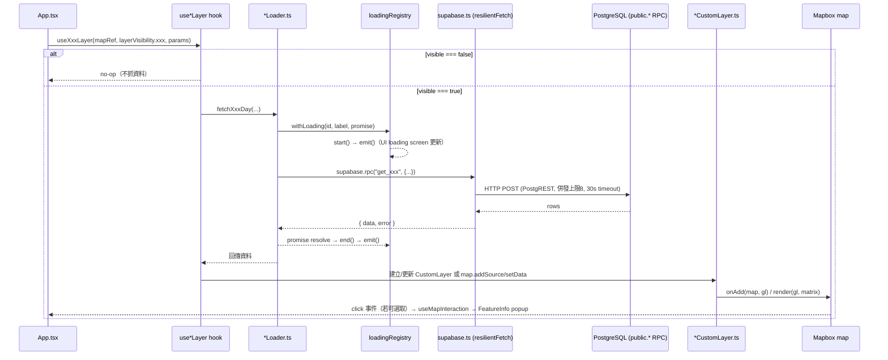

# 系統架構文件 — Mini Taiwan Pulse

> 產出時間：2026-07-12 · 基於 `.trace/_context/recon.md`、`entry_points.md`、`core_logic.md`、`extensions.md`
> 本文件為架構總覽入口；細節規則見 [`CLAUDE.md`](../CLAUDE.md)、[`docs/development-rules.md`](../docs/development-rules.md)。

## 1. 高層架構

Mini Taiwan Pulse 是一個**單頁應用（monolith SPA）+ Layer-plugin 慣例**的混合架構：一個 React 主殼（`App.tsx`）承載 91 個 `use*Layer` hook，經三條渲染路徑（宣告式 Overlay / 自管 Mapbox source / Three.js CustomLayer）把資料畫到同一個 Mapbox GL 地圖上；後端是 Supabase（PostgreSQL + PostGIS）透過 PostgREST 暴露的同步 RPC，前端沒有 WebSocket、沒有 Redux/Context，全域共享狀態一律用手刻的外部 store（`timeStore` / `loadingRegistry` / `dateNotifier` / `chatStore`）搭配 `useSyncExternalStore` 讀取。

**分層重點**：
- `App.tsx`（2870 行）是唯一容器，`<App/>` 下沒有任何 Context Provider（`Grep "Provider|createContext"` 掃全檔零命中）——全域狀態一律走外部 store。
- `MapView.tsx` 只建立**一次** Mapbox `map` 實例（`useEffect` deps 為 `[]`），其餘 91 個 hook 共用同一個 `mapRef`，不各自建立地圖。
- Supabase 只透過 `public.*` schema 的 RPC 存取（`CLAUDE.md` §2 強制規則），`realtime`/`reference`/`spatial` 前端不可直讀。
- 靜態大檔（PMTiles、H3 預聚合 JSON、大型 GeoJSON）繞過 Supabase，走 S3 + nginx location 分流，`public/` 保留扁平檔名契約的小檔（git-tracked）。

## 2. 元件清單

| 元件 | 職責 | 關鍵檔案/目錄 | 上游依賴 | 下游依賴 |
|---|---|---|---|---|
| App.tsx | 單一巨型容器；接線 91 個 `use*Layer` hook；渲染 sidebar/HUD/chat/loading screen | `src/App.tsx` | `main.tsx` | 所有 hooks、`MapView`、`layerCatalog` |
| MapView.tsx | 建立唯一 Mapbox `map` 實例；`style.load`/`load` 事件驅動 overlay 掛載、terrain、PMTiles 註冊、replay 補發 toggle 狀態 | `src/map/MapView.tsx` | `App.tsx`（props：`layerVisibility`, `overlayParams`, `onMapReady`） | `overlayRegistry`、`overlayManager`、Three.js CustomLayer 集合 |
| timeStore | 外部（非 React）「資料時間軸」store：Observer/Pub-Sub，`getTime()` 同步讀 + 三種訂閱頻率 | `src/state/timeStore.ts` | 僅 `useTimeline` 可 `setTime()` | RAF 動畫迴圈、`subscribeThrottled` filter hook、`subscribeDate` 跨日 loader |
| loadingRegistry | 全域 loading task 註冊中心；`Map<id,count>` + `Set<Listener>`，非同步呼叫必須 `withLoading()` 包裝 | `src/lib/loadingRegistry.ts` | 所有 `*Loader.ts` | UI 端 `useSyncExternalStore` 訂閱者（開頁 splash / toast） |
| overlayRegistry / overlayManager | 宣告式 Strategy pattern：`OverlayConfig[]` 表登記靜態/半靜態圖層，`overlayManager.ts` 統一處理 add source/layer、paint diff、visibility | `src/map/overlayRegistry.ts`（6475 行）、`src/map/overlayManager.ts` | `MapView.tsx`（`style.load` 時批量 `addAllOverlays`） | Mapbox `map` 實例 |
| Hooks 層（use*Layer） | 橋接 loader → 渲染路徑（overlay / 自管 source / CustomLayer）；決定 visible 時該不該抓資料 | `src/hooks/use*Layer.ts`（91 個） | `App.tsx` 呼叫，傳入 `mapRef` + `layerVisibility.<key>` + params | `*Loader.ts`、`timeStore`、`overlayRegistry` 或 `*CustomLayer.ts` |
| Loaders 層 | Supabase RPC 呼叫 / 靜態檔 fetch；一律用 `withLoading()` 包 | `src/data/*Loader.ts`（75 個） | Hooks 層呼叫 | `src/lib/supabase.ts`（`resilientFetch`）、`loadingRegistry` |
| CustomLayer / three Scene 層 | Mapbox `CustomLayerInterface` 生命週期橋接（`onAdd`/`render`/`onRemove`）+ Three.js 場景邏輯（geometry/material/camera），復用 Mapbox 同一個 WebGL context | `src/map/*CustomLayer.ts`（38 個）、`src/three/*Scene.ts` | `useThreeJsLayers.ts` 集中掛載，靠 `opts.getXxx()` getter 拉最新狀態（非 props） | `timeStore.getTime()`（RAF 內同步讀）、Mapbox `map.triggerRepaint()` |
| layerCatalog.ts | 圖層目錄單一真實來源：`LAYER_COLORS`（型別強制窮舉）+ `THEMES`/`SECTIONS`（UI 分組，桌機/手機雙 sidebar 共用） | `src/components/sidebar/layerCatalog.ts`（1175 行） | `LayerVisibility` interface（`types/index.ts`） | `IconRailSidebar.tsx`、`LayerSidebar.tsx`、`useLayerVisibility.ts` 的 `buildDefaults()` |
| featureInfo registry | Click popup 渲染層：`layerType → Panel` 查表 | `src/components/featureInfo/registry.tsx` | `useMapInteraction.ts`（`GIS_LAYERS` 表 + Scene `pickXxx()` 命中後組出 `FeatureInfo`） | 各 domain Panel 元件（如 `agriPanels.tsx`） |
| useMapInteraction.ts | 統一 click handler：先試 Three.js scene picking，後查 `GIS_LAYERS`（Mapbox `queryRenderedFeatures`） | `src/hooks/useMapInteraction.ts`（561 行） | `MapView.tsx` 的 `map` 實例 | `featureInfo/registry.tsx` |
| useLayerVisibility.ts | `layerVisibility` React state 來源；`DEFAULT_ON` 白名單（目前全空——訪客進站預設不打任何 RPC） | `src/hooks/useLayerVisibility.ts` | `LAYER_COLORS`（`Object.keys()` 派生全集） | `App.tsx` state |
| supabase.ts | module-level Supabase client 初始化，注入 `resilientFetch`（併發上限 8、30s timeout、5xx/429 retry） | `src/lib/supabase.ts` | env（`VITE_SUPABASE_URL/ANON_KEY`） | 所有 loader |

## 3. 分層設計 / Module boundary

### 3.1 Layer-plugin：型別窮舉 + ratchet 測試，而非抽象基底類別

專案沒有 `abstract class Layer` 或動態 `registerLayer()` API。新增一個圖層靠三層疊加達成一致性：

1. **命名慣例**：`use<Key>Layer.ts` / `<key>Loader.ts` / `<key>CustomLayer.ts`，讓 91+75+38 個檔案彼此可預測，不需要中央索引。
2. **固定接觸點**：`LayerVisibility` interface（`src/types/index.ts:693`）是唯一的「這個圖層開了嗎」SSOT；下游多處以 `keyof LayerVisibility` 為 index 建 `Record<keyof LayerVisibility, T>` 完整性表（`LAYER_COLORS`、`OverlayConfig.id`、`CameraPreset.layers`），任何一處漏補 key 在編譯期直接 `tsc` 報 `TS2739`。
3. **測試補強**：型別系統只能強制「必選」欄位（顏色）。像 popup / opacity slider / 圖例這類「可選但常漏」的接點，改用 `layerConsistency.test.ts` + `featureInfo/__tests__/registry.test.ts` 兩支 ratchet 測試——用**原始碼文字掃描**（非 AST）比對「全集 vs 已接線集合」，雙向檢查（漏接 fail、接好卻還留白名單也 fail），每條白名單例外附中文理由註解，形成一份「活文件」。

**為什麼不用抽象基底類別**：三種圖層（宣告式 Overlay / 自管 Mapbox source / Three.js CustomLayer）的渲染模型天差地別（靜態 paint expression vs 逐秒 snapshot 查找 vs WebGL 場景渲染），硬抽共同基底類別只會產生大量無意義的空方法覆寫。改用「中心化 union type + 完整性表 + ratchet 測試」讓每條路徑保持各自最適合的實作方式，同時仍能在架構層面保證「新圖層不會漏接關鍵 UX」。這是 CLAUDE.md §2 Simplicity First 與 §3 Surgical Changes 兩條通則，在本專案具體化為「不用繼承、用型別 + 測試做約束」的落地方案。

### 3.2 雙 Sidebar：SSOT 資料 + 各自渲染

`IconRailSidebar.tsx`（桌機）與 `LayerSidebar.tsx`（手機）共用 `layerCatalog.ts` 的 `LAYER_COLORS`/`THEMES`/`SECTIONS`，資料層唯一；但兩份元件各自重複實作了完整的渲染邏輯（含「`options.length > 3` 切原生 `<select>`」的鐵則 4），沒有抽共用元件。這是專案在 CLAUDE.md §3「不重構未壞的東西」原則下有意識容忍的技術債：換取「新增圖層一次改 `layerCatalog.ts`、兩端自動同步」的簡單心智模型。

### 3.3 三條圖層渲染路徑的分岔標準

| 路徑 | 適用場景 | 機制 |
|---|---|---|
| A：宣告式 Overlay | 靜態/半靜態 GeoJSON、PMTiles，用 Mapbox paint expression（`case`/`interpolate`）就能表達分類著色 | `overlayRegistry.ts` 的 `OverlayConfig[]`，`overlayManager.ts` 統一 add/paint-diff/visibility |
| B：自管 hook | 需要「依 `currentTime` 動態換算 snapshot」的時序資料，靜態 paint expression 模型無法表達跨時間查找 | Hook 自行 `map.addSource`/`addLayer`，訂閱 `timeStore.subscribeDate`（換日）+ `subscribeThrottled`（逐秒 binary-search） |
| C：Three.js CustomLayer | 3D 視覺化（光球/拖尾/光柱/立體長條），或需要自訂 picking（非 Mapbox native feature） | `*CustomLayer.ts` 橋接生命週期 + `*Scene.ts` 場景邏輯，復用 Mapbox 同一個 gl context |

`freewayCongestion`（路徑 B）vs `parkingOnstreet`（路徑 A）是本專案文件中最完整的端到端對照案例，兩者共用同一個 `LayerVisibility` boolean 開關，但底層機制完全不同——`LayerVisibility[key]` 是唯一交會點。

## 4. 通訊模式

### 4.1 前端 ↔ Supabase：同步 REST-like RPC，非 WebSocket/pub-sub

前端沒有訂閱 Supabase Realtime channel。所有資料抓取都是 `supabase.rpc(fnName, params)` 一次性請求／回應，`src/lib/supabase.ts` 注入自訂 `resilientFetch` 取代預設 `fetch`：全域併發上限 8（FIFO queue）、每請求 30s timeout、5xx/429 與網路層錯誤 retry 2 次（backoff 500ms/1500ms + jitter）、寫入類 RPC（`log_session_events`）不 retry。時序資料的「即時性」靠**前端輪詢/timeline 播放**模擬，不是伺服器推播——`useTimeline` 驅動 `timeStore.setTime()` 往前走，各 hook 依此重新查詢/重繪，而非等待後端主動推送新事件。

### 4.2 圖層間通訊：timeStore 訂閱制，非 event emitter

圖層之間互不知道彼此存在，也沒有共用的 event bus（如 `EventEmitter`/`mitt`）。時間狀態的擴散完全靠 `timeStore` 這個中心化外部 store 的「讀寫 + 訂閱通知」：

- 高頻（RAF 動畫）：`getTime()` 同步讀，不訂閱。
- 中頻（filter/lookup）：`subscribeThrottled(ms, cb)`，trailing-edge 保證最後一次會送。
- 低頻（跨日資料載入）：`subscribeDate(cb)`，走 300ms leading+trailing debounce（`dateNotifier.ts`），避免快速拖曳 timeline 跨多天時對每個中間日期都觸發 RPC 洪流。

Three.js CustomLayer 用「getter 而非 props/state」的方式從外部（React ref）拉最新值——因為渲染迴圈由 Mapbox 驅動，脫離 React 生命週期，無法靠重新建立 closure 拿到新值，只能每幀主動查詢。這與 `timeStore` 的整體設計哲學一致：狀態變更「廣播」給誰要誰自己決定訂閱頻率，而不是每次變更都「推播」給所有訂閱者處理。

### 4.3 Click Popup：Scene picking 優先於 Mapbox queryRenderedFeatures

`useMapInteraction.ts` 的 click handler 依序嘗試：Three.js 場景自帶的 `pickXxx()`（rail/bus/ship/flight/reservoir，因為這些不是 Mapbox native feature）→ 若都沒命中，再用 `map.queryRenderedFeatures` 對照 `GIS_LAYERS` 表（130+ 筆 `{ layers, type }` 登記）。順序即優先權：小範圍點層排前面，大面積 polygon 排最後，避免遮擋可點選性。

## 5. 核心流程 Sequence Diagram

### 5.1 使用者切換 timeline → CustomLayer 重繪

### 5.2 資料生命週期：Supabase RPC → Loader → Hook → CustomLayer → Mapbox render

## 6. 關鍵設計決策與 Trade-off

1. **時間狀態外部化（`timeStore.ts`），繞過 React state/Context**
   - 決策：`currentTime` 存在模組級可變變數 + `Set<Listener>`，而非 `useState`/Context。
   - 為什麼：Timeline 播放時 `currentTime` 每秒可能更新數十次（RAF 驅動）；若放進 React state/Context，每次更新會觸發訂閱樹上所有元件 re-render + reconcile，91 個圖層規模下是效能災難。
   - Trade-off：放棄 React DevTools 可視化狀態變化的便利性，換來動畫迴圈完全脫離 reconciliation；CLAUDE.md 把這條寫成專案級強制規則（§6：禁止把 `currentTime` 塞進 `useEffect`/`useMemo` deps），意味著任何新 hook 若違反會被 code review 攔下（無 tsc/測試強制，純規範）。

2. **用型別窮舉 + ratchet 測試取代抽象基底類別做圖層擴充機制**
   - 決策：`LayerVisibility` 是扁平 `boolean` union，`LAYER_COLORS: Record<keyof LayerVisibility, string>` 型別強制窮舉（漏補直接 `tsc` TS2739）；popup/slider/legend 等「可選」接點改用文字掃描 ratchet 測試 + 附理由白名單。
   - 為什麼：三種圖層渲染路徑（宣告式/自管/Three.js）差異太大，硬做共同基底類別只會產生空方法覆寫；型別系統能強制「必選」欄位，但無法窮舉「有沒有接 popup」這種散落多檔案的存在性問題，測試補上這塊型別系統管不到的區域。
   - Trade-off：91 個 hook + 75 個 loader + 38 個 CustomLayer 沒有中央 registry，`App.tsx` 的圖層接線量隨圖層數量線性成長（純手動列出每個 hook 呼叫）；ratchet 測試靠原始碼文字比對（非 AST），若重構 `useTransportParams`/`LegendPanel` 的內部結構，比對邏輯需要同步更新，否則會產生假陽性/假陰性。

3. **雙 Sidebar（桌機/手機）資料共用、渲染各自複製**
   - 決策：`layerCatalog.ts` 是資料 SSOT，`IconRailSidebar.tsx` 與 `LayerSidebar.tsx` 各自實作完整渲染邏輯（含鐵則 4 dropdown 閾值判斷 `options.length > 3`）。
   - 為什麼：兩端 UI 版面差異大（icon rail vs 折疊面板），抽共用元件的重構成本與風險（可能動到既有穩定 UI）高於維持兩份重複實作。
   - Trade-off：日後若要改 dropdown 閾值或 slider 樣式需要同步改兩處，且沒有測試守備「兩份渲染邏輯是否等價」——ratchet 測試只守備「資料是否存在」，不守備「渲染程式碼是否同步」，這是專案在 CLAUDE.md §3「不重構未壞的東西」下刻意接受的技術債。

4. **Supabase 前端一律走 `public.*` RPC，禁止直打 `realtime`/`reference`/`spatial` schema**
   - 決策：資料庫分四個 schema，前端只能經過薄 `public.*` RPC wrapper 存取。
   - 為什麼：把「哪些欄位/查詢對外開放」的決策收斂到後端一處，避免前端直接依賴內部 schema 結構，跨 repo（`gis-platform` 管 migration）變更時前端影響面可控；也是 pre-aggregate pattern（RPC 響應 > 1s 時套用）能落地的前提——薄 RPC 背後可以自由替換成 pre-aggregate table 而不影響前端呼叫介面。
   - Trade-off：多一層 wrapper 的維護成本（每個新資料需求都要先在後端開一個 RPC 函式），且 Supabase pooler 強制 2 分鐘 timeout（僅 pg_cron 例外），大量資料的 RPC 必須設計成「輕量 SELECT + 背景預聚合」而非即時運算。

5. **`resilientFetch` 注入 Supabase client：併發上限 + retry，而非依賴 Supabase SDK 預設行為**
   - 決策：`src/lib/supabase.ts` 自訂 `fetch` 實作（併發上限 8、FIFO queue、30s timeout、5xx/429 retry 2 次 + backoff/jitter、寫入類 RPC denylist 不 retry）取代預設 `fetch`。
   - 為什麼：91 個 hook 若各自無節制併發打 RPC，容易在使用者快速切換多個圖層時瞬間發出大量請求，觸發後端限流或前端本身的網路壅塞；這是純前端層級的保護，不依賴後端配合。
   - Trade-off：全域共用一個併發 queue，意味著某個圖層的大量請求可能排隊延後另一個圖層的請求完成時間；`WRITE_RPC_DENYLIST` 需要手動維護（新增寫入類 RPC 若忘記加入會被誤 retry，可能造成重複寫入副作用）。

6. **供應商無關的多 LLM 聊天子系統（BYOK），CSP 白名單限制金鑰流向**
   - 決策：`src/chat/` 透過 Vercel AI SDK 統一介面接三家 LLM provider，金鑰由使用者自帶（BYOK），CSP `connect-src` 白名單只允許送往這三家 LLM + Supabase + Mapbox。
   - 為什麼：專案已進入面向公開使用者的安全加固階段（`nginx.conf` 2026-07-04 新增 BC-4 安全 header），BYOK 避免專案自身持有/計費使用者的 LLM 用量，CSP 限制降低金鑰外洩風險面。
   - Trade-off：CSP 目前仍是 Report-Only 階段（尚未真正阻擋違規請求，只回報），代表這條安全邊界尚未完全生效；⚠️ 未驗證 Report-Only 何時會切換為 Enforce。

## 7. 相關文件索引

- [`CLAUDE.md`](../CLAUDE.md) — 開發規則精簡版索引（資料來源分工、loading UI、新增 layer 7 步 + UX 四鐵則、timeStore 強制規則）
- [`docs/development-rules.md`](../docs/development-rules.md) — 規則詳細版 + 程式碼範例
- [`docs/TIMELINE_ARCHITECTURE.md`](../docs/TIMELINE_ARCHITECTURE.md) — timeline UI 三層結構完整設計
- [`docs/supabase-optimization.md`](../docs/supabase-optimization.md) — Pre-aggregate pattern 完整指南
- [`docs/bus-layer-design.md`](../docs/bus-layer-design.md) — progress-based 時序圖層案例研究（與本文件 §3.3 路徑 B 的 freeway snapshot 模式互補對照）
- `.trace/_context/recon.md` / `entry_points.md` / `core_logic.md` / `extensions.md` — 本文件的原始素材與更細節的程式碼行號引用
