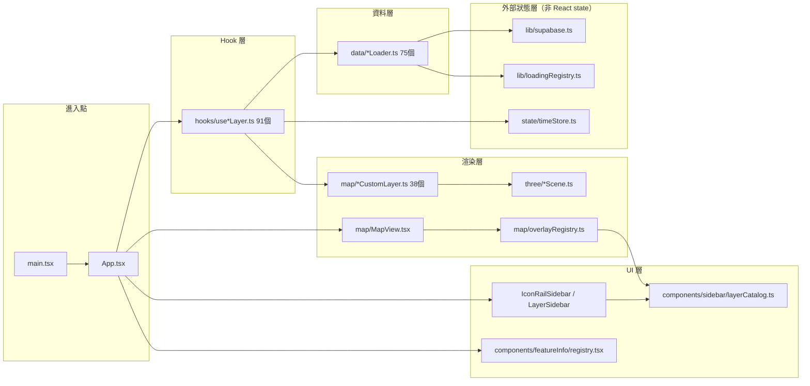

# CODEBASE_MAP — 程式碼地圖

> 基於 [`.trace/_context/recon.md`](./_context/recon.md) 目錄快照 + Stage 2 追蹤結果整理。

## Annotated Directory Tree

```
mini-taiwan-pulse/
├── src/                          # 353 個純程式碼檔（.ts/.tsx，不含測試）
│   ├── main.tsx                  # 唯一 entrypoint：createRoot().render(<StrictMode><App/></StrictMode>)
│   ├── App.tsx                   # 2870 行單一巨型容器元件，91 個 use*Layer hook 全在此接線，無路由/無 Context Provider
│   ├── data/            (75)     # Supabase RPC / 靜態檔 loader，每個資料源一支 *Loader.ts，皆需包 loadingRegistry
│   │   └── __tests__/            # loader 單元測試
│   ├── hooks/            (91)    # React hook 層，use*Layer.ts 橋接 loader → CustomLayer/overlay；動態圖層禁收 currentTime 參數
│   │   └── factories/            # hook 工廠，抽象重複 pattern
│   ├── map/              (38)    # Mapbox CustomLayer 實作
│   │   ├── MapView.tsx           # 地圖主容器，唯一建立 mapboxgl.Map 的地方（mount-only useEffect）
│   │   ├── overlayRegistry.ts    # 6400+ 行，靜態圖層泛型登記表，MapView 統一查表顯隱
│   │   └── overlayManager.ts / overlayPaintDiff.ts  # 動態 paint property 差異更新
│   ├── three/            (~20)   # Three.js Scene 類別，一資料類別一 Scene，供 CustomLayer 呼叫
│   │   └── shaders/               # GLSL (.vert/.frag)，vite.config.ts assetsInclude 特別處理
│   ├── state/                     # 外部 store（非 React state，禁止塞進 useEffect deps）
│   │   └── timeStore.ts          # 資料時間軸；另有 wallClock（真實時間，易混淆）
│   ├── types/index.ts             # 集中型別定義，LayerVisibility interface 為新增圖層第一步
│   ├── lib/                        # 橫切工具
│   │   ├── supabase.ts            # Supabase client + resilientFetch（併發8/30s timeout/retry）
│   │   ├── loadingRegistry.ts     # 全域 loading task 註冊中心
│   │   ├── auth.ts / keyVault.ts / layerGates.ts  # 認證、BYOK 金鑰、owner-gated layer
│   │   └── rpcDebounce.ts / dayPrefetch.ts / sessionTracker.ts
│   ├── components/
│   │   ├── sidebar/layerCatalog.ts  # LAYER_COLORS + SECTIONS 單一真實來源（桌機/手機雙消費）
│   │   ├── featureInfo/registry.tsx # click popup PANEL_REGISTRY
│   │   ├── chat/、admin/、auth/、hud/、intel/、satelliteConsole/
│   ├── chat/                       # BYOK 多 LLM（agent.ts/providers.ts/systemPrompt.ts/tools/）
│   ├── engines/                    # BusEngine/RailEngine/TraTrainEngine，progress-based 動畫引擎
│   ├── constants/ utils/           # 純函式：座標轉換、插值、maneuver impact
│   └── styles/                     # CSS
├── scripts/
│   ├── fetch/            # 外部 API 抓取（TDX/FlightRadar24），package.json fetch:* scripts
│   ├── preprocess/       # Python 前處理（rail bundle、station pillars）
│   ├── deploy/           # S3 上傳 + nginx entrypoint/pull-deploy-assets
│   ├── export/ audit/ poc/
├── public/               # 靜態資產，扁平檔名契約（S3 deploy-assets 管理，不可改路徑）
├── docs/                 # 185 個 md，含 features/（19 個功能資料夾，各含 README/backlog/changelog/handoff）
└── .claude/              # memory 記憶迴圈 / pitfalls / skills / commands / agents
```

## 「我想改 X 要看哪裡？」速查表

| 我想要... | 看這裡 | 關鍵檔案 |
|---|---|---|
| 新增一個地圖圖層 | 先跑 `layer-onboarding` skill 或 `/new-layer` command | `src/types/index.ts`（LayerVisibility）→ `src/data/xxxLoader.ts` → `src/hooks/useXxxLayer.ts` → `src/map/overlayRegistry.ts` 或 `xxxCustomLayer.ts` → `src/components/sidebar/layerCatalog.ts` → `src/App.tsx` → `src/hooks/useLayerVisibility.ts` |
| 修改圖層透明度/圖例/popup（UX 四鐵則） | `docs/development-rules.md#4a` | `useTransportParams.ts`（opacity）/ `LegendPanel.tsx` + `LEGEND_REGISTRY`（圖例）/ `useMapInteraction.ts` + `featureInfo/registry.tsx`（popup） |
| 新增 Supabase RPC 資料源 | `src/data/*Loader.ts` | 參考 `freewayLoader.ts`（含 loadingRegistry 範例） |
| 除錯圖層資料抓不到 | `src/lib/loadingRegistry.ts` / `src/lib/supabase.ts` | 檢查 `resilientFetch` 併發佇列、`withLoading` 是否有包 |
| 調整時間軸/timeline 行為 | `src/state/timeStore.ts` + `docs/TIMELINE_ARCHITECTURE.md` | `useTimeline.ts`（唯一允許呼叫 `setTime` 的 hook） |
| 新增 3D 視覺元件 | `three-3d-component` skill + `public/three-showcase.html`（68 元件案例庫） | `src/three/*Scene.ts` + `src/map/*CustomLayer.ts` |
| 調整建置/TS 設定 | 根目錄 | `vite.config.ts`、`tsconfig.json` + `tsconfig.app.json`（project references，用 `tsc -b`） |
| 調整部署/靜態資產分流 | 根目錄 + `scripts/deploy/` | `Dockerfile`、`nginx.conf`（S3 volume vs dist fallback location 表）、`docker-compose.yml` |
| 新增/修改 BYOK 聊天功能 | `src/chat/` | `agent.ts`、`providers.ts`（多 LLM SDK 直連）、`systemPrompt.ts` |
| 查某個 feature 的完整脈絡 | `docs/features/<slug>/` | README/backlog/changelog/handoff 四檔慣例 |
| 查已知踩坑 | `.claude/pitfalls/` | 具名 bug 復盤模板 |

## 模組依賴關係圖


