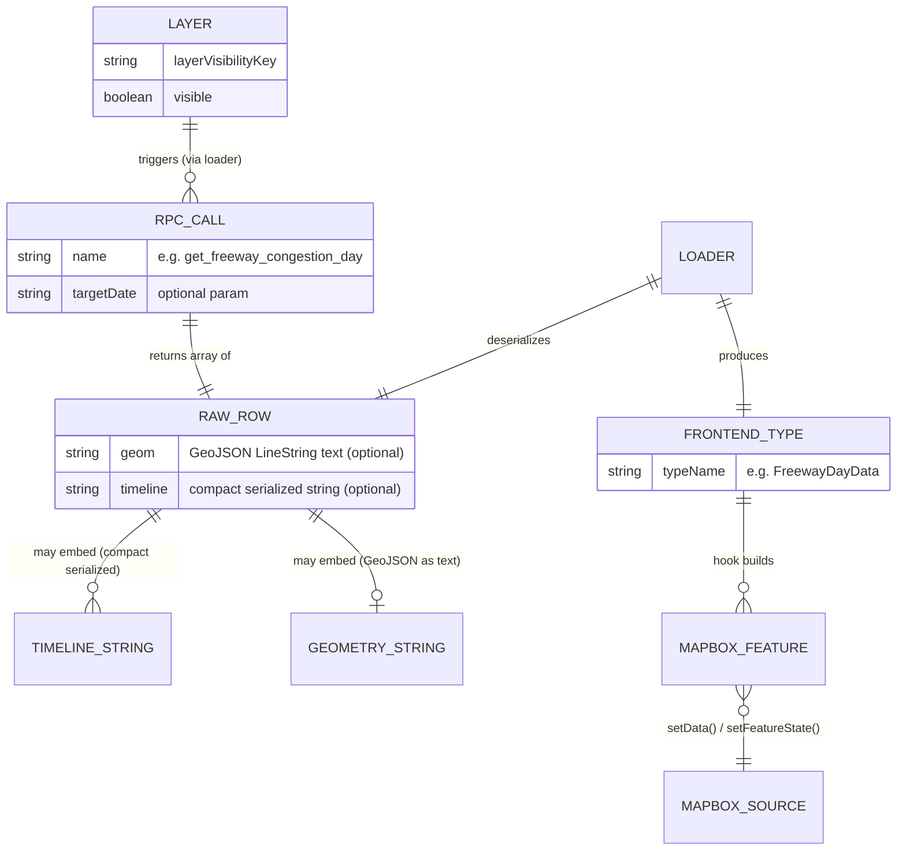
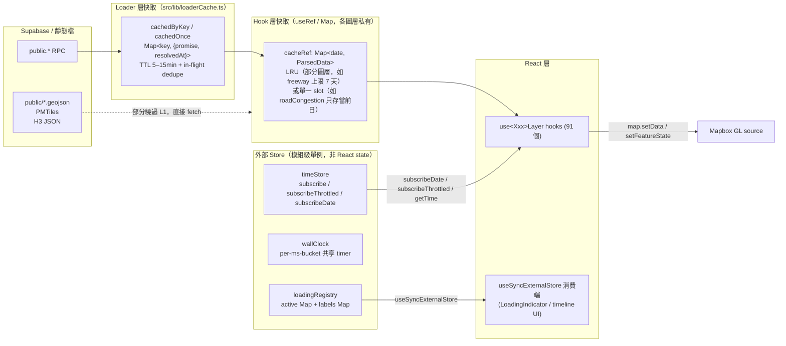

# 資料模型 — Mini Taiwan Pulse

> 產出時間：2026-07-12 · 依 `.trace/_context/recon.md` / `data_flow.md` / `core_logic.md` 彙整。
> 本 repo **不含資料庫 schema 定義**（Supabase migrations 在姊妹 repo `gis-platform`），前端
> 只透過 `public.*` RPC 消費資料。因此本文件不畫傳統 ER diagram，而是聚焦「前端實際消費的
> 資料形狀」：型別定義 → RPC 回傳形狀 → 概念實體關係 → 各層快取生命週期 → 靜態資產載入。
> 只讀程式碼，未做任何修改。⚠️ 標記處為未完整驗證細節。

## 目錄

1. [前端核心資料型別清單](#1-前端核心資料型別清單)
2. [Supabase RPC → 前端型別對照](#2-supabase-rpc--前端型別對照)
3. [State management 策略](#3-state-management-策略)
4. [靜態資料載入與快取](#4-靜態資料載入與快取)
5. [Migration / 版本化機制](#5-migration--版本化機制)

---

## 1. 前端核心資料型別清單

所有集中型別定義於 `src/types/index.ts`（1039 行）。以下是與資料模型直接相關的關鍵型別，
依「資料域」分組。

### 1.1 圖層控制核心 — `LayerVisibility`

```ts
// src/types/index.ts:693
export interface LayerVisibility {
  flights: boolean;
  ships: boolean;
  rail: boolean;
  stationsTHSR: boolean;
  // ... 共 ~290 個 key（693–989 行），每個對應一個可獨立開關的地圖圖層
  freewayCongestion: boolean;
  parkingOnstreet: boolean;
  parkingOffstreet: boolean;
  // ...
}
```

- **用途**：整個地圖「哪些圖層目前顯示」的唯一真實來源（SSOT），~290 個 boolean flag，
  每個 key 對應一個獨立可開關的圖層（不是物件實例，是扁平 flag registry）。
- **與 loader/hook 的關聯**：`key` 本身不直接觸發任何資料載入；實際載入邏輯在對應的
  `use<Key>Layer.ts` hook 內部訂閱 `visible` 參數後才呼叫 loader（見 §3.2）。
- **編譯期強制**：`src/components/sidebar/layerCatalog.ts:31` 的 `LAYER_COLORS` 型別標注為
  `Record<keyof LayerVisibility, string>`，新增 key 卻忘記補色會直接 TS2739 編譯失敗——這是
  本專案「用型別系統做架構約束」而非傳統 ER/schema 的具體手法（詳見 `core_logic.md` §1）。
- **消費端**：`src/hooks/useLayerVisibility.ts` 的 `buildDefaults()` 從 `LAYER_COLORS` 的
  `Object.keys()` 派生出完整 key 集合與 React `useState` 初始值（全部預設 `false`）。

### 1.2 點擊資訊 — `FeatureInfo`

```ts
// src/types/index.ts:618
export interface FeatureInfo {
  layerType: "submarineCable" | "landingStation" | ... /* ~150 個 union 分支 */
    | "roadCongestion" | "parkingOnstreet" | "chatHighlight";
  properties: Record<string, unknown>;
  coords?: [number, number];
}
```

- **用途**：使用者點擊地圖任一可選取物件後，統一組裝出的「這是什麼」資訊物件，交給
  `src/components/featureInfo/registry.tsx` 的 `PANEL_REGISTRY` 查表渲染對應 Panel。
- `layerType` 是與 `LayerVisibility` **平行但獨立**的 union type：不是所有 `LayerVisibility`
  key 都可點選（因此無對應 `layerType`），也有多個 `LayerVisibility` key 共用同一個
  `layerType`（例如 7 個 `livestockFarmXxx` 共用 `"livestockFarm"`）。
- `properties` 是未經型別化的 `Record<string, unknown>`——來源可能是 Mapbox GeoJSON feature
  properties，也可能是合併了 `feature-state`（如 `roadCongestion` 的 `level`）的結果，前端
  在 Panel 元件內部才做欄位解讀，沒有集中 schema 驗證這層資料。

### 1.3 Overlay 宣告式設定 — `OverlayConfig` / `OverlayLayerSpec`

```ts
// src/types/index.ts:587
export interface OverlayConfig {
  id: keyof LayerVisibility;       // 與 LayerVisibility key 型別綁死，拼錯字串編譯錯誤
  sourceUrl: string;
  sourceId: string;
  layers: OverlayLayerSpec[];      // 同一 source 可拆多層（glow/line/fill...）
  rebuildOnParamChange?: string[];
  filter?: unknown[];
  pmtiles?: { sourceLayer: string; minzoom: number; maxzoom: number };
  dynamicData?: boolean;           // true = source 以空 FC 初始化，資料由 loader/hook 按日餵入
}
```

- **用途**：「路徑 A：宣告式 Overlay」圖層（多數靜態/半靜態圖層）的 Strategy 物件，由
  `src/map/overlayRegistry.ts` 產生、`src/map/overlayManager.ts` 統一消費（加 source/layer、
  paint diff、visibility 切換）。
- `pmtiles` 欄位標示「這個 source 是向量切片 HTTP Range Request，不是全量 GeoJSON」；
  `dynamicData` 標示「資料不是靜態檔，是 loader/hook 逐日 `setData()` 餵入」。

### 1.4 交通載具型別群

| 型別 | 檔案位置 | 用途 |
|---|---|---|
| `Flight` / `TrailPoint` | `types/index.ts:2,5` | 航班快照 + 軌跡點 `[lat, lng, alt, ts]`，供 `FlightScene.ts` 繪製 |
| `Ship` / `ShipData` | `types/index.ts:326,332` | 船舶即時位置 |
| `RailTrain` / `RailSystem` / `RailSchedule` / `RailDeparture` / `RailStationTime` / `RailData` | `types/index.ts:339–378` | 捷運/輕軌列車位置與時刻表（`RailEngine.ts` progress-based 動畫用） |
| `TraDeparture` / `TraSchedule` / `TraData` | `types/index.ts:387–406` | 台鐵時刻表（與捷運系統分開建模） |
| `BusVehicle` / `BusPosition` / `BusRouteGeometry` / `BusRouteData` / `BusTrail` / `BusDateInfo` | `types/index.ts:510–566` | 公車即時位置 + 路線幾何 + 逐日 trail（見 `docs/bus-layer-design.md` progress-based 全台擴展） |

### 1.5 時間軸相關型別

| 型別 | 用途 |
|---|---|
| `TimelineState`（`:43`） | `{ playing, currentTime, startTime, endTime, speed }`，`useTimeline` UI 播放器內部狀態 |
| `TimeMode`（`:52`） | `"replay" \| "live"` |
| `AppMode`（`:55`） | `"realtime" \| "historical"` |
| `TimeType`（`:63`） | 資料源的時間行為分類：`track`/`snapshot`/`cyclic`/`event`/`static`，決定該圖層該走哪種時間訂閱策略 |
| `DataSourceMeta`（`:77`） | `{ id, timeType, timeRanges, supportsLive, refreshInterval? }`，資料源自我描述用元資料 |

### 1.6 環境感測型別（代表性範例）

`AqiStation`（`:1005`）、`MicroSensor`（`:1026`）為典型的「感測站快照」型別：扁平欄位（`lon`/
`lat`/`observedAt` + 多個 nullable 污染物數值），對應 `src/data/aqiStationsLoader.ts` 的 RPC
回傳，欄位命名已從 DB snake_case 轉為前端 camelCase（loader 層做轉換，見 §2）。

---

## 2. Supabase RPC → 前端型別對照

Loader 層（`src/data/*Loader.ts`，共 75 個檔案）是「RPC 原始回應」轉換成「前端型別」的唯一
邊界。以下挑 6 個代表性 loader 說明轉換方式。

### 2.1 概念實體關係圖（非資料庫 ER，是前端消費視角）



### 2.2 代表性 loader 對照表

| Loader | RPC | 回傳形狀（`RawRow`） | 前端型別 / 轉換方式 |
|---|---|---|---|
| `freewayLoader.ts` | `get_freeway_congestion_day({target_date})` | `{ geom: string(GeoJSON LineString text), timeline: "ts,level,speed;ts,level,speed;..." }[]`（`:49-56`） | `parseLineString()`（`:73-81`）+ `parseTimeline()`（`:58-71`）逐段反序列化 → `FreewayDayData`；`buildFreewayGeoJSON(day, t)`（`:171-196`）在渲染時二分搜尋出當下 snapshot，bake 成 GeoJSON `FeatureCollection` |
| `roadCongestionLoader.ts` | `get_road_congestion_day({target_date})` | `{ section_uid: string, timeline: string(288 字元，每字元=5分鐘槽的壅塞等級) }[]`（`:89-93`，**不含幾何**——幾何走靜態 PMTiles） | `levelFromChar()`（`:59-62`）逐字元轉數字陣列；渲染時不重建 GeoJSON，改用 `map.setFeatureState({source, sourceLayer, id: section_uid}, {level})` 差異染色 |
| `parkingLoader.ts` | `get_parking_segments_current()` / `get_parking_lots_current()`（快照，非 timeline） | 路邊 3084 段（部分含 `geom` polygon，部分只有 `lon`/`lat`）+ 場外 2083 場（皆點座標），含 `availability_rate`（`:1-40` 註解） | 依「有無 `geom`」分流成 Polygon feature（fill 層）與 Point feature（circle 層）；`availabilityColorExpr()`／`neutralCapacityColorExpr()` 純函式產生 Mapbox paint expression，交給 `overlayRegistry.ts` 組 `OverlayConfig`（路徑 A） |
| `aqiStationsLoader.ts` | ⚠️ 未在本次逐行讀取，依型別推斷對應 RPC 回傳環境部 77 站觀測 | RPC row 欄位為 snake_case（如 `station_name`/`pm25`） | 轉為 `AqiStation`（`types/index.ts:1005`）camelCase 欄位；`pollutant`/`status` 等允許 `null` |
| `h3Loader.ts` | **非 RPC**——`fetch('./h3/h3_population_res{res}.json')` 靜態 JSON（`:112-134`） | `H3DataSet = { metadata: {...}, cells: { h, d, n }[] }`（`h`=H3 index, `d`=day population, `n`=night population，欄位刻意縮寫以壓低 JSON 體積） | 直接 `res.json()` 型別斷言，無反序列化轉換；`DemographicH3DataSet`（`:22`）欄位更縮寫（`p`/`hh`/`m`/`f`/`sr`/`pph`/`dr`/`cd`/`ed`/`ai`），對應村里人口指標 10 個欄位 |
| `satelliteLoader.ts` | 外部 TLE API（非 Supabase），另有 `localStorage` 6 小時快取（`CACHE_KEY = "satellite-layer-tle-v5-multi-country"`） | ⚠️ 未展開讀取完整回傳形狀 | 見 §5（唯一發現的「快取 key 帶版本號」案例） |

### 2.3 Loader 共同骨架（75 個檔案的典型結構）

```
export async function fetchXxxDates()        → RPC 取「可用日期」清單（給 timeline UI 用）
async function fetchXxxDayUncached(date)      → RPC 取「單日全部路段/物件 + timeline」
const fetchXxxDayCached = cachedByKey(...)    → 套 TTL + LRU cache（src/lib/loaderCache.ts）
export function fetchXxxDay(date)             → 對外唯一入口，呼叫方不知道有沒有快取
```

每一次 `supabase.rpc(...)` 呼叫都直接包在 `withLoading(id, label, rpcPromise)`
（`src/lib/loadingRegistry.ts:64-67`）內，且都經過共用的 `resilientFetch`
（`src/lib/supabase.ts:44-153`：併發上限 8、30s timeout、5xx/429 最多 retry 2 次）。
資料庫端把 timeline 序列化成單一字串欄位（如 `freeway`/`roadCongestion`）是典型的
「pre-aggregate 後只做薄 SELECT」模式，呼應 `CLAUDE.md` §4。

---

## 3. State management 策略

前端沒有 Redux/Zustand，資料生命週期分散在 4 層，各自獨立、互不知道彼此存在：



### 3.1 Loader 層快取 — `src/lib/loaderCache.ts`

- `cachedOnce(fetcher, ttlMs)`：無參數 fetcher（如「地震列表」），in-flight 期間共享同一
  Promise（順便擋 React StrictMode 雙跑），resolve 後記錄 `resolvedAt`，超過 TTL 才重抓，
  失敗自動清除 entry（不快取錯誤）。
- `cachedByKey(fetcher, ttlMs, max?)`：以字串 key（通常是 `date`）為索引的版本，額外有 LRU
  上限避免長 session 滾動 timeline 把記憶體吃滿。
- **TTL 慣例**（`loaderCache.ts` 檔頭註解）：歷史/靜態資料 15 分鐘、`*Latest` 即時值 5 分鐘、
  per-day 時序資料 10 分鐘。
- ⚠️ 未驗證：`cachedByKey` 的 LRU 淘汰演算法細節（本次僅讀取 `cachedOnce` 完整實作，
  `cachedByKey` 簽章從呼叫端推斷）。
- **失效策略**：純 TTL-based（時間到自動視為 stale，下次呼叫重抓），無主動 invalidate 事件
  （唯一例外是 `CachedOnce.invalidate()` / `CachedByKey.invalidate()` 供測試或手動刷新呼叫）。

### 3.2 Hook 層快取 — 各 `use<Xxx>Layer.ts` 私有 `useRef`

- 與 Loader 層是**兩層獨立快取**：Loader 層快取「原始 RPC 回應」，Hook 層快取「已解析成
  前端型別的物件」（例如 `FreewayDayData`）。
- 生命週期完全綁定元件 mount：`useRef` 存活跨 render 但元件 unmount 即消失（無跨 session
  持久化）。
- 快取策略依圖層而異——非統一規範：`useFreewayLayer.ts` 有 `cacheRef`（`Map<date, CachedDay>`，
  `CACHE_MAX = 7` 天 LRU）；`useRoadCongestionLayer.ts` 只有 `dayRef` 單一 slot（只存當前日，
  換日直接覆蓋，不保留歷史）。
- 額外用 `fetchingRef` 做「進行中 fetch」去重 + 競態保護（避免「舊 fetch resolve 但已不是
  目前日期」造成畫面顯示錯誤日期資料）。
- **失效策略**：無 TTL，只有「換日期」時觸發新 fetch 覆蓋對應 key；`visible=false→true` 切換
  不重新拉資料（只切 Mapbox layer 的 `visibility` layout property）。

### 3.3 外部 Store — `timeStore` / `wallClock`

`src/state/timeStore.ts`（237 行，純 TS 模組級單例，無 React import）：

| 生命週期階段 | 機制 |
|---|---|
| 建立 | 模組載入時初始化 `currentTime` 變數 + `Set<Listener>`（`rawListeners`），無持久化，reload 重置 |
| 寫入 | 唯一寫入點是 `setTime(t)`（`timeStore.ts:12` 註解「只有 `useTimeline` 應該呼叫」），同步更新 `currentTime` 並觸發通知 |
| 通知 | 三種頻道：`subscribe`（每次 setTime 都觸發，動畫迴圈用）、`subscribeThrottled(ms, cb)`（trailing-edge 節流，filter/lookup 用）、`subscribeDate(cb)`（僅日期變化時觸發，300ms leading+trailing debounce，跨日 RPC 觸發用） |
| 讀取 | `getTime()` 同步讀（RAF / CustomLayer `render()` 內直接呼叫，不訂閱） |
| 淘汰 | 無「淘汰」概念——是即時狀態鏡射，不是快取；訂閱者可隨時 unsubscribe（回傳的 cleanup function） |

`wallClock`（`timeStore.ts:186-236`）是獨立的「牆上時鐘」store（`Date.now()` 永遠前進，非可
回放的資料時間軸），額外做 **per-ms-bucket 共享 `setInterval`**：多個訂閱者用同一個 `ms`
（如都要 1Hz tick）只共用一個 timer，訂閱數歸零才清除，避免 timer 氾濫。

### 3.4 `loadingRegistry` — 全域 loading 狀態

`src/lib/loadingRegistry.ts`：兩個模組級 `Map`（`active: Map<taskId, count>`、
`labels: Map<taskId, string>`），`start()`/`end()` 是唯二寫入點，皆呼叫 `emit()` 通知所有
`listeners`。生命週期：`withLoading()` 包住任一 RPC Promise → `start()` → RPC resolve/reject
（`finally`）→ `end()`；`keepLoadingUntilMapIdle()`（`loadingRegistry.ts:80-116`）額外把「loading
中」狀態延續到 Mapbox `sourcedata`（`isSourceLoaded`）或 `idle` 事件（3000ms timeout 保底），
彌合「RPC 完成」與「畫面真的渲染完成」之間的空窗——但此 helper 是**條件式套用**（只有整包
`setData()` 渲染路徑需要），非所有動態圖層強制。UI 端唯一消費者是 `useLoadingTasks()`
（`useSyncExternalStore` 包裝）+ `LoadingIndicator.tsx`。

---

## 4. 靜態資料

三類靜態資料，載入策略與快取行為各不相同：

| 類型 | 位置 / 傳輸方式 | 載入方式 | 快取層 |
|---|---|---|---|
| **靜態 GeoJSON** | `public/*.geojson`（38 個 git-tracked 小檔，扁平檔名契約），部分經 nginx location 分流走 S3 volume 大檔 | `overlayRegistry.ts` 的 `OverlayConfig.sourceUrl` 交給 Mapbox `addSource({type:"geojson", data: url})`，Mapbox 內部自行 fetch + parse，前端程式碼不介入 | 瀏覽器 HTTP cache（依 nginx/S3 回應的 `Cache-Control` header，本次未逐一確認各 location 設定 ⚠️）；記憶體內快取即 Mapbox GL 自身的 source 物件，一旦 `addSource` 存在不會重複下載，直到 `removeSource` |
| **PMTiles 向量切片** | 同上目錄，`.pmtiles` 副檔名（14 個 git-tracked 小檔，大檔在 S3），`OverlayConfig.pmtiles` 欄位標記 | `registerPmtilesSourceTypeOnce()`（`src/map/pmtilesSourceType.ts` ⚠️ 未展開讀取）註冊自訂 Mapbox source protocol，按需 HTTP Range Request 載入 tile（非全量下載），對應 tippecanoe 的 `-Z`/`-z` minzoom/maxzoom 設定 | 瀏覽器 HTTP cache（Range request 逐 tile 快取）+ `pmtiles` 套件內部的 tile index 快取（in-memory，隨 source 存活） |
| **H3 預聚合 JSON** | `public/h3/*.json`（`h3_population_res{N}.json` 等，欄位刻意用單字母縮寫如 `h`/`d`/`n` 壓低體積） | `src/data/h3Loader.ts` 的 `tryFetchH3()`（`:112`）用原生 `fetch('./h3/{filename}')`，包在 `withLoading()` 內但**不經過** `loaderCache.ts` 的 TTL 快取層 | 純瀏覽器 HTTP cache；無應用層記憶體快取（每次 hook mount 都重新 `fetch`，僅靠瀏覽器 cache 避免重複下載） |

**共同點**：三類靜態資產都**不經過** `src/lib/loaderCache.ts`（那是 Supabase RPC 專用的
in-flight dedupe + TTL 快取層），依賴瀏覽器原生 HTTP cache 機制。這與 Supabase 動態資料的
「應用層雙重快取」（loader 層 + hook 層）形成對比——靜態資料本身變動頻率低，不需要應用層
主動失效邏輯。

---

## 5. Migration / 版本化機制

本 repo 是純前端，**沒有資料庫 migration**（migrations 在姊妹 repo `gis-platform`，不在本
repo 追蹤範圍）。以「版本化資料結構」為關鍵字搜尋前端程式碼，結果如下：

- **`localStorage` 快取 key 帶版本號**（唯一發現案例）：`src/data/satelliteLoader.ts:17`

  ```ts
  const CACHE_KEY = "satellite-layer-tle-v5-multi-country";
  ```

  衛星 TLE 資料的 6 小時 `localStorage` 快取，key 本身帶 `v5` 版本後綴——當資料格式或內容
  範圍變更（如「multi-country」擴展）時，透過改變 key 字串讓舊快取自然失效（不需要顯式
  migration 邏輯，因為讀不到舊 key 就視為 cache miss 重新 fetch）。這是最輕量的一種
  「版本化」手法：**版本遞增 = 換 key**，而非「讀到舊版本 → 轉換成新版本」的真正 migration。

- **`keyVault.ts`（BYOK LLM 金鑰儲存）**：`src/lib/keyVault.ts` 有 L1（記憶體）/L2
  （`sessionStorage`）/L3（`localStorage`，`persist === "local"` 時）三層儲存，但未見任何
  版本號或 schema version 標記（存的是單純字串金鑰，非結構化物件，無 migration 必要性）。

- **其餘 `localStorage` 使用點**（`src/components/chat/KeySettings.tsx`、`src/chat/types.ts`）：
  皆為 BYOK 聊天金鑰相關，同樣無版本欄位。

**結論**：本 repo 沒有正式的「localStorage schema version」或「快取 key 版本號」通用機制
（`satelliteLoader.ts` 的 `v5` 後綴是單一 loader 的 ad-hoc 做法，非專案級慣例）；資料庫端的
真正 schema migration 由 `gis-platform` repo 管理，前端只透過 `public.*` RPC 的**回傳形狀**
間接感知資料結構變化——若上游 RPC 回傳欄位變更，前端 loader 的手寫 parse 邏輯（如
`parseTimeline`/`parseLineString`）會是第一個需要同步更新的地方，CLAUDE.md 明確要求跨 repo
資料契約變動必須「上游先動、下游後動」（`gis-platform` migration → `mini-taiwan-pulse` 前端
接線）。

---

## 附註：與既有文件的關係

- 本文件聚焦「資料形狀與生命週期」，與 `.trace/_context/data_flow.md`（完整 sequence diagram、
  RPC → Loader → Hook → Render 逐步追蹤）、`.trace/_context/core_logic.md`（`LayerVisibility`
  型別系統如何做編譯期強制、`timeStore` pub-sub 設計）互補，避免重複其內容，讀者可交叉參照。
- `docs/supabase-optimization.md`、`docs/supabase_rpc_audit.md` 描述資料庫端 pre-aggregate
  pattern 與 RPC 效能盤點，屬於本 repo 看不到但前端資料形狀高度依賴的上游設計，值得一併閱讀。
