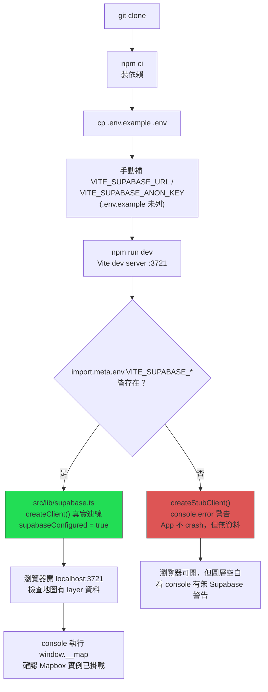

# Mini Taiwan Pulse — Developer Guide

> 產出時間：2026-07-12 · 依 `.trace/_context/recon.md`、`configuration.md`、`web_findings.md` 整理
> 目的：新人 / 新開發環境快速上手，涵蓋環境建置、日常 workflow、測試策略、debug 技巧、貢獻流程。
> 詳細規則以 [`CLAUDE.md`](../CLAUDE.md) 與 [`docs/development-rules.md`](../docs/development-rules.md) 為準，本文件不重複造輪子，只做「照著做就能跑起來」的路徑整理。

---

## 1. Prerequisites 與環境建置

### 1.1 需要的工具與帳號

| 項目 | 版本 / 說明 | 依據 |
|---|---|---|
| Node.js | CI 用 `20`；生產 Docker build 用 `node:22-alpine` | `.github/workflows/ci.yml:17`、`Dockerfile:2` — ⚠️ 兩者不一致，本機開發建議至少 Node 20，若要貼近生產可用 Node 22 |
| 套件管理 | `npm`（`package.json` 無 `packageManager` 欄位，CI 用 `npm ci`） | CI workflow；CLAUDE.md 指令表雖列 `pnpm dev`，但 repo 內只認得 `npm`/`npx` 的 lockfile 慣例，兩者皆可用，**若用 pnpm 需自行確認沒有 lockfile 衝突** ⚠️ 未驗證 |
| TypeScript | `~5.7.0`（devDependency） | `package.json` |
| Vite | `^6.1.0`，dev server 固定 port `3721`（`strictPort`） | `recon.md` §技術棧 |
| Mapbox 帳號 | 需要 `VITE_MAPBOX_TOKEN`（access token），並在 Mapbox 後台設網域白名單 | `docs/launch/07_KEY_SETUP.md` |
| Supabase 專案 | 需要 `VITE_SUPABASE_URL` + `VITE_SUPABASE_ANON_KEY`（anon key 設計上可公開，靠 RLS/RPC 權限保護） | `configuration.md` §2.3 |
| （可選）FlightRadar24 API | `FR24_API_TOKEN`，只有跑 `scripts/fetch/fetch-flights.ts` 才需要 | `.env.example` |
| （可選）AWS S3 帳號 | `S3_ACCESS_KEY` / `S3_SECRET_KEY` / `S3_BUCKET` / `S3_REGION`，只有跑 `scripts/deploy/*` 上傳大檔才需要 | `.env.example` |

### 1.2 Step-by-step

```bash
# 1. Clone
git clone <repo-url> mini-taiwan-pulse
cd mini-taiwan-pulse

# 2. 裝依賴
npm ci        # 或 npm install

# 3. 設定 .env（見下方「.env 落差說明」）
cp .env.example .env
# 編輯 .env，至少補齊：
#   VITE_MAPBOX_TOKEN=<你的 Mapbox token>
#   VITE_SUPABASE_URL=<你的 Supabase 專案 URL>
#   VITE_SUPABASE_ANON_KEY=<你的 Supabase anon key>

# 4. 啟動 dev server
npm run dev   # http://localhost:3721
```

### 1.3 ⚠️ `.env.example` 不完整 — 手動補齊事項

`configuration.md` §1.1/§1.4 已核實：**`.env.example` 缺少 Supabase 三個核心變數**（`VITE_SUPABASE_URL`、`VITE_SUPABASE_ANON_KEY`，以及腳本用的 `SUPABASE_SERVICE_ROLE_KEY`/`SUPABASE_DB_URL`），實際型別要求以 `src/vite-env.d.ts` 為準（`VITE_MAPBOX_TOKEN`/`VITE_SUPABASE_URL`/`VITE_SUPABASE_ANON_KEY` 皆為必填）。建置 `.env` 時請照下表補：

```env
# .env.example 已有
VITE_MAPBOX_TOKEN=your_mapbox_access_token_here
VITE_WASTE_MATCHED_TRAILS=1
FR24_API_TOKEN=your_flightradar24_api_token_here
# VITE_IMAGERY_CDN_BASE=...（選填，CWA 衛星影像 CDN，不填會走既有 base64 RPC）

# .env.example 缺、但前端啟動必要（手動補）
VITE_SUPABASE_URL=https://<your-project>.supabase.co
VITE_SUPABASE_ANON_KEY=<your-anon-key>

# 只有跑 scripts/export|audit|preprocess 才需要（手動補）
SUPABASE_SERVICE_ROLE_KEY=<service-role-key，禁止進前端 bundle>
SUPABASE_DB_URL=<psql 連線字串>

# 只有跑 scripts/deploy/upload-to-s3.ts 等上傳腳本才需要
S3_BUCKET=migu-gis-data-collector
S3_ACCESS_KEY=your_aws_access_key_here
S3_SECRET_KEY=your_aws_secret_key_here
S3_REGION=ap-southeast-2
```

另外 CLAUDE.md 環境變數表提到的 `VITE_DATA_SOURCE=supabase` 已核實為**死配置**（`configuration.md` §1.3：`grep -rn "VITE_DATA_SOURCE" src/` 無結果，Pulse API 備援分支已被移除，前端現在無條件走 Supabase），可忽略、不必設定。

### 1.4 環境建置 flowchart



---

## 2. 本地開發 workflow

### 2.1 啟動

```bash
npm run dev      # Vite dev server，固定 port 3721（strictPort，被佔用會直接失敗，不會跳號）
npm run build    # tsc -b && vite build（見第 6 節）
npm run preview  # 本地預覽 production build
```

### 2.2 如何確認 Supabase 連線成功 vs 靜默退化成 stub client ⚠️ 重點

這是本專案最容易踩的坑（`configuration.md` §3.1/§7 已詳細記錄）：**env 沒設不會讓 app crash，只會整站沒資料**。

- 真連線：`src/lib/supabase.ts` 用 `createClient()`，`supabaseConfigured = true`，`src/data/*Loader.ts` 的 `.rpc()`/`.from()` 呼叫會打真的 Supabase。
- 假連線（stub）：任一 `VITE_SUPABASE_URL`/`VITE_SUPABASE_ANON_KEY` 缺失時，`createStubClient()`（`src/lib/supabase.ts:19-38`）接管，所有 `.rpc()`/`.from()` 一律回傳 `{ data: null, error }`，**不拋錯、不中斷 render**，只在瀏覽器 console 印一則 `console.error` 警告。

**排查步驟**：
1. 打開瀏覽器 DevTools console，確認開機時有沒有 `src/lib/supabase.ts` 印出的 Supabase 未設定警告。
2. 地圖能開但所有圖層（船舶、航班、軌道、公車…）都是空的 → 先懷疑 stub client，檢查 `.env` 是否真的有 `VITE_SUPABASE_URL`/`VITE_SUPABASE_ANON_KEY` 且 dev server **重啟過**（Vite 的 `import.meta.env.VITE_*` 是 build-time inline，改 `.env` 後必須重啟 `npm run dev` 才生效，單純 HMR 不會重新讀 env）。
3. 若要在瀏覽器直接檢查目前地圖 layer/source 狀態，見第 4 節 `window.__map`。

同樣的「build-time inline 而非 runtime 讀取」機制，在 Docker/Zeabur 部署時也是已知風險點（`configuration.md` §3.1）：若改用純本地 `docker build` 卻沒額外帶 `VITE_SUPABASE_URL`/`VITE_SUPABASE_ANON_KEY`，build 出來的 image 一樣會是 stub 版本——本機開發時若你用 docker-compose 而非 `npm run dev`，也要留意這點。

### 2.3 開發時常見的資料層路徑

- 新增/修改 layer 一律先跑 `layer-onboarding` skill 或 `/new-layer` slash command（CLAUDE.md §5），本文件不重複 7 步流程。
- Supabase RPC loader 一律要接 `src/lib/loadingRegistry.ts`（CLAUDE.md §3），否則會被 `claude-review.yml` 的 PR 自動 review 抓到。

---

## 3. 測試策略

### 3.1 執行方式

```bash
npm test         # vitest run（單次跑完退出，CI 用這個）
npm run test:watch  # vitest（watch mode，本地開發用）
```

### 3.2 涵蓋範圍

`vitest.config.ts` 設定：

```ts
export default defineConfig({
  test: {
    include: ["src/**/*.test.ts"],
    environment: "node",
  },
});
```

- 只吃 `src/**/*.test.ts`，**不含 `.test.tsx`**——目前測試策略聚焦「純邏輯層」（loader 轉換邏輯、hook 內部函式、config 一致性檢查），沒有 React component render 測試，也沒有 `@testing-library/react` 依賴。
- `environment: "node"`（非 `jsdom`）——測試不模擬瀏覽器 DOM，任何依賴 `window`/`document` 的程式碼（例如 `window.__map`）**不會**被單元測試涵蓋到，這類邏輯只能靠手動瀏覽器驗證或未來補 e2e。
- Repo 目前共 17 個 `.test.ts` 檔案（`src/data/__tests__/`、`src/map/__tests__/`、`src/components/sidebar/__tests__/` 等）。

### 3.3 `layerConsistency` ratchet 測試詳解

檔案：`src/components/sidebar/__tests__/layerConsistency.test.ts`

**用途**：CLAUDE.md §4a「圖層 UX 四鐵則」中「分類 ≥ 2 種必寫圖例」等接線規則的自動化 enforcement。這是一個 **ratchet 測試**（只進不退）：

1. 掃描 `LAYER_COLORS`/`SECTIONS`（`src/components/sidebar/layerCatalog.ts`）、`LEGEND_REGISTRY`（`src/components/LegendPanel.tsx`），並用 `readFileSync` 讀 `src/hooks/useTransportParams.ts` 原始碼文字做字串比對（`case "key"` / `visibility.key` pattern）。
2. 對照三個 baseline allowlist：`BASELINE_NOT_IN_SIDEBAR`（已知沒有 sidebar toggle 的 layer）、`BASELINE_NO_PARAMS`（已知沒有透明度 slider 的 layer），還有圖例相關的 baseline。
3. **雙向都會 fail**：
   - 新 layer 漏接線（沒進 baseline，卻缺少對應 UI/legend/params）→ fail，提示去補接線。
   - Layer 已經補齊接線了，但還留在 baseline allowlist 裡（沒清掉）→ 一樣 fail，逼你把 baseline 同步更新成最新狀態。

**如何新增白名單例外**（若某 layer 是刻意設計成沒有某項 UI，例如子 UI 控制、裝飾性圖層、Phase 未實作）：直接在 `layerConsistency.test.ts` 對應的 `BASELINE_*` Set 裡加上該 layer 的 key，並在旁邊加註解說明原因。實際範例（`layerConsistency.test.ts` 內既有）：

```ts
const BASELINE_NOT_IN_SIDEBAR = new Set([
  "wasteRoute", "wasteStop", "medICUBeds",
  // Energy MVP：KPI 性質，預定整合到 monitor 面板（LayerVisibility key 保留）
  "powerStatusHud", "powerRegionDemand",
  // ...
]);

const BASELINE_NO_PARAMS = new Set([
  "medICUBeds",
  // wasteScheduleNote：Three.js ShaderMaterial 音符特效，opacity 需動 shader uniform，
  // 屬裝飾性圖層 → 有意識地不做（2026-06-10 決定）
  "wasteScheduleNote",
  "wasteRoute",
  "wasteStop",
  "wasteCleaningSquads",  // 單色綠 POI，無 size/opacity slider（透過 isDark 自動配色）
]);
```

⚠️ 測試檔頭註解自承這是 heuristic（掃字串比對，非 AST），若未來改寫 `useTransportParams.ts` 或 `LegendPanel.tsx` 的結構，需要同步更新比對邏輯，否則測試可能失去偵測能力或誤判。

---

## 4. Debugging 技巧

### 4.1 `window.__map` — 瀏覽器 console 直接操作地圖實例

`src/map/MapView.tsx:268-273`：

```ts
// debug handle：dev 一律暴露；production 帶 ?debug 才暴露
// （給 E2E / 線上排障直接操作相機、查 source/layer 狀態用）
if (import.meta.env.DEV || window.location.search.includes("debug")) {
  (window as unknown as { __map?: mapboxgl.Map }).__map = map;
}
```

- **dev 模式**（`npm run dev`）：一律自動掛載，直接在瀏覽器 console 打 `window.__map` 即可拿到 `mapboxgl.Map` 實例。
- **production**：預設不掛載，需在 URL 加 `?debug` 參數（例如 `https://your-domain/?debug`）才會暴露。

常用排查指令（console 內）：
```js
window.__map.getStyle().layers.map(l => l.id)   // 列出目前所有 layer id
window.__map.getSource("some-source-id")         // 查某 source 狀態
window.__map.getZoom() / window.__map.getCenter()
```

### 4.2 `layerConsistency` 測試失敗時如何解讀

跑 `npm test` 若在 `layerConsistency.test.ts` fail，先判斷是哪個方向：

- **「缺少 XXX」類訊息**：代表你新增/修改的 layer key 出現在 `LAYER_COLORS`/`SECTIONS`，但沒有對應的圖例 / params slider / sidebar toggle，且不在 baseline allowlist 裡 → 去補實作（回頭看 CLAUDE.md §5a 四鐵則），或者這是刻意的設計決定，就照 §3.3 的方式加進 baseline 並寫清楚原因。
- **「baseline 裡有 XXX 但已經接好線」類訊息**：代表你補齊了某個舊 layer 的接線，但忘記把它從 `BASELINE_NOT_IN_SIDEBAR`/`BASELINE_NO_PARAMS` 移除 → 直接刪掉那個 Set 裡的項目即可。

### 4.3 `.claude/pitfalls/` 已知踩坑清單

| 檔案 | 一句話摘要 |
|---|---|
| `2026-04-07-empty-ships-flights.md` | Timeline 顯示 0 船舶/航班，根因不在前端：上游 collector 當機 61 小時 + `datetime.now()` naive 時區 bug 造成 `collected_at` 偏移 8 小時。 |
| `2026-04-22-mapbox-load-once-fired.md` | 用 `map.once('load', attach)` 排程 CustomLayer 掛載，若 hook 觸發時 `load` 事件早已 fire 過，該事件不會再觸發第二次 → attach 永遠不執行，畫面沒東西也不報錯。 |
| `2026-06-20-mapbox-expression-glsl-shader.md` | Phase 8 SSOT 整理時集中記錄的 4 類 Mapbox expression / GLSL shader / image lifecycle silent fail，寫 visual layer 前建議先掃一遍。 |
| `2026-07-01-layer-integration-common-misses.md` | 新 layer 上線常漏項總清單（資料完整性、UX 四鐵則等），作為 `layer-onboarding` skill 的補充資料。 |
| `_TEMPLATE.md` | 新增 pitfall 記錄時使用的模板（日期/嚴重度/受影響範圍/發現方式/耗時等欄位）。 |

新踩到值得記錄的坑，依模板新增檔案，並在完成一段工作後透過 `/wrap-up` skill 決定要不要收錄進 pitfalls（CLAUDE.md「Session 記憶迴圈」）。

### 4.4 CI 綠燈不代表什麼

`configuration.md` §6.1 已核實：`.github/workflows/ci.yml` 的 `npm run build` 步驟**沒有**設定任何 `VITE_MAPBOX_TOKEN`/`VITE_SUPABASE_URL`/`VITE_SUPABASE_ANON_KEY`，故 CI 綠燈只保證「TypeScript 型別正確 + build 不崩潰（走 stub client 路徑）+ node 環境純邏輯單元測試通過」，**不驗證** Supabase/Mapbox 金鑰是否實際可用、地圖能否正常渲染。視覺/整合驗證仍需依 `docs/launch/03_DEPLOY_RUNBOOK.md` 手動跑本地 docker build + 瀏覽器逐層 smoke test。

---

## 5. Contribution Workflow

本專案採 **GitHub Flow**（單人開發，`master` = 生產，`feat/*` 等分支 → PR → squash merge）。完整規則（branch 命名前綴表、commit prefix、PR 流程 7 步、PR 描述模板、hotfix 判準、跨 repo 同步順序）已完整定義於 [`CLAUDE.md` 「Git Workflow」段落](../CLAUDE.md#git-workflowgithub-flow)，本文件不重複貼，重點提醒：

- 新分支同時 `cp -r docs/features/_TEMPLATE docs/features/<slug>` 建功能檔案。
- 完成後必跑 `npx tsc -b` + `pnpm test`（或 `npm test`）全綠才能開 PR。
- `claude-review.yml` 會在 PR opened/synchronize 時自動用 Claude 做 diff-only review，checklist 聚焦兩條最容易犯的規則：**動態圖層 `currentTime` 誤放進 `useEffect` deps**、**Supabase loader 沒接 `loadingRegistry`**（`configuration.md` §6.3）。
- 若 PR 動到跨 repo 資料契約（Supabase schema、S3 檔名契約等），依 CLAUDE.md「跨 repo 同步順序」表，**上游（`taipei-gis-analytics`/`gis-platform`）先動，`mini-taiwan-pulse` 前端接線最後動**。

---

## 6. 相依性管理

### 6.1 `package.json` 主要 dependency 分類

| 分類 | 套件 | 用途 |
|---|---|---|
| 框架 | `react` ^19.0.0, `react-dom` ^19.0.0 | UI |
| 地圖 | `mapbox-gl` ^3.9.0, `mapbox-pmtiles` ^1.0.56, `pmtiles` ^4.4.1 | 向量地圖 + 向量切片 |
| 3D 渲染 | `three` ^0.172.0 | CustomLayer 場景（`src/three/*Scene.ts`） |
| 輔助渲染 | `@deck.gl/core` / `geo-layers` / `layers` / `mapbox` ^9.2.10 | 部分圖層用 |
| 後端 SDK | `@supabase/supabase-js` ^2.101.1 | Supabase client（唯一建立點：`src/lib/supabase.ts`） |
| 空間運算 | `h3-js` ^4.4.0 | 六角格人口/人流密度 |
| 衛星軌道 | `satellite.js` ^5.0.0 | 衛星圖層計算 |
| LLM 聊天 | `ai` ^7.0.11 + `@ai-sdk/anthropic` / `@ai-sdk/google` / `@ai-sdk/openai` | BYOK 多 LLM 聊天（`src/chat/`） |
| Schema 驗證 | `zod` ^4.4.3 | — |
| 雲端儲存（腳本用） | `@aws-sdk/client-s3` ^3.995.0 | `scripts/deploy/*` 上傳大檔到 S3，不進前端 bundle |
| 圖示 | `lucide-react` ^0.576.0 | — |
| Env 讀取（腳本用） | `dotenv` ^17.3.1 | `scripts/*` Node 端讀 `.env`，前端不需要（Vite 內建處理 `VITE_*`） |

devDependencies：`typescript` ~5.7.0、`vite` ^6.1.0、`vitest` ^3.2.6、`@vitejs/plugin-react` ^4.3.0、`tsx` ^4.21.0（跑 `scripts/*.ts`）、`@types/react` / `@types/react-dom` / `@types/three`。

### 6.2 `tsc -b` 在 CI 中的角色

`package.json` 的 `build` script 是 `tsc -b && vite build`，CI（`.github/workflows/ci.yml`）直接跑 `npm run build`，故任何 TypeScript 型別錯誤都會讓 CI 直接 fail。

**為何是 `tsc -b` 而不是 `tsc --noEmit`**（`configuration.md` §4.2，CLAUDE.md 明確禁用 `--noEmit`）：
- 專案用 TypeScript **project references**（`tsconfig.json` 只放 `references: [{ path: "./tsconfig.app.json" }]`，本身 `files: []` 不編譯任何檔案）。
- `tsc -b` 是 project references 專用的 build mode，會依 references 圖遞迴、依序建置子專案，並用 `.tsbuildinfo` 做增量編譯。
- `tsc --noEmit` 是設計給單一專案用的旗標，在 project references 模式下**不會**真正驗證 references 圖的建置正確性——這是 CLAUDE.md 強制要求本機開發者也用 `npx tsc -b`（而非慣用的 `tsc --noEmit`）驗證的原因，確保本機驗證結果與 CI 一致。
- `tsconfig.app.json` 開啟 `strict` + `noUnusedLocals` + `noUnusedParameters` + `noFallthroughCasesInSwitch` + `noUncheckedIndexedAccess` 全套嚴格檢查，這也是「用型別系統做架構約束」（例如漏補 `LAYER_COLORS` key 會直接編譯期報 `TS2739`）的技術基礎。

⚠️ CI（`node-version: '20'`）與生產 Docker build（`node:22-alpine`）Node major 版本不一致，理論上 CI 綠燈不完全保證生產容器行為一致，但目前未發現因此產生的實際問題（`configuration.md` §6.1 標記為潛在風險，非已知事故）。

---

## 7. 延伸閱讀

- [`CLAUDE.md`](../CLAUDE.md) — 完整開發規則索引（本文件的規則章節皆連結至此，不重複展開）
- [`docs/development-rules.md`](../docs/development-rules.md) — 開發規則詳細版
- [`docs/launch/03_DEPLOY_RUNBOOK.md`](../docs/launch/03_DEPLOY_RUNBOOK.md) — 完整部署步驟（含 Zeabur 環境變數清單）
- [`docs/launch/07_KEY_SETUP.md`](../docs/launch/07_KEY_SETUP.md) — Mapbox/Supabase 金鑰申請與白名單設定
- [`docs/known-issues.md`](../docs/known-issues.md) — 歷史事故復盤（含診斷指令）
- [`docs/supabase-optimization.md`](../docs/supabase-optimization.md) — Pre-aggregate pattern 完整指南
- `.trace/_context/configuration.md` — 本指南環境變數/CI/Docker 章節的完整佐證來源
