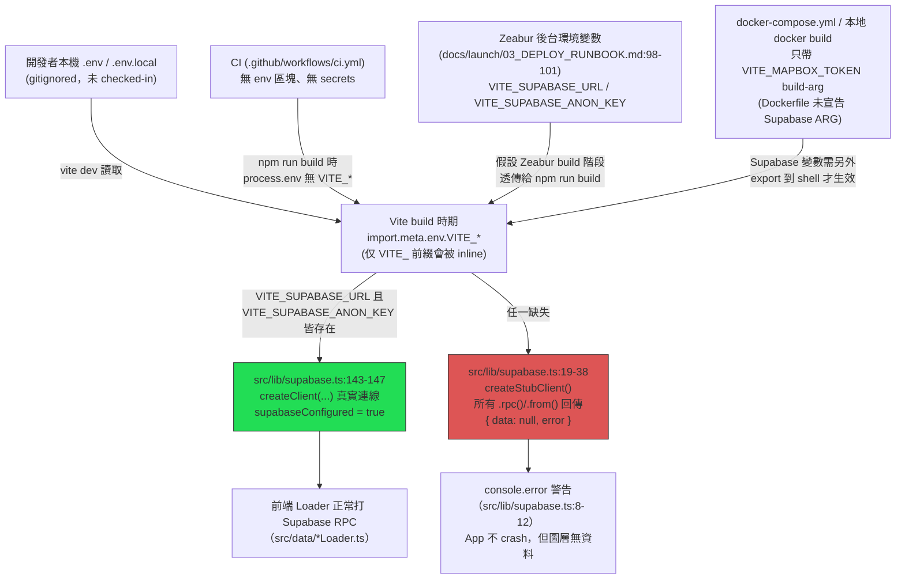

# Stage 2 — 設定與環境追蹤

> 產出時間：2026-07-12 · 依 `.trace/_context/recon.md` 背景延伸
> 範圍：環境變數載入機制、Secrets 管理、Docker/部署設定注入、TypeScript project references、測試設定、CI

## 1. 設定載入機制

### 1.1 `.env.example` 實際內容

`.env.example:1-14` 只列出以下變數（**不含** CLAUDE.md 提到的 `VITE_SUPABASE_URL`/`VITE_SUPABASE_ANON_KEY`/`SUPABASE_SERVICE_ROLE_KEY`/`SUPABASE_DB_URL`/`VITE_DATA_SOURCE`，見 1.4 節落差說明）：

```
VITE_MAPBOX_TOKEN=your_mapbox_access_token_here
VITE_WASTE_MATCHED_TRAILS=1
FR24_API_TOKEN=your_flightradar24_api_token_here

# CWA 衛星/雷達影像讀取路徑（AR-11d feature flag）
# VITE_IMAGERY_CDN_BASE=https://pub-eae6980c040441adbd1eaded2870d3d2.r2.dev

# S3 (upload script)
S3_BUCKET=migu-gis-data-collector
S3_ACCESS_KEY=your_aws_access_key_here
S3_SECRET_KEY=your_aws_secret_key_here
S3_REGION=ap-southeast-2
```

`.gitignore:3-4` 排除 `.env` / `.env.local`，故實際本機/生產金鑰不進 git，`.env.example` 是唯一 checked-in 的變數清單樣板 —— 但該樣板本身**不完整**（缺 Supabase 三個核心變數），是本次追蹤發現的第一個落差。

### 1.2 `import.meta.env`（Vite 前綴機制）

- `src/vite-env.d.ts:1-13` 宣告 `ImportMetaEnv` 型別，僅列出 `VITE_MAPBOX_TOKEN`（必填）、`VITE_SUPABASE_URL`（必填）、`VITE_SUPABASE_ANON_KEY`（必填）、`VITE_WASTE_MATCHED_TRAILS?`（可選）、`VITE_IMAGERY_CDN_BASE?`（可選）。這是型別層面的「應該存在」清單，與 `.env.example` 的實際內容不一致（`.env.example` 缺 Supabase 兩項）。
- Vite 內建規則：只有 `VITE_` 前綴的變數會被靜態替換進前端 bundle（build time inline），非 `VITE_` 前綴變數（如 `FR24_API_TOKEN`、`S3_ACCESS_KEY`）**不會**出現在前端產物中，只給 Node 端腳本（`scripts/*`）用 `dotenv`（`package.json` dependencies 含 `dotenv ^17.3.1`）或 shell 環境變數讀取。
- `src/lib/supabase.ts:3-4` 讀取時做了非 `VITE_` 前綴的 fallback：
  ```ts
  const SUPABASE_URL = import.meta.env.VITE_SUPABASE_URL ?? import.meta.env.SUPABASE_URL;
  const SUPABASE_ANON_KEY = import.meta.env.VITE_SUPABASE_ANON_KEY ?? import.meta.env.SUPABASE_ANON_KEY;
  ```
  但因 Vite 只 inline `VITE_*` 前綴變數，`import.meta.env.SUPABASE_URL`（無前綴）在瀏覽器端實際上永遠是 `undefined`（Vite 編譯期就把它替換掉，不是 runtime 讀取），這行 fallback 在瀏覽器 build 下是死路徑，僅在型別上留了彈性。
- 其他直接讀 `import.meta.env.VITE_SUPABASE_URL` / `VITE_SUPABASE_ANON_KEY` 的位置：`src/data/satelliteLoader.ts:14-15`、`src/data/railScheduleLoader.ts:9-10`、`src/lib/sessionTracker.ts:44-45`。四處各自重複讀取（無集中的 config 模組），`src/lib/supabase.ts` 是唯一真正建立 `SupabaseClient` 的地方，其餘三處是各自 loader 內部直連 `fetch`/其他用途。

### 1.3 `VITE_DATA_SOURCE` feature flag — 程式碼中查無實作

CLAUDE.md（`CLAUDE.md`「環境變數」表格）記載 `VITE_DATA_SOURCE=supabase` 用途為「啟用 Supabase（否則用 Pulse API）」，並在 `docs/launch/03_DEPLOY_RUNBOOK.md:100` 列為 Zeabur Runtime env 之一。但實際搜尋 `src/**/*.ts(x)`：

```
grep -rn "VITE_DATA_SOURCE" src/  → 無結果
```

`src/vite-env.d.ts` 的 `ImportMetaEnv` 型別也未宣告此欄位。對照 nginx.conf 的註解（`nginx.conf` 約第 120 行附近）：

> `（已移除 /api/ → pulse-api proxy：前端全走 Supabase，不再使用 pulse-api...）`

可判定：Pulse API 備援分支在某次重構中已被整個移除（前端現在**無條件**走 Supabase），但 `VITE_DATA_SOURCE` 這個 flag 名稱殘留在 CLAUDE.md 與 `docs/launch/03_DEPLOY_RUNBOOK.md` 的部署清單裡，屬於**文件落後於程式碼**的死配置（dead config）。日後若要清理，建議同時移除 CLAUDE.md「環境變數」表格中的該行與 Zeabur 後台實際設定的該環境變數（不影響行為，純粹避免誤導）。

### 1.4 環境變數落差總表

| 來源 | `VITE_SUPABASE_URL` | `VITE_SUPABASE_ANON_KEY` | `VITE_DATA_SOURCE` | `SUPABASE_SERVICE_ROLE_KEY` | `SUPABASE_DB_URL` |
|---|---|---|---|---|---|
| `.env.example` | ❌ 未列 | ❌ 未列 | ❌ 未列 | ❌ 未列 | ❌ 未列 |
| `src/vite-env.d.ts`（型別宣告） | ✅ 必填 | ✅ 必填 | ❌ 未宣告 | — | — |
| 實際程式碼讀取（`src/`） | ✅ 4 處（見 1.2） | ✅ 4 處（見 1.2） | ❌ 無 | ❌ 無（前端不該碰） | ❌ 無（前端不該碰） |
| `scripts/` 讀取 | — | — | — | ✅ 2 支腳本（見 §2） | ✅ 4 支腳本（見 §2） |
| CLAUDE.md「環境變數」表 | ✅ 提及 | ✅ 提及 | ✅ 提及（死配置） | ✅ 提及 | ✅ 提及 |
| `docs/launch/03_DEPLOY_RUNBOOK.md:100` | ✅ Zeabur Runtime env | ✅ Zeabur Runtime env | ✅ Zeabur Runtime env（死配置） | — | — |

**結論**：`.env.example` 應視為「範例不完整」而非權威清單；真正的權威來源是 `src/vite-env.d.ts`（型別，前端）+ `docs/launch/03_DEPLOY_RUNBOOK.md`（部署清單，Zeabur 實際變數）。`VITE_DATA_SOURCE` 是唯一已知的殘留死配置。

## 2. Secrets 管理

### 2.1 `SUPABASE_SERVICE_ROLE_KEY` 禁止進 bundle 的佐證

- 直接佐證：`src/vite-env.d.ts:1-9` 的 `ImportMetaEnv` 完全不宣告 `SUPABASE_SERVICE_ROLE_KEY`，且此變數**沒有** `VITE_` 前綴 → 依 Vite 規則不會被 build 時 inline 進前端 bundle（見 1.2 節機制說明），這是「技術上不可能進 bundle」而非僅靠約定。
- CLAUDE.md「環境變數」表格明確標註：`SUPABASE_SERVICE_ROLE_KEY` 用途為「腳本（禁止進 bundle）」。
- 實際使用位置（`grep -rln "SUPABASE_SERVICE_ROLE_KEY" scripts/`）：
  - `scripts/deploy/upload_fire_events.py`（上傳消防事件 GeoJSON 到 Supabase `realtime.fire_events`，`scripts/deploy/upload_fire_events.py:1-13` docstring 說明來源與前置 migration）
  - `scripts/deploy/upload_h3_demographics_yearly.py`（H3 人口統計年度資料上傳）
  - 兩支皆為 Python 腳本，透過 `os.environ` 讀取，執行環境是開發者本機或 CI 的 shell，不經過 Vite build pipeline。

### 2.2 `SUPABASE_DB_URL` 使用位置

`grep -rln "SUPABASE_DB_URL" scripts/` 命中 4 支：
- `scripts/export/export-water-static.sh`
- `scripts/export/export-static-rpc-snapshots.sh`
- `scripts/audit/audit_facility_locations.py`
- `scripts/preprocess/extract_climate_uv.py`

皆屬「用 `psql` 直連資料庫做匯出 / 稽核 / 前處理」性質的離線腳本，CLAUDE.md 環境變數表格標註其用途為「psql 直連」，與前端 runtime 完全隔離。

### 2.3 Secrets 隔離小結

```
前端 bundle（VITE_* 前綴，build-time inline）
  └─ VITE_MAPBOX_TOKEN / VITE_SUPABASE_URL / VITE_SUPABASE_ANON_KEY / VITE_WASTE_MATCHED_TRAILS / VITE_IMAGERY_CDN_BASE
     （VITE_SUPABASE_ANON_KEY 依 docs/launch/07_KEY_SETUP.md:57 說明「本來就設計成公開，受 RLS / RPC 權限保護」）

Node 腳本 only（無 VITE_ 前綴，只在 scripts/ 執行環境可見）
  └─ SUPABASE_SERVICE_ROLE_KEY / SUPABASE_DB_URL / S3_ACCESS_KEY / S3_SECRET_KEY / FR24_API_TOKEN
```

## 3. Docker / 部署設定

### 3.1 Dockerfile 兩階段 build（`Dockerfile:1-25`）

```dockerfile
FROM node:22-alpine AS build
...
ARG VITE_MAPBOX_TOKEN
ENV VITE_MAPBOX_TOKEN=$VITE_MAPBOX_TOKEN
RUN npm run build

FROM nginx:alpine
RUN apk add --no-cache aws-cli
COPY nginx.conf /etc/nginx/conf.d/default.conf
COPY --from=build /app/dist /usr/share/nginx/html
...
ENTRYPOINT ["/usr/local/bin/entrypoint.sh"]
```

**關鍵觀察**：`Dockerfile` 只為 `VITE_MAPBOX_TOKEN` 宣告 `ARG`/`ENV`（`Dockerfile:9-10`），**沒有**為 `VITE_SUPABASE_URL` / `VITE_SUPABASE_ANON_KEY` 宣告對應 `ARG`。但這兩個變數是 `import.meta.env.VITE_*` 前綴，必須在 `RUN npm run build`（`Dockerfile:13`）當下就存在於 process env 才能被 Vite inline（見 §1.2）。

對照 `docs/launch/03_DEPLOY_RUNBOOK.md:98-101`：
```
Zeabur 設定：
- Runtime env：S3_ACCESS_KEY S3_SECRET_KEY S3_REGION S3_BUCKET VITE_SUPABASE_URL VITE_SUPABASE_ANON_KEY VITE_DATA_SOURCE=supabase
- Build arg：VITE_MAPBOX_TOKEN
```

此處文件把 `VITE_SUPABASE_URL`/`VITE_SUPABASE_ANON_KEY` 歸類為「Runtime env」而非「Build arg」，但依 Vite 的 build-time inline 機制，若這兩個變數只在 container **runtime**（`entrypoint.sh` 執行階段）才存在、build 階段不存在，则前端 bundle 裡的 `import.meta.env.VITE_SUPABASE_URL` 會被 inline 成 `undefined`，導致 `src/lib/supabase.ts:6-13` 的 `supabaseConfigured` 為 `false`、進而回退到 `createStubClient()`（`src/lib/supabase.ts:19-38`，所有 `.rpc()`/`.from()` 呼叫回傳 `{ data: null, error }`，不會 crash app 但整站無資料）。

**解讀**：Zeabur 平台的 build pipeline（非本地純 `docker build`）通常會把「Runtime env」也一併注入到 build container 的 process env 中（多數 PaaS 對 Dockerfile 沒有顯式 `ARG` 宣告的變數，仍可能因為 `docker build --build-arg` 全量透傳，或 Zeabur 用 buildkit 的 `--secret`/env 注入方式繞過顯式 `ARG` 宣告直接讓 `npm run build` 子行程看到），才使得系統實際能動。但**若有人改用本地 `docker build`（如 `docs/launch/03_DEPLOY_RUNBOOK.md:85` 的 STEP 6 範例指令 `docker build --build-arg VITE_MAPBOX_TOKEN="<token>" -t pulse-local .`）**，因指令中完全沒有帶 `VITE_SUPABASE_URL`/`VITE_SUPABASE_ANON_KEY`，且 Dockerfile 沒有 `ARG` 宣告去接住它們，本地 build 出的 image 會是「Supabase 未設定」的 stub 版本 —— 這是一個**部署設定的隱性風險點**（文件與 Dockerfile 對「Supabase 變數該在 build time 還是 runtime 注入」認知不一致），值得在 `docs/launch/03_DEPLOY_RUNBOOK.md` 或 `Dockerfile` 補上明確的 `ARG VITE_SUPABASE_URL` / `ARG VITE_SUPABASE_ANON_KEY` 對齊實際需求。

### 3.2 `docker-compose.yml`（本地開發，非生產路徑）

`docker-compose.yml:1-24` 只做兩件事：
1. build-time 傳入 `VITE_MAPBOX_TOKEN`（`args: VITE_MAPBOX_TOKEN: ${VITE_MAPBOX_TOKEN}`）
2. 把本地 `public/*` 大檔（`aviation_data.json`、`ship_data.json`、`rail/`、各 GeoJSON、H3 JSON 等 15 項）用**唯讀 volume**掛到 `/data/*`，模擬生產環境「大檔走 S3 volume」的路徑結構，讓本地開發不用真的連 S3 也能測到 nginx `/data` fallback 邏輯。同樣未見 Supabase 變數注入，代表本地 `docker-compose` 場景預設也依賴外部 shell 環境（`.env` 或 export）先備妥 `VITE_SUPABASE_*`。

### 3.3 nginx 分流（`nginx.conf`，185 行）

模式固定：`root /data; try_files $uri @dist;`（例：`/geo/`、`/h3/`、`/bus/`、`/forestry/`、`/fishery/`、`/coverage/`）代表「先找 S3 大檔 volume，找不到 fallback 到 dist（git-tracked 小檔）」；另一組（`/water_resources/`、`/agriculture/`、`/sports/`、`/static-rpc/`、`/medical/`、`/base_map/`、`/climate/`、`/fire/`、`/police_justice/`、`/road/`、`/rail/`）只 `root /data`（純 S3，無 dist fallback，因這些資料集在 git 沒有小檔備份）。

`location /` 區塊（SPA fallback，nginx.conf 尾段）額外加了 BC-4 安全 header（2026-07-04 新增，見註解）：
- `X-Frame-Options: SAMEORIGIN`、`X-Content-Type-Options: nosniff`、`Referrer-Policy: strict-origin-when-cross-origin`（`always` 立即生效）
- `Content-Security-Policy-Report-Only`（目前 **Report-Only** 階段，不阻擋，只在 console 記錄違規）：`connect-src` 白名單明確列出 Supabase host（`https://utcmcikhvxnohbxchbrs.supabase.co` + `wss://` 版本）、Mapbox（`api.mapbox.com` / `events.mapbox.com` / `*.tiles.mapbox.com`）、三家 BYOK LLM（`api.anthropic.com` / `api.openai.com` / `generativelanguage.googleapis.com`）、`data.itsmigu.com`、R2 CDN（`pub-eae6980c040441adbd1eaded2870d3d2.r2.dev`，對應 `.env.example` 註解提到的 `VITE_IMAGERY_CDN_BASE`）。註解註明「切正式 enforcing 只需把 header 名稱改成 `Content-Security-Policy`」，代表這是刻意分階段上線的安全加固（BC-4），與 recon.md 觀察一致。

### 3.4 `entrypoint.sh` 啟動流程（`scripts/deploy/entrypoint.sh`）

1. nginx **立即前景啟動**（優先通過 Zeabur 健康檢查），避免因大量 S3 pull（~600MB）拖慢部署。
2. 若有 `S3_ACCESS_KEY`/`S3_SECRET_KEY` → **背景**跑 `pull-deploy-assets.sh`（盡力而為，失敗不影響 nginx；`entrypoint.sh` 註解說明 persistent volume + sync 機制讓重啟後幾乎零下載）。
3. 額外背景迴圈：每 `CLIMATE_REFRESH_SEC`（預設 21600 秒 = 6 小時）跑一次 `refresh-climate.sh`，同步氣候 texture（~1.3MB）。
4. `pull-deploy-assets.sh` 用 `aws s3 sync`（2026-06 從逐檔 `cp` 改版），對扁平 S3 結構用 `--include` filter 分流進對應 `/data` 子目錄（`geo/`、`h3/`、`bus/`、`fire/`、`medical/`、`agriculture/`…）。

這一段是**runtime 環境變數**（`S3_ACCESS_KEY`/`S3_SECRET_KEY`/`S3_REGION`/`S3_BUCKET`/`CLIMATE_REFRESH_SEC`）唯一真正在 container runtime 被讀取、影響行為的地方 —— 與 §3.1 討論的「build-time inline 的 `VITE_*` 變數」是完全不同的注入時機，兩者不可混淆（這正是 §3.1 提到的隱性風險成因）。

## 4. TypeScript 設定（project references）

### 4.1 結構

```
tsconfig.json（root）
  { "files": [], "references": [{ "path": "./tsconfig.app.json" }] }
```
`tsconfig.json:1-4` 本身不編譯任何檔案（`files: []`），純粹是 project references 的入口，指向 `tsconfig.app.json`。

`tsconfig.app.json:1-21` 才是真正管 `src/` 的設定：
- `include: ["src"]`
- `noEmit: true`（型別檢查用，不產出 JS —— 實際 JS 產出交給 `vite build`）
- `strict: true` + `noUnusedLocals` + `noUnusedParameters` + `noFallthroughCasesInSwitch` + `noUncheckedIndexedAccess` 全開（後者是 recon.md 提到「用型別系統做架構約束」的技術基礎，例如 `LAYER_COLORS` 若漏 key 會在 `noUncheckedIndexedAccess` 下於存取處直接暴露 `undefined` 風險，或搭配 `Record<keyof LayerVisibility, string>` 產生 TS2739）

### 4.2 為何 `tsc -b` 而非 `tsc --noEmit`

`package.json` build script：`"build": "tsc -b && vite build"`。

`tsc -b`（build mode）是 project references 專用旗標，它會：
1. 依 `tsconfig.json` 的 `references` 圖遞迴解析並**依序**建置每個子專案（此處只有一個 `tsconfig.app.json`，但架構預留了未來拆分多個子專案，如 `scripts/` 獨立 tsconfig 的可能性）。
2. 利用 `.tsbuildinfo` 做增量編譯（incremental），比每次全量 `tsc --noEmit` 快。
3. **關鍵**：`tsc --noEmit` 在 project references 模式下**不會**真正驗證 references 圖的建置正確性（它是設計給單一專案用的旗標，混用 `-b` 語意會被忽略或報錯），故 CLAUDE.md 明確禁止用 `--noEmit`，必須用 `tsc -b` 才能保證「有正確跑過 project references 的完整建置驗證」。

CI 直接執行 `npm run build`（`package.json` → `tsc -b && vite build`），故 `tsc -b` 失敗會讓 CI 直接 fail（見 §6）。

## 5. 測試設定（Vitest）

`vitest.config.ts:1-8`：
```ts
export default defineConfig({
  test: {
    include: ["src/**/*.test.ts"],
    environment: "node",
  },
});
```

- 範圍只吃 `src/**/*.test.ts`（**不含** `.test.tsx`），代表目前測試策略聚焦於「純邏輯層」（loader、hook 內部邏輯、config consistency）而非 React component render 測試 —— 與 recon.md 統計的「17 個 `.test.ts`」一致，且解釋了為何沒有 `@testing-library/react` 之類的相依。
- `environment: "node"`（非 `jsdom`），代表測試不模擬瀏覽器 DOM，故任何依賴 `window`/`document` 的程式碼無法被涵蓋到，測試對象是純函式與資料轉換邏輯。

### 5.1 `layerConsistency` 測試（CLAUDE.md 提到的「擋漏接圖例」機制）

`src/components/sidebar/__tests__/layerConsistency.test.ts:1-60+`：
- 屬於「ratchet 測試」（`layerConsistency.test.ts:1-14` 檔頭註解自述）：把「目前已知的接線缺口」凍結成 baseline allowlist（如 `BASELINE_NOT_IN_SIDEBAR`、`BASELINE_NO_PARAMS`），新 layer 若漏接（未出現在 baseline 卻缺少接線）會 fail；反之 layer 已補齊接線卻仍留在 baseline 也會 fail —— 雙向都會擋，逼迫 baseline 隨程式碼同步更新。
- 資料來源：直接 import `LAYER_COLORS`/`SECTIONS`（`src/components/sidebar/layerCatalog.ts`）與 `LEGEND_REGISTRY`（`src/components/LegendPanel.tsx`），並用 `readFileSync("src/hooks/useTransportParams.ts")` 讀原始碼文字做字串比對（`case "key"` / `visibility.key` pattern）—— 檔頭註解自承這是 heuristic，若 `useTransportParams`/`LegendPanel` 結構改寫需同步更新比對邏輯，屬於「測試脆弱點」但目前有意識地接受此 tradeoff 換取簡單實作。
- 這正是 CLAUDE.md §4a「圖層 UX 四鐵則」中「分類 ≥ 2 種 → 必寫圖例」規則的自動化 enforcement 機制。

## 6. CI 設定（`.github/workflows/`）

三個 workflow：

### 6.1 `ci.yml` — 主要驗證流程

```yaml
on:
  pull_request: { branches: [master] }
  push: { branches: [master] }

jobs:
  test:
    runs-on: ubuntu-latest
    steps:
      - actions/checkout@v4
      - actions/setup-node@v4 (node-version: '20', cache: 'npm')
      - run: npm ci
      - name: TypeScript build (tsc -b + vite build)
        run: npm run build
      - name: Tests (vitest)
        run: npm test
```

**觀察**：
- Node 版本為 `20`，但 Dockerfile 生產 build 用 `node:22-alpine`（`Dockerfile:2`）—— CI 與生產容器的 Node major 版本不一致（20 vs 22），屬於潛在版本飄移風險，若有僅在 Node 22 才出現的行為差異，CI 綠燈不代表生產環境行為完全一致。
- `npm run build` 這一步**沒有**設定任何 `VITE_MAPBOX_TOKEN` / `VITE_SUPABASE_URL` / `VITE_SUPABASE_ANON_KEY` env 或 secrets（workflow 全文搜尋不到 `env:` 區塊），也沒有 `secrets.` 引用。依 §1.2/§3.1 的機制，這代表 CI 跑 `vite build` 時所有 `VITE_*` 變數在 `import.meta.env` 下都是 `undefined`：
  - `src/lib/supabase.ts:6-13` 的 `supabaseConfigured` 判定為 `false` → build 過程只是靜態 inline `undefined`，不會讓 build 失敗（`createStubClient()` fallback 保證 build-time 不 crash）。
  - Mapbox token 缺失則交由 `src/map/MapView.tsx`（或相近的地圖初始化模組）在 runtime 處理，CI 只跑 build + vitest（node 環境測試，不啟動瀏覽器/地圖），故不會觸發。
  - **結論**：CI 綠燈只保證「TypeScript 型別正確 + build 不崩潰 + 純邏輯單元測試通過」，**不驗證**「Supabase/Mapbox 金鑰實際可用、地圖能否正常渲染」，這與 `docs/launch/03_DEPLOY_RUNBOOK.md` STEP 6/8 要求的「本地 docker build + 瀏覽器逐層 smoke test」形成互補（CI 管型別/邏輯，人工 runbook 管視覺/整合驗證）。

### 6.2 `claude-mention.yml` — `@claude` 觸發的協作 workflow

觸發條件（`if:` 區塊）涵蓋 4 種 GitHub 事件：`issue_comment`（含 `@claude`）、`pull_request_review_comment`（含 `@claude`）、`pull_request_review`（review body 含 `@claude`）、`issues`（opened/assigned，body 或 title 含 `@claude`）。使用 `anthropics/claude-code-action@v1`，權限含 `contents: read`、`pull-requests: write`、`issues: write`、`id-token: write`，透過 `secrets.CLAUDE_CODE_OAUTH_TOKEN` 認證。無 `prompt` 輸入，代表用 action 預設行為回應被 mention 的內容。

### 6.3 `claude-review.yml` — PR 自動 code review

觸發於 `pull_request: [opened, synchronize]`，同樣用 `anthropics/claude-code-action@v1` + `CLAUDE_CODE_OAUTH_TOKEN`，但帶了明確 `prompt`（繁體中文）：

> 只 review 本 PR 的 diff，不要主動讀 diff 以外的檔案，不要全 repo 探索。檢查：明顯 bug、TypeScript 錯、動態圖層誤把 currentTime 放進 useEffect deps、Supabase loader 沒接 loadingRegistry。無問題回單行「LGTM」即可；有問題最多列 5 點，每點 1 行，繁體中文。

值得注意這個 prompt 直接對應 CLAUDE.md 兩條核心強制規則（§3「資料載入必須有 Loading UI」、§6「動態圖層時間訂閱」），代表專案把「最容易被 AI 或人類寫出的兩類典型 bug」寫死進自動 review 的 checklist，是 recon.md 提到的「強 Claude Code 協作基礎設施」的具體落地之一。

## 7. 設定載入優先順序（Mermaid）

以「前端 Supabase 連線設定」為例，畫出從各層設定來源到最終 runtime 行為的決策流程：



**圖說**：`VITE_MAPBOX_TOKEN` 有明確的單一注入路徑（Dockerfile `ARG` → build），而 `VITE_SUPABASE_URL`/`VITE_SUPABASE_ANON_KEY` 的注入路徑依部署場景（本機 dev / CI / Zeabur / 本地 docker build）而異，且**沒有一份設定檔案是唯一權威來源** —— `.env.example` 不完整、`Dockerfile` 未顯式宣告、真正生效與否取決於「執行 `npm run build` 那個 process 當下的 shell env」。這是本次追蹤中最值得留意的設定脆弱點：一旦部署方式偏離 `docs/launch/03_DEPLOY_RUNBOOK.md` 記載的 Zeabur 標準流程（例如改用純本地 `docker build` 又忘記額外 export Supabase 變數），會**靜默**退化成 stub client（不 crash，只是整站無資料），排查難度較高。

## 8. 延伸閱讀

- `docs/launch/07_KEY_SETUP.md` — 金鑰輪替與 URL 限制設定（`VITE_MAPBOX_TOKEN` 加白名單網域、`VITE_SUPABASE_ANON_KEY` 公開性說明）
- `docs/launch/03_DEPLOY_RUNBOOK.md` — 完整部署步驟（STEP 1-8），含本文件 §3.1 引用的 Zeabur 環境變數清單
- `docs/scaling-resilience-runbook.md` — 容錯 / 擴展性 runbook，補充 `entrypoint.sh` 背景 pull 失敗時的行為
- `docs/known-issues.md` — 歷史上與環境變數/時區相關的事故（`datetime.now()` naive 導致 +8h 偏移，非本文件範圍但屬同類「隱性設定假設」問題）
- CLAUDE.md「環境變數」表格 — 本文件 §1.3/§1.4 已指出其中 `VITE_DATA_SOURCE` 為死配置，建議未來清理時一併處理
