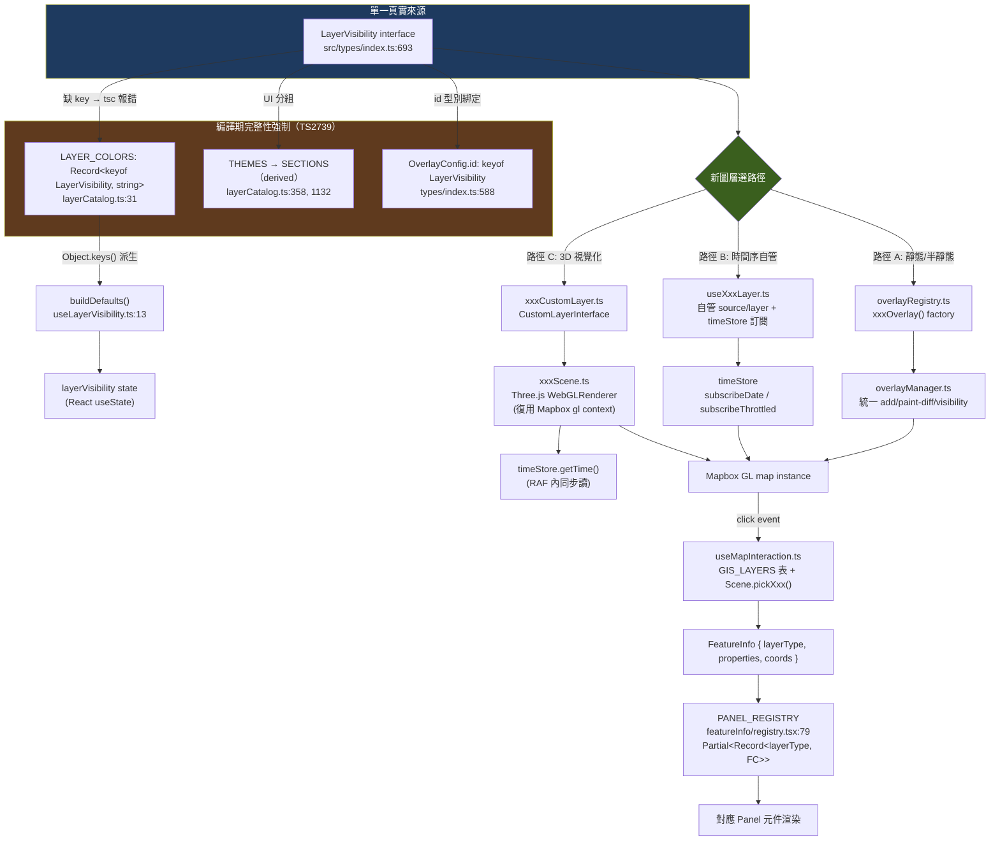

# Stage 2 核心邏輯追蹤 — Layer-plugin 系統與外部時間狀態

> 產出時間：2026-07-12 · 依 `.trace/_context/recon.md` 判定，此專案的「心臟」是
> (1) 命名慣例驅動的 Layer-plugin 架構、(2) 繞過 React state 的 `timeStore` 外部狀態管理。
> 本文件只讀程式碼，不修改任何檔案。

## 目錄

1. [Layer 系統核心 abstraction](#1-layer-系統核心-abstraction)
2. [timeStore 外部狀態管理](#2-timestore-外部狀態管理)
3. [useLayerVisibility：DEFAULT_ON 機制](#3-uselayervisibility)
4. [Click Popup 可擴充機制](#4-click-popup-可擴充機制)
5. [CustomLayer × Three.js 基礎](#5-customlayer--threejs-基礎)
6. [端到端案例：freeway vs parking 對照](#6-端到端案例freeway-vs-parking-對照)
7. [Mermaid 圖：Layer 註冊機制總覽](#7-mermaid-圖layer-註冊機制總覽)

---

## 1. Layer 系統核心 abstraction

### 1.1 這是什麼 pattern？

嚴格說，這**不是**傳統物件導向的抽象基底類別（沒有 `abstract class Layer`、沒有繼承鏈），
而是三個獨立機制的組合，靠 **TypeScript 型別系統做編譯期強制**：

| 機制 | 對應 pattern | 強制手段 |
|---|---|---|
| `LayerVisibility` interface（`src/types/index.ts:693-989`） | **Union-of-flags Registry** — 每個圖層是一個 boolean flag key，不是一個物件實例 | `interface` 缺任何 key 都不會報錯本身，但下游消費者用 `Record<keyof LayerVisibility, ...>` 會報錯 |
| `LAYER_COLORS`（`src/components/sidebar/layerCatalog.ts:31`） | **完整性檢查表（Exhaustiveness map）** | 型別標注為 `Record<keyof LayerVisibility, string>` — 新增一個 `LayerVisibility` key 卻忘記在此補色，TS 會直接報 **TS2739**（Property missing）編譯失敗 |
| `OverlayConfig` / `overlayRegistry.ts` 內的 `xxxOverlay()` 函式 | **Strategy pattern**（每個圖層是一個「如何渲染」的 config 物件，被統一的 overlay engine 消費） | `OverlayConfig.id: keyof LayerVisibility`（`src/types/index.ts:588`）把「渲染設定」與「可見性 key」型別綁死，拼錯字串會直接編譯錯誤 |

也就是說，這套系統用「**一個中心化 union type（`LayerVisibility`）+ 多個以此 type 為 index 的
`Record<keyof LayerVisibility, T>` 完整性表**」達成「新增圖層必須補齊所有接點」的強制力，而不是
用繼承要求子類別實作抽象方法。這正是 recon.md 觀察到的「用型別系統做架構約束」的具體實作方式。

### 1.2 三種圖層渲染路徑

專案裡的圖層依「資料形狀」與「渲染複雜度」分岔成三條路徑，`LayerVisibility` 是唯一共同入口：

```
LayerVisibility[key]: boolean  ←── 唯一的「這個圖層開了嗎」SSOT
        │
        ├─ 路徑 A：宣告式 Overlay（多數靜態/半靜態圖層）
        │    src/map/overlayRegistry.ts → OverlayConfig（Strategy 物件）
        │    → 被 src/map/overlayManager.ts 統一消費：加 Mapbox source/layer、
        │      套 paint diff（避免整層重建）、依 visible 切 layout visibility
        │
        ├─ 路徑 B：自管 Mapbox source/layer 的專屬 hook（時序資料，需要逐幀/逐日更新）
        │    src/hooks/useXxxLayer.ts 自己呼叫 map.addSource / map.addLayer /
        │    setData，繞過 overlayRegistry（因為需要客製化的 timeStore 訂閱邏輯）
        │    例：useFreewayLayer.ts（見 §6）
        │
        └─ 路徑 C：Three.js CustomLayer（3D 視覺化：光球/拖尾/光柱/立體長條）
             src/three/*Scene.ts（純渲染邏輯）
             + src/map/*CustomLayer.ts（Mapbox CustomLayerInterface 生命週期橋接）
             + src/hooks/useThreeJsLayers.ts（React 端統一管理多個 Scene 實例）
```

三條路徑最終都只由 `LayerVisibility[key]` 這一顆 boolean 控制開關，`layerCatalog.ts` 的
`LAYER_COLORS` / `THEMES` 是三條路徑共用的「圖層目錄」單一真實來源。

### 1.3 具體圖層對照

**flights（Three.js 路徑 C）**
- Type：`LayerVisibility.flights`（`src/types/index.ts:694`）
- Loader：`src/data/`（航班快照走 fetch，非本文重點）
- Scene：`src/three/FlightScene.ts`
- CustomLayer：`src/map/customLayer.ts` 內 `createFlightLayer`
- Hook 掛載：`src/hooks/useThreeJsLayers.ts:14`（`import { createFlightLayer, ... } from "../map/customLayer"`）
- Popup：`FeatureInfo.layerType = "ship"` 系列（flights 走 Three.js `pickFlight`，不經 Mapbox `queryRenderedFeatures`，見 `src/hooks/useMapInteraction.ts:156-175`）

**freewayCongestion（自管 hook 路徑 B）**
- Type：`LayerVisibility.freewayCongestion`（`src/types/index.ts:715`）
- Loader：`src/data/freewayLoader.ts`（`fetchFreewayDay` / `buildFreewayGeoJSON`，Supabase RPC `get_freeway_dates`）
- Hook：`src/hooks/useFreewayLayer.ts` — 自行 `map.addSource("freeway-congestion", ...)`、
  `map.addLayer(LAYER_GLOW/LAYER_LINE)`，訂閱 `timeStore.subscribeDate` 換日、
  `timeStore.subscribeThrottled(1000, tick)` 逐秒 binary-search 找最近 snapshot 更新 `setData`
- 沒有走 `overlayRegistry.ts`（因為需要逐秒依 `currentTime` 找 snapshot，`OverlayConfig` 的
  靜態 paint expression 模型不夠用）
- LAYER_COLORS：`src/components/sidebar/layerCatalog.ts:53`（`freewayCongestion: "#ef5350"`）

**parking（宣告式 Overlay 路徑 A，`dynamicData` 混合模式）**
- Type：`LayerVisibility.parkingOnstreet` / `parkingOffstreet`（`src/types/index.ts:814-815`）
- Loader：`src/data/parkingLoader.ts` 提供 `availabilityColorExpr` / `neutralCapacityColorExpr` /
  `sourceCategoryRingExpr` 等 Mapbox expression builder function（純函式，不含 fetch 主體本身在此檔外）
- Overlay config：`src/map/overlayRegistry.ts:23-25` import 上述 expression builder，組成
  `OverlayConfig`（`id: "parkingOnstreet"` 等），走 `overlayManager` 統一生命週期
- Popup：`ParkingOnstreetPanel` / `ParkingOffstreetPanel`（`src/components/featureInfo/registry.tsx:38, 300-301`）

**livestockFarmPig 等 7 個畜牧子圖層（宣告式 Overlay + 共用 source 的典型範例）**
- `src/map/overlayRegistry.ts:76-127` `livestockFarmOverlay()` 是一個 **factory 函式**，
  7 個 `LayerVisibility` key（`livestockFarmPig` ... `livestockFarmOther`）共用同一個
  `sourceId: "livestock-farms"`（同一份資料只 fetch 一次），靠各自的 `filter` 在 Mapbox 端切子集。
  這示範了「一個 `LayerVisibility` key ≠ 一次網路請求」——registry 允許多 key 共用底層 source。

---

## 2. timeStore 外部狀態管理

檔案：`src/state/timeStore.ts`（全文 237 行）。

### 2.1 Pattern 判定

**Observer / Pub-Sub store**，搭配 React 18+ 的 `useSyncExternalStore` 在 UI 層讀取
（`timeStore.ts` 本身不含 React import，是純 TS 模組級單例；`useSyncExternalStore` 的接線在消費端
hook，例如 timeline UI 元件）。核心手法：

```
let currentTime = ...            // 模組級可變狀態（非 React state）
const rawListeners = new Set();  // 訂閱者registry
setTime(t) { currentTime = t; notifyRaw(); notifyThrottled(); ... }  // 寫入 + 主動通知
```

這是教科書式的「外部 store + 手動訂閱」模式，等同 Redux/Zustand 的最小實作，但這裡連
第三方 state 函式庫都沒用，直接手刻 `Set<Listener>` + closure。

### 2.2 為什麼要繞過 React state（效能考量）

檔案開頭註解直接說明理由（`src/state/timeStore.ts:1-13`）：

> 動態圖層的時間來源。目的是讓動畫迴圈脫離 React re-render 週期：
> 時間變動透過 subscribe 通知，而不是 setState 觸發整棵元件樹重算。

具體原因：
- Timeline 播放時 `currentTime` 可能每秒更新數十次（RAF 驅動的動畫迴圈）。
- 若 `currentTime` 是 React state 或存在 Context，每次更新會觸發訂閱該 state/context 的
  **所有**元件重新 render + reconcile——而地圖上同時有 91 個 `use*Layer` hook，多數只關心
  「日期變了沒」或「該不該重畫」，不需要每幀都收到通知。
- 用外部 store，animation loop（Three.js `render()` 內、CustomLayer 的 `render(gl, matrix)`）
  可以直接 `timeStore.getTime()` 同步讀值，完全不經過 React reconciliation；
  真正需要「資料變了才重算」的 hook（例如 freeway lookup）改用節流訂閱，主動控制通知頻率；
  只在意日期切換的 loader（例如跨日 prefetch）用 `subscribeDate`，完全不會被逐秒的 tick 打擾。
- CLAUDE.md 第 6 條明確把這條規則寫成專案級強制項：「動態 / 時序圖層**禁止**把 `currentTime`
  放進 React `useEffect` / `useMemo` deps」——因為放進 deps 意味著每次 tick 都要重跑整個 effect
  （重新註冊 Mapbox 事件、重建 closure 等），這在 91 個圖層規模下會是效能災難。

### 2.3 四種訂閱介面的差異與適用時機

| 介面 | 頻率 | 適用場景 | 範例（本次追蹤到的實際呼叫點） |
|---|---|---|---|
| `getTime()` | 同步讀，無訂閱 | RAF / per-frame 內讀值，不需要「變了通知我」 | Three.js `render(matrix)` 內部直接呼叫（`CustomLayer.render` 生命週期，見 §5） |
| `subscribe(cb)` | **每次** `setTime` 都觸發（高頻，raw） | 動畫迴圈本身需要精確逐幀值 | `rawListeners`（`timeStore.ts:33,48-50`）——註解標明「動畫迴圈用；高頻」 |
| `subscribeThrottled(ms, cb)` | 依 `ms` 節流，trailing-edge 保證最後一次會送 | filter / lookup / UI 顯示，值變動快但消費端不需要每幀反應 | `useFreewayLayer.ts:230`：`timeStore.subscribeThrottled(1000, tick)` — 每秒 binary-search 找最近 snapshot，1 秒節流因為資料本身是 10 分鐘粒度，逐幀算浪費 |
| `subscribeDate(cb)` | 只在**日期**（`YYYY-MM-DD`，Asia/Taipei）變化時觸發，且走 300ms leading+trailing debounce（`dateNotifier`） | 跨日資料載入（RPC 換日期參數重打） | `useFreewayLayer.ts:183`：`timeStore.subscribeDate(handler)` — 換日才重新 `fetchFreewayDay` |

`subscribeDate` 特別值得注意的細節（`timeStore.ts:52-56`）：日期通知刻意做成
**leading+trailing debounce（`quietMs: 300`）**，理由是「快速 scrub 跨多天只通知『最後停下來的
日期』，避免 6~10 個 hook 同時為中間日期打出 RPC 洪流」——這是拖曳 timeline 快速跨日時的
效能保護機制，`dateNotifier.push()`（`createDateNotifier`，`src/state/dateNotifier.ts`）實作。

### 2.4 額外機制：`wallClock`（真實時間，非資料時間軸）

`timeStore.ts:186-236` 同檔還輸出一個**獨立**的 `wallClock` store，用途完全不同：

- `timeStore` 管的是「資料時間軸」（可被 `useTimeline` 改寫、可回放歷史、可暫停）。
- `wallClock` 管的是「牆上時鐘」（`Date.now()`，永遠往前走，給「3 分鐘前」這類 UI 用）。
- 同樣走 subscribe 模式，但額外做了 **per-ms-bucket 共享 timer**（`wallBuckets: Map<number, WallBucket>`）：
  多個訂閱者若用同一個 `ms`（例如都要 1Hz tick），只會共用一個 `setInterval`，訂閱數歸零才清掉 timer——避免每個元件各自開一個 `setInterval` 造成 timer 氾濫。

---

## 3. useLayerVisibility

檔案：`src/hooks/useLayerVisibility.ts`（31 行，全文已讀）。

### 3.1 `DEFAULT_ON` 機制

```ts
const DEFAULT_ON: ReadonlySet<keyof LayerVisibility> = new Set<keyof LayerVisibility>([]);
```

目前（2026-07-12 快照）這個 Set 是**空集合**——註解（`useLayerVisibility.ts:10`）說明：
「全部預設關閉：訪客一進站不打任何 RPC；PMTiles 圖層也依使用者 toggle 才顯示。」
這是效能 / 成本考量的產品決策：避免訪客一開站就觸發 91 個 hook 全部打 API。

### 3.2 「預設 false 自動派生」邏輯

```ts
function buildDefaults(): LayerVisibility {
  const keys = Object.keys(LAYER_COLORS) as (keyof LayerVisibility)[];
  return Object.fromEntries(
    keys.map((k) => [k, DEFAULT_ON.has(k)]),
  ) as unknown as LayerVisibility;
}
```

關鍵設計：**key 全集不是手寫的，而是從 `LAYER_COLORS` 的 `Object.keys()` 派生**
（`useLayerVisibility.ts:14`）。因為 `LAYER_COLORS` 已經被型別強制為
`Record<keyof LayerVisibility, string>`（§1.1），所以：

1. 新增一個 layer → 只需要在 `LayerVisibility` 補 key + 在 `LAYER_COLORS` 補色（tsc 會強制後者）。
2. **不需要**手動改 `useLayerVisibility.ts`——`buildDefaults()` 會自動把新 key 收進來，
   預設值為 `false`（除非額外把該 key 加進 `DEFAULT_ON`）。

這正是 CLAUDE.md「新增 layer 強制順序」第 7 條的原文依據：「僅『預設開啟』才需加
`DEFAULT_ON`（預設 false 自動派生）」。這是一個典型的「單一資料源（`LAYER_COLORS` 的 key 集合）
派生出下游多個結構」的做法，避免多處維護同一份 key 清單導致漂移。

---

## 4. Click Popup 可擴充機制

兩個檔案協作：

- `src/hooks/useMapInteraction.ts`（561 行，已讀全文）：**事件層**——`map.on("click", ...)`
  的統一 handler，決定「點到什麼」。
- `src/components/featureInfo/registry.tsx`：**渲染層**——`layerType → panel 元件` 的查表。

### 4.1 判定順序（`useMapInteraction.ts` 內 `bindEvents`）

click handler 依序嘗試多種「拾取」策略，**先 Three.js 場景物件、後 Mapbox 向量圖層**：

```
1. rail（railScene.pickTrain，僅 vis.rail 開啟時）
2. wasteSchedule（wasteScheduleScene.pickRoute）
3. busLive（busScene.pickBus）
4. touristShuttleLive（共用 bus tooltip）
5. ships（shipScene.pickShip）→ 直接組 FeatureInfo（layerType: "ship"）
6. flights（flightScene.pickFlight）→ tooltipInfo（獨立於 FeatureInfo 的簡化 tooltip）
7. waterReservoirs（reservoirScene.pickReservoir）→ FeatureInfo（layerType: "waterDam"）
8. 以上皆未命中 → 查 GIS_LAYERS 表（Mapbox queryRenderedFeatures，見下）
9. 仍未命中 → 若 windField/oceanCurrents 開啟，改用 sampleClimateFields 讀 UV 場值
```

Three.js 物件（flights/ships/rail/bus/reservoir）走**自訂 picking 演算法**（各 Scene 類別的
`pickXxx(screenX, screenY, w, h)` 方法），因為它們不是 Mapbox native feature，
`map.queryRenderedFeatures` 查不到——這是 Three.js CustomLayer 混合渲染必須額外處理的代價。

### 4.2 `GIS_LAYERS` 登記表（純 Mapbox 向量圖層的「登記自己」機制）

`useMapInteraction.ts:210-400` 是一個**巨大陣列**：

```ts
const GIS_LAYERS: { layers: string[]; type: FeatureInfo["layerType"] }[] = [
  { layers: ["road-congestion-hit"], type: "roadCongestion" },
  { layers: ["submarine-cables-line", "submarine-cables-glow"], type: "submarineCable" },
  ...（超過 130 筆）
];
```

- 每筆是「一組 Mapbox layer id → 對應的 `FeatureInfo.layerType`」。
- Click handler 逐筆用 `map.queryRenderedFeatures(bbox, { layers: existingIds })` 命中檢測
  （bbox 是點擊點 ±5px 的容錯框），命中後組出 `FeatureInfo`（含 `properties` + `coords`），
  呼叫 `setFeatureInfo(...)`。
- **登記新圖層 popup 的機制** = 在此陣列**加一行**（layer id 對應到 Mapbox layer 建立時的
  id，與 `overlayRegistry.ts` 裡 `OverlayLayerSpec.suffix` 組出的實際 layer id 必須一致，
  慣例是 `${sourceId}-${suffix}`，註解 `useMapInteraction.ts:360` 明確提到）。
- 特例：`roadCongestion` 的 `level` 存在 **feature-state**（非 baked GeoJSON properties），
  所以命中後要額外 `{...f.properties, ...f.state}` 合併（`useMapInteraction.ts:421-423`）——
  這是因為該圖層用 `setFeatureState` 做逐秒染色（避免整層 `setData` 重建）。
- 陣列內的**順序即優先權**：小範圍/點層排前面、大面積 polygon（例如
  `agri-soil-fill`、`fire-isochrone-coverage-fill`、`base-*-boundary-fill`）刻意排在最後，
  避免大面積圖層「擋住」下方細小的點層可點選性（見多處中文註解，如 `:344, :349, :353`）。

### 4.3 Panel Registry（渲染層）

`src/components/featureInfo/registry.tsx:79` 起：

```ts
export const PANEL_REGISTRY: Partial<Record<FeatureInfo["layerType"], FC<PanelProps>>> = {
  submarineCable: SubmarineCablePanel,
  ...
};
```

- Key 是 `FeatureInfo["layerType"]`（`src/types/index.ts:618` 起的巨大 union type，
  與 `LayerVisibility` 是**平行但獨立**的 union——不是所有 `LayerVisibility` key 都有對應
  `FeatureInfo.layerType`，因為部分圖層不可點選；也有多個 `LayerVisibility` key 共用同一個
  `layerType`，例如 7 個 `livestockFarmXxx` 都指向同一個 `"livestockFarm"` popup）。
- 用 `Partial<Record<...>>` 而非完整 `Record`——檔案頂端註解明確說明這是刻意設計：
  `groundwaterWell` / `iotWraRiver` / `iotWraStructure` 「自始沒有專屬 panel，維持原行為」，
  用 `layerConsistency` / `featureInfoRegistry` 測試守備「漏接」而非型別系統本身強制
  （因為 `Partial` 允許缺 key，這點與 `LAYER_COLORS` 的完整 `Record` 形成對比——
  popup 是「可選」擴充點，顏色是「必選」）。
- 新增圖層 popup 的完整步驟（檔案頂端註解 `registry.tsx:3-4`）：
  「寫 panel 元件（放對應 domain 檔，例如 `agriPanels.tsx`）→ 此處各加一行」。

---

## 5. CustomLayer × Three.js 基礎

### 5.1 Mapbox `CustomLayerInterface` 生命週期

以 `src/map/lighthouseCustomLayer.ts`（54 行，已讀全文）為範例，這是最簡潔的 CustomLayer 範本：

```ts
export function createLighthouseLayer(opts: LighthouseLayerOptions): CustomLayerInterface {
  const scene = new LighthouseScene();   // ① 建立對應的 Three.js Scene 封裝物件
  let map: MapboxMap | null = null;
  let initialized = false;

  return {
    id: "lighthouse-3d",
    type: "custom" as const,
    renderingMode: "3d" as const,

    onAdd(mapInstance, gl) {             // ② Mapbox 呼叫時機：map.addLayer() 時
      map = mapInstance;
      scene.init(gl);                    // 用 Mapbox 傳入的同一個 WebGL context 初始化 Three.js renderer
    },

    render(_gl, matrix) {                // ③ 每幀呼叫（Mapbox 的渲染迴圈驅動）
      if (!initialized) { ...懶初始化資料... }
      scene.playing = opts.getIsPlaying();      // 從外部（React ref / getter）拉最新參數
      if (!opts.getIsVisible()) return;         // visibility 由 caller 的 getter 決定，不是 layout property
      scene.render(matrix);                     // matrix = Mapbox 投影矩陣，餵給 Three.js camera
      map?.triggerRepaint();                    // 主動要求 Mapbox 下一幀繼續渲染（動畫持續）
    },

    onRemove() {                          // ④ map.removeLayer() 時呼叫
      scene.dispose();
    },
  };
}
```

**設計慣例**（跨 15 個 `*CustomLayer.ts` 檔案一致）：
- `*CustomLayer.ts`（`src/map/`）只負責**橋接生命週期**（`onAdd`/`render`/`onRemove`）與
  「從外部拉最新狀態」（透過 `opts.getXxx()` getter，而非直接吃 React props——因為 CustomLayer
  是在 React 生命週期外由 Mapbox 驅動渲染，不能重新建立 closure 才能拿到新值，只能靠 getter
  每幀主動查詢，這也呼應 §2 timeStore「用 getter 而非 props/state」的一致設計哲學）。
- `*Scene.ts`（`src/three/`）才是實際的 Three.js 場景邏輯（geometry / material / mesh /
  camera 更新），與 Mapbox API 完全解耦，方便獨立測試與在 `public/three-showcase.html`
  （68 元件案例庫）中重用。

### 5.2 Three.js Scene 與 Mapbox 共用同一個 WebGL context

`src/three/LighthouseScene.ts:16-23`（`init()` 方法）：

```ts
init(gl: WebGLRenderingContext) {
  this.renderer = new THREE.WebGLRenderer({
    canvas: gl.canvas as HTMLCanvasElement,
    context: gl as unknown as WebGL2RenderingContext,   // 關鍵：復用 Mapbox 的 gl context，不是新建 canvas
    antialias: true,
  });
  this.renderer.autoClear = false;   // 不清空畫布——Mapbox 底圖已經畫在上面，Three.js 疊加渲染
}
```

以及 `render()` 方法（`LighthouseScene.ts:66-90`）：

```ts
render(matrix: number[]) {
  const gl = this.renderer.getContext();
  // 保存 Mapbox 當下的 WebGL blend 狀態（避免 Three.js 渲染後污染 Mapbox 接下來的繪製）
  const blendEnabled = gl.isEnabled(gl.BLEND);
  ...
  this.camera.projectionMatrix = new THREE.Matrix4().fromArray(matrix);  // 直接吃 Mapbox 投影矩陣
  ...
  this.renderer.resetState();       // 渲染前重置 Three.js 內部 GL 狀態快取，避免與 Mapbox 的狀態互相干擾
  this.renderer.render(this.scene, this.camera);
}
```

三個關鍵技巧構成「Three.js 與 Mapbox 共存於同一 WebGL context」的模式：
1. `new THREE.WebGLRenderer({ canvas, context })` 不新建 canvas，直接接管 Mapbox 傳入的 context。
2. `autoClear = false` + `resetState()` 前後成對出現，確保 Three.js 不會清掉 Mapbox 底圖，
   也不會把自己的 GL 狀態遺留給 Mapbox 下一次繪製使用。
3. 座標系轉換：`toMercator(lat, lng, alt)`（`src/utils/coordinates.ts`）把地理座標轉成
   Mapbox 使用的 Web Mercator 座標系，Three.js 場景內的物件位置全部用這個轉換後的座標
   （見 `LighthouseScene.ts:51`）。

### 5.3 多 Scene 共存管理：`useThreeJsLayers.ts`

`src/hooks/useThreeJsLayers.ts`（僅讀前 80 行，已足夠看出結構）是**多個 CustomLayer 的集中掛載點**：
單一 hook 裡一次性 import 全部 `create*Layer` 工廠函式（`createFlightLayer` / `createBusLayer` /
`createLighthouseLayer` / `createFireStationLayer` / `createTemperatureWaveLayer` 等 10+ 個），
接收巨量的 `React.RefObject<T>` 參數（`timeRef` / `flightsRef` / `layerVisibilityRef` / 各種
`paramRefs` 滑桿數值），這些 ref 正是各 CustomLayer 的 `getXxx()` getter 內部讀的值來源——
呼應 §2 的架構決策：**多個 Three.js Scene 各自獨立 `render()`，但全部共用同一個 Mapbox map
實例掛出的 gl context**，互不知道彼此存在，靠 Mapbox 的 layer 渲染順序（`map.addLayer` 呼叫序）
決定疊圖順序。

---

## 6. 端到端案例：freeway vs parking 對照

| 面向 | freewayCongestion（路徑 B：自管 hook） | parkingOnstreet/Offstreet（路徑 A：overlayRegistry） |
|---|---|---|
| Type | `LayerVisibility.freewayCongestion`（`types/index.ts:715`） | `LayerVisibility.parkingOnstreet` / `parkingOffstreet`（`types/index.ts:814-815`） |
| Loader | `src/data/freewayLoader.ts`：`fetchFreewayDay()` 呼叫 Supabase RPC，回傳整日 timeline，`buildFreewayGeoJSON(day, t)` 依時間點組 GeoJSON | `src/data/parkingLoader.ts`：純粹提供 Mapbox expression builder（`availabilityColorExpr` 等），實際 fetch 邏輯由對應 loader 主體處理 |
| Hook / Overlay | `src/hooks/useFreewayLayer.ts`：自行 `map.addSource`/`addLayer`，訂閱 `timeStore.subscribeDate`（換日重抓）+ `subscribeThrottled(1000, tick)`（逐秒 binary-search 找 snapshot） | `src/map/overlayRegistry.ts:23-25` 引入 loader 的 expression builder，組成宣告式 `OverlayConfig`，交給 `overlayManager` 統一處理生命週期 |
| 為何選這條路徑 | 需要「依 `currentTime` 動態換算 snapshot」的邏輯，`OverlayConfig` 的靜態 paint expression 模型無法表達「哪個 snapshot 生效」這種跨日期時間序查找 | 資料本身是「快照 + 分類著色」，用純 Mapbox expression（`case`/`interpolate`）就能表達，不需要 hook 層自訂邏輯 |
| LAYER_COLORS | `layerCatalog.ts:53` `freewayCongestion: "#ef5350"` | 同檔案內對應 parking key（型別強制兩者都必須存在） |
| Popup | 未在 `useMapInteraction.ts` 的 `GIS_LAYERS` 表中找到 `road-congestion-hit` 以外的 freeway 專屬項（congestion 走獨立 line 圖層，可能透過 hover 而非 click，或與 `roadCongestion` type 共用；本文件未深入 popup 細節，僅指出 freeway 圖層存在但未走 `PANEL_REGISTRY` 常見的 layerType 命名） | `ParkingOnstreetPanel` / `ParkingOffstreetPanel`（`featureInfo/registry.tsx:38`），對應 `GIS_LAYERS` 表 `parking-onstreet-fill/circle` 與 `parking-offstreet-circle`（`useMapInteraction.ts:300-301`） |

這組對照具體示範了「圖層 7 步流程」中第 4 步（`overlayRegistry.ts` 或 `xxxCustomLayer.ts`）
的**分岔點**：多數靜態/半靜態圖層走宣告式 `OverlayConfig`（維護成本低，型別安全），
但涉及「逐幀/逐秒依時間軸重算」或「3D 視覺化」的圖層必須跳出宣告式框架，自己管
Mapbox source/layer 生命週期或接 Three.js CustomLayer。

---

## 7. Mermaid 圖：Layer 註冊機制總覽



---

## 附註：與既有文件的關係

- 本文件聚焦「程式碼層面的機制如何運作」（型別如何強制、subscribe 如何節流、
  CustomLayer 生命週期如何橋接），與 `docs/development-rules.md`（規則 + rationale）、
  `docs/TIMELINE_ARCHITECTURE.md`（timeline UI 三層結構設計）互補，不重複其內容。
- 7 步流程 + UX 四鐵則的**規範性**清單請見 `CLAUDE.md` 與 `.claude/skills/layer-onboarding/`；
  本文件提供的是「為什麼這樣設計會成立」的程式碼實證。
- `docs/bus-layer-design.md` 對「progress-based 時間軸」（另一種處理時序資料的模式，
  用於 GPS 軌跡而非 snapshot 表）有更深入的討論，與本文件 §6 的 freeway snapshot 模式是
  兩種不同的時序資料處理策略，適用場景不同（freeway 為離散 10 分鐘快照，bus 為連續 GPS 軌跡插值）。
