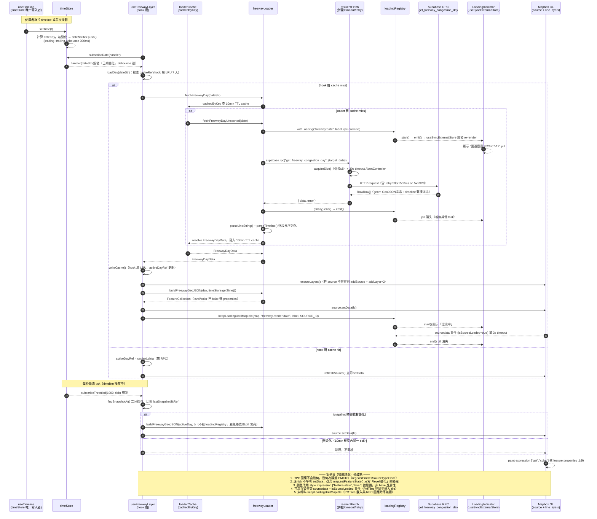

# Stage 2 資料流生命週期追蹤 — Mini Taiwan Pulse

> 產出時間：2026-07-12 · 依 Stage 1 `recon.md` 附註：本專案無傳統 HTTP request/response server，
> 「Request/Data Flow」章節改為 trace **圖層資料生命週期**：
> `Supabase RPC → Loader → loadingRegistry → Hook（timeStore 訂閱）→ Mapbox/Three.js render`。
> 本文件只讀程式碼，未做任何修改。

## 為什麼挑這兩個案例

| 案例 | 檔案 | 挑選理由 |
|---|---|---|
| **案例 A：國道壅塞** | `src/data/freewayLoader.ts` + `src/hooks/useFreewayLayer.ts` | CLAUDE.md §3 明確指定為 loading UI 範例；資料型態最典型（RPC 回傳「路段 × timeline 字串」，前端解析後逐 tick 重建 GeoJSON） |
| **案例 B：省道路況** | `src/data/roadCongestionLoader.ts` + `src/hooks/useRoadCongestionLayer.ts` | 與案例 A 同語意（壅塞等級 timeline）但**渲染策略完全不同**——PMTiles 靜態幾何 + `setFeatureState` 差異染色，而非每 tick 重建 GeoJSON；程式碼註解明講「不像 freeway 每 tick 重建整包 GeoJSON setData」（`roadCongestionLoader.ts:9-11`），是很好的架構決策對照組 |

兩者都**不經過** `src/map/*CustomLayer.ts` 或 `src/three/*Scene.ts`——這點本身是重要發現，見下方「渲染層」一節。為補足 Three.js × CustomLayer 路徑的示意，第 5 節另外引用 `src/map/lighthouseCustomLayer.ts`（非本案例主線，僅作對照）。

---

## 1. Supabase RPC 呼叫層

### 1.1 共用 base client — `src/lib/supabase.ts`

所有 loader 共用同一個 `supabase` client 實例（`src/lib/supabase.ts:60-64`），並非各自建立連線：

```ts
export const supabase: SupabaseClient = supabaseConfigured
  ? createClient(SUPABASE_URL!, SUPABASE_ANON_KEY!, {
      global: { fetch: resilientFetch },
    })
  : createStubClient();
```

關鍵共用機制（`src/lib/supabase.ts:44-58`）：

- **缺環境變數不 crash**：`createStubClient()`（`supabase.ts:18-38`）回傳一個 Proxy stub，所有 `.from()` / `.rpc()` 呼叫都 resolve 成 `{ data: null, error }`，讓 app 在缺 `VITE_SUPABASE_URL`/`VITE_SUPABASE_ANON_KEY` 時仍可啟動。
- **`resilientFetch`（AR-01 韌性 fetch wrapper）**（`supabase.ts:44-153`）：注入到 `createClient` 的 `global.fetch`，所有 RPC 呼叫（含本文兩個案例）都會經過：
  - 全域同時併發上限 **8**，超過進 FIFO queue（`acquireSlot`/`releaseSlot`，`supabase.ts:66-82`）
  - 單一請求 **30s timeout**（`AbortController`，與 caller 自帶 signal 用 `AbortSignal.any` 合成）
  - 網路層錯誤（`fetch` 拋 `TypeError`）與 `5xx`/`429` **最多 retry 2 次**（backoff 500ms/1500ms + jitter，`backoffDelay`，`supabase.ts:91-94`）
  - 寫入類 RPC **denylist 不 retry**（目前僅 `log_session_events`，`supabase.ts:47`），避免重送造成重複寫入
  - 錯誤最終仍 `throw` / 轉成 `{ error }`，**不吞錯**——`loadingRegistry` 的錯誤態依賴這點（見 §2）

### 1.2 Loader 共同模式

`freewayLoader.ts` 與 `roadCongestionLoader.ts` 結構幾乎同構，代表 75 個 `src/data/*Loader.ts` 的典型骨架：

```
export async function fetchXxxDates()        → RPC 取「可用日期」清單（給 timeline UI 用）
async function fetchXxxDayUncached(date)      → RPC 取「單日全部路段/物件 + timeline」
const fetchXxxDayCached = cachedByKey(...)    → 套 TTL + LRU cache（src/lib/loaderCache.ts）
export function fetchXxxDay(date)             → 對外唯一入口，呼叫方不知道有沒有快取
```

**案例 A**：`fetchFreewayDayUncached`（`freewayLoader.ts:83-128`）呼叫
```ts
supabase.rpc("get_freeway_congestion_day", { target_date: date })
```
回傳 `RawRow[]`（`freewayLoader.ts:49-56`）：`geom` 是 GeoJSON LineString 字串、`timeline` 是自訂緊湊格式 `"ts,level,speed;ts,level,speed;..."`。前端自行 `parseLineString`（`freewayLoader.ts:73-81`）與 `parseTimeline`（`freewayLoader.ts:58-71`）反序列化——**資料庫端把 timeline 序列化成單一字串欄位**，是典型的「pre-aggregate 後只做薄 SELECT」模式（呼應 CLAUDE.md §4）。

**案例 B**：`fetchRoadCongestionDayUncached`（`roadCongestionLoader.ts:95-127`）呼叫
```ts
supabase.rpc("get_road_congestion_day", { target_date: date })
```
回傳 `RawRow[]`（`roadCongestionLoader.ts:89-93`）：**不含幾何**（幾何走 PMTiles 靜態切片，見 §5），只有 `section_uid` + 288 字元的 timeline 字串（每字元代表一個 5 分鐘槽，`'1'~'4'` = congestion level，`'-'/'0'` = 無資料）。這是比案例 A 更精簡的 payload 設計——geometry 完全從 RPC 回應中拿掉，換取更小的 response size。

### 1.3 快取層 — `src/lib/loaderCache.ts`

兩個 loader 都用 `cachedByKey(fetchXxxDayUncached, 10 * 60_000)`（`freewayLoader.ts:130`、`roadCongestionLoader.ts:129`），語意：以 `date` 字串為 key 的 LRU + TTL 快取。作用：

- **in-flight 去重**：並發呼叫共享同一個 Promise，也順便擋 React StrictMode 雙跑（`loaderCache.ts` 開頭註解）
- **10 分鐘 TTL**：per-day 時序資料的慣例 TTL（`loaderCache.ts:13`：「歷史/靜態 15min、`*Latest` 即時值 5min、per-day 時序 10min」）
- 失敗自動清除 cache entry，不會快取住錯誤

⚠️ 未驗證：`cachedByKey` 完整實作（LRU 上限邏輯）未在本次 trace 中完整讀取，僅讀取檔首 `cachedOnce` 部分（`loaderCache.ts:1-49`）；`cachedByKey` 簽章從呼叫端可推斷為 `(fetcher, ttlMs, max?) => (key) => Promise<T>`。

---

## 2. Loading UI 註冊

### 2.1 `withLoading` — RPC 呼叫包裝

`src/lib/loadingRegistry.ts:64-67`：

```ts
export function withLoading<T>(id: string, label: string, p: PromiseLike<T>): Promise<T> {
  loadingRegistry.start(id, label);
  return Promise.resolve(p).finally(() => loadingRegistry.end(id));
}
```

兩個 loader 的每一個 RPC 呼叫都直接包在 `withLoading(...)` 裡（不是額外一層，是**直接包住 `supabase.rpc(...)` 這個 thenable**）：

```ts
// freewayLoader.ts:85-89
const { data, error } = await withLoading(
  `freeway:${date}`,
  `國道壅塞 ${date}`,
  supabase.rpc("get_freeway_congestion_day", { target_date: date }),
);
```

```ts
// roadCongestionLoader.ts:97-101
const { data, error } = await withLoading(
  `roadCongestion:${date}`,
  `省道路況 ${date}`,
  supabase.rpc("get_road_congestion_day", { target_date: date }),
);
```

`loadingRegistry`（`loadingRegistry.ts:38-61`）內部用兩個 `Map`：`active`（taskId → 併發計數，同 id 可重入）與 `labels`（taskId → 顯示文字），`start()`/`end()` 各自 `emit()` 通知所有訂閱者重建 snapshot。

### 2.2 `keepLoadingUntilMapIdle` — 延續到「畫面真的更新完」

`withLoading` 只涵蓋 **RPC 往返**，但 Mapbox `source.setData()` 之後畫面渲染仍需時間，若不處理使用者會看到「loading 消失但資料還沒畫出來」的空窗。`keepLoadingUntilMapIdle`（`loadingRegistry.ts:80-116`）解決此問題：

- 傳入 `sourceId` 時：監聽 `sourcedata` 事件，命中 `evt.sourceId === sourceId && evt.isSourceLoaded` 才 `finish()`
- `sourceId` 為 `null` 時：監聽 map `idle` 事件（所有 source/render 完成）
- 兩者皆有 **3000ms timeout 保底**，避免卡死

**案例 A** 在 `loadDay` 的成功 callback 中呼叫（`useFreewayLayer.ts:159-164`）：

```ts
if (map && ensureLayers(map)) {
  refreshSource(map, timeStore.getTime());
  // 新日資料載入後，延續 loading 到 Mapbox 真的畫完
  keepLoadingUntilMapIdle(map, `freeway-render:${dateStr}`, `國道壅塞 渲染中`, SOURCE_ID);
}
```

程式碼註解明確標註「**每秒觸發的 timeline 回放 tick 不延續 loading**」（`useFreewayLayer.ts:121-125`）——只有「切換日期後首次 refresh」才會延續，否則 timeline 拖拉播放時 loading 指示器會一直亮，體感很差。這是本專案 loading UI 設計中一個重要但容易漏掉的細節。

**案例 B** 未呼叫 `keepLoadingUntilMapIdle`（PMTiles 幾何是靜態切片，載入時機與 RPC 回應無關；`useRoadCongestionLayer.ts` 用 `sourcedata` 事件 + `firstFlushDoneRef` 自行判斷 source 是否已載入，見 §4），顯示此 helper 是**依渲染策略選用**而非強制套用於所有動態圖層。

### 2.3 UI 端消費 — `useLoadingTasks` + `LoadingIndicator`

```ts
// src/hooks/useLoadingTasks.ts
export function useLoadingTasks(): LoadingTask[] {
  return useSyncExternalStore(
    loadingRegistry.subscribe,
    loadingRegistry.snapshot,
    loadingRegistry.snapshot,
  );
}
```

`LoadingIndicator.tsx:8-10` 消費此 hook，`tasks.length === 0` 時完全不渲染（`return null`），否則顯示右上角浮動 pill，最多列 3 個任務 + `+N more`（`LoadingIndicator.tsx:12-13, 73-78`）。這是 `loadingRegistry` 唯一的 UI 消費端（`App.tsx` 中掛載一次，全域生效）。

**模式小結**：`start()/end()` 是 loading 生命週期的唯一寫入點，`useSyncExternalStore` 是唯一的 React 橋接方式（不用 `useState` + `useEffect` 訂閱，避免額外一輪 re-render 延遲），這與 §4 timeStore 的訂閱哲學一致。

---

## 3. Hook 層轉換

### 3.1 案例 A — `useFreewayLayer.ts`：逐 tick 重建 GeoJSON

Hook 內部用 4 個 `useRef` 管理跨 render 存活的可變狀態（不用 `useState`，因為這些值不該觸發 re-render）：

| ref | 用途 |
|---|---|
| `cacheRef` | Hook 層自己的 LRU cache（`Map<string, CachedDay>`，上限 7 天，`CACHE_MAX = 7`），與 loader 層的 `cachedByKey` 是**兩層獨立快取**——loader 快取原始 RPC 回應，hook 快取「已解析成 `FreewayDayData` 的物件」 |
| `activeDayRef` / `activeDateRef` | 目前作用中的日資料 + 日期字串 |
| `layersReadyRef` | Mapbox source/layer 是否已建立 |
| `fetchingRef` | 進行中的 fetch date（避免重複觸發 + 快速切換時「舊 fetch resolve 但已不是目前日期」的競態保護，見 `useFreewayLayer.ts:154-155`） |
| `lastSnapshotTsRef` | 上次套用的 snapshot 時間戳，用來判斷「這個 tick 是否需要重繪」 |

轉換邏輯核心：`buildFreewayGeoJSON(day, currentTime)`（loader 層純函式，`freewayLoader.ts:171-196`）對每個路段呼叫 `findSnapshotAt`（二分搜尋，`freewayLoader.ts:157-168`）找出 `ts <= currentTime` 的最後一筆 snapshot，組出當下的 `level`/`color`/`speed` 屬性，回傳整包 `FeatureCollection`。Hook 層的 `refreshSource`（`useFreewayLayer.ts:126-131`）直接 `src.setData(fc)` 整包覆寫。

**LayerVisibility toggle 處理**（`useFreewayLayer.ts:187-200`）：`visible=false` 時只是把兩個 Mapbox layer 的 `visibility` 設成 `"none"`（`setLayoutProperty`），**不移除 source/layer**，也不停止資料訂閱——下次切回 `visible=true` 不需重新拉資料。

### 3.2 案例 B — `useRoadCongestionLayer.ts`：差異化 `setFeatureState`

Hook 邏輯與案例 A 平行但渲染策略不同（詳見 §5），這裡只談 hook 層轉換差異：

- `lastAppliedRef: Map<string, number>`（`useRoadCongestionLayer.ts:65`）記錄「每個 `section_uid` 上次套用的 level」，`flush()`（`useRoadCongestionLayer.ts:123-148`）只對「level 與上次不同」的路段呼叫 `map.setFeatureState`，其餘跳過——避免每個 5 分鐘槽都要對 6818 個路段全刷。
- `lastPopulatedSlot` clamp 邏輯（`roadCongestionLoader.ts:32-38` 註解 + `useRoadCongestionLayer.ts:130`）：因為 refresh function 只填「已發生」的槽，`currentTime` 換算出的槽常落在「尚未刷新」的區間，若不 clamp 會整批顯示灰色無資料——這是一個**資料新鮮度與前端呈現對齊**的細節轉換，loader 端先算好 `lastPopulatedSlot` 供 hook 端 clamp，是 loader/hook 分工的具體案例。

**LayerVisibility toggle 處理**：同案例 A 模式，只切 `visibility`（`useRoadCongestionLayer.ts:184-193`），不重新拉資料。

### 3.3 Hook 層轉換總結

| 轉換類型 | 案例 A（freeway） | 案例 B（roadCongestion） |
|---|---|---|
| 幾何來源 | RPC 回應內（`geom` GeoJSON 字串） | PMTiles 靜態切片（RPC 完全不含幾何） |
| 逐 tick 更新方式 | 整包 `FeatureCollection` 重建 + `source.setData()` | 差異 `setFeatureState`（僅變動路段） |
| 變動判斷 | 找到的 snapshot `ts` 是否變化（`lastSnapshotTsRef`） | 5 分鐘槽 index 是否變化（`lastSlotRef`）+ 逐段 level 比對 |
| Hook 層快取 | 有（`cacheRef`，LRU 7 天） | 無（`dayRef` 單一 slot，只存當前日） |

---

## 4. 時間訂閱（`timeStore.ts`）

兩個案例都**嚴格遵守 CLAUDE.md §6**：`currentTime` 從未出現在 `useEffect`/`useMemo` 的 deps array 中。訂閱分兩層：

### 4.1 `subscribeDate` — 跨日載入

```ts
// useFreewayLayer.ts:177-184（roadCongestion 同構，useRoadCongestionLayer.ts:173-178）
useEffect(() => {
  if (!visible) return;
  const handler = (dateStr: string) => {
    if (dateStr) loadDay(dateStr);
  };
  handler(timeStore.getDateKey());       // 掛載時先用目前日期跑一次
  return timeStore.subscribeDate(handler); // 之後只在「日期」變化時觸發
}, [visible, loadDay]);
```

`timeStore.subscribeDate`（`timeStore.ts:141-144`）背後是 `dateNotifier`（`src/state/dateNotifier.ts`，本次未展開讀取，⚠️ 未驗證細節），`timeStore.ts:52-53` 註解說明它走 **leading+trailing debounce（quietMs 300ms）**：單次切日零延遲，但快速拖拉 timeline 跨多天時只通知「最後停下來的日期」，避免多個 hook（本文兩案例 + 其餘時序 layer）同時對中間經過的每一天發 RPC 造成洪流。

### 4.2 `subscribeThrottled` — 高頻 tick 節流

```ts
// useFreewayLayer.ts:228-230
tick(timeStore.getTime()); // 初始化
return timeStore.subscribeThrottled(1000, tick);  // 1s 節流

// useRoadCongestionLayer.ts:208-210，同為 1000ms
const unsub = timeStore.subscribeThrottled(1000, tick);
```

兩案例都選 **1000ms** 節流窗口，理由都寫在程式碼註解中：「1s 節流足夠（資料本身 10min/5min 粒度）」——這是「UI 更新頻率跟著資料粒度走，不需要比資料更新頻率高」的具體實例，呼應 CLAUDE.md 節流表的設計精神。

`timeStore.subscribeThrottled` 實作（`timeStore.ts:122-134`）用 trailing-edge 保證：距上次通知超過 `ms` 立即觸發，否則排 `setTimeout` 補上「最後一次」通知，確保拖到某個時間點放開後畫面一定會更新到最終位置。

### 4.3 `getTime()` 同步讀

`loadDay` 的成功 callback 內直接同步呼叫 `timeStore.getTime()`（`useFreewayLayer.ts:161`、`useRoadCongestionLayer.ts:162`）取得「當下」時間去初次 render，而不是等下一次 `subscribeThrottled` tick——這是 CLAUDE.md 規範的「RAF / 事件回呼內同步讀 `getTime()`」用法示範，避免多等一個節流週期才顯示新載入日期的資料。

### 4.4 `setTime` 的唯一寫入點

`timeStore.ts:12` 註解「只有 `useTimeline` 應該呼叫 `setTime`」。本文兩個案例都只**讀**（`getTime`/`getDateKey`/`subscribeDate`/`subscribeThrottled`），驗證了「時間狀態單向流動：`useTimeline`（UI 播放器）→ `timeStore`（唯一真相）→ 各 hook（訂閱端）」的架構邊界在這兩個案例中被遵守。

---

## 5. 渲染層

### 5.1 案例 A + B 共同模式：Hook 自管 Mapbox source/layer（無獨立 CustomLayer 檔）

與「7 步流程」文件（CLAUDE.md §5）列出的 `src/map/overlayRegistry.ts` 或 `src/map/xxxCustomLayer.ts` 不同，**這兩個案例的 Mapbox source/layer 生命週期直接寫在 hook 內**（`ensureLayers()` / `buildLayers()`），而非拆到獨立的 `*CustomLayer.ts` 檔案。`useFreewayLayer.ts` 檔首註解自陳「仿 `useEarthquakeLayer` 自行管理 Mapbox source + layers」（`useFreewayLayer.ts:17`），顯示這是專案內**另一種被接受的圖層渲染慣例**（非 Three.js CustomLayer、非 overlayRegistry 靜態註冊），適用於「原生 Mapbox `line`/`circle` 圖層即可表達語意，不需要 WebGL 自訂繪製」的場景。

**案例 A**（`buildLayers`，`useFreewayLayer.ts:31-72`）：兩層原生 Mapbox `line` layer——`LAYER_GLOW`（模糊光暈，`line-blur: 6`）+ `LAYER_LINE`（實際線條，`line-width` 依 zoom 分段 `interpolate`）。`paint["line-color"] = ["get", "color"]` 直接讀 GeoJSON feature properties 中 loader 算好的顏色字串（`buildFreewayGeoJSON` 已把 `CONGESTION_COLORS[level]` bake 進 properties）。

**案例 B**（`useRoadCongestionLayer.ts:70-115`）：source 型別是 `PMTILES_SOURCE_TYPE`（`registerPmtilesSourceTypeOnce()` 註冊自訂 protocol，`src/map/pmtilesSourceType.ts`，本次未展開讀取），`promoteId: { [SOURCE_LAYER]: "section_uid" }` 讓 Mapbox 用該欄位當 `setFeatureState` 的 feature id。顏色不是 bake 進 tile 屬性，而是用 Mapbox style expression 動態讀 feature-state：

```ts
// useRoadCongestionLayer.ts:32-40
const COLOR_EXPR = [
  "match",
  ["coalesce", ["feature-state", "level"], 0],
  1, "#22c55e", 2, "#eab308", 3, "#f97316", 4, "#ef4444",
  "#808080",
];
```

另外多加一層 `LAYER_HIT`（透明加寬命中層，`line-width: 12` + `line-opacity: 0`，`useRoadCongestionLayer.ts:98-109`），註解標注是「四鐵則③：細線點擊命中率極差」的因應——原始線寬只有 0.6~5px，難點擊，疊一條寬 12px 全透明線提升點擊命中率。

### 5.2 對照：Three.js × CustomLayer 路徑（非本案例主線）

38 個 `src/map/*CustomLayer.ts` 中，多數走「`src/three/*Scene.ts`（場景邏輯）+ CustomLayerInterface（生命週期橋接）」模式，例如 `lighthouseCustomLayer.ts`（`src/map/lighthouseCustomLayer.ts:14-53`）：

```ts
export function createLighthouseLayer(opts): CustomLayerInterface {
  const scene = new LighthouseScene();
  return {
    id: "lighthouse-3d", type: "custom", renderingMode: "3d",
    onAdd(mapInstance, gl) { scene.init(gl); },
    render(_gl, matrix) {
      scene.playing = opts.getIsPlaying();
      if (!opts.getIsVisible()) return;
      scene.render(matrix);
      map?.triggerRepaint();
    },
    onRemove() { scene.dispose(); },
  };
}
```

此路徑用 `opts.getXxx()` getter 而非直接傳值，讓 `render()`（每幀呼叫，由 Mapbox 驅動）永遠讀到最新狀態，不受 React re-render 週期影響——與案例 A/B 用 `timeStore.subscribeThrottled` 驅動 `setData`/`setFeatureState` 是**兩種不同但目的相同**的「脫離 React reconcile 週期」手法。本文未深入 trace 此路徑的完整資料流（非本次挑選案例），僅作渲染層對照。

### 5.3 Click Popup / 圖例接線現況（實測發現，非文件推論）

實際搜尋 `src/hooks/useMapInteraction.ts` 與 `src/components/featureInfo/registry.tsx`：

- **案例 B（roadCongestion）**：已接 click popup（`useMapInteraction.ts:211` `{ layers: ["road-congestion-hit"], type: "roadCongestion" }`，並在 `:421-422` 特別處理「level 在 feature-state 而非 baked properties」的合併邏輯）+ 圖例（`LegendPanel.tsx:174` `RoadCongestionLegend`）。
- **案例 A（freewayCongestion）**：**未接 click popup**（`useMapInteraction.ts` 搜尋 `freeway` 無結果）；圖例則是**有意識地留白**——`layerConsistency.test.ts:76` 的 `BASELINE_NO_LEGEND` 集合中明確列了 `"freewayCongestion"`，代表這是測試 ratchet 機制已知並「凍結」的缺口，而非漏接。這與 CLAUDE.md §5a 鐵則②「分類 ≥ 2 種必寫圖例」的要求形成對照——`CONGESTION_COLORS` 明明有 6 個分類（0~5），理論上該有圖例，但目前是已登記的技術債。⚠️ click popup 缺失則未見於任何 baseline 清單登記，可能是純粹遺漏，也可能是刻意設計（線段本身已有顏色/寬度傳達壅塞資訊）——本次 trace 未找到明確決策紀錄佐證，標注為觀察發現。

---

## 6. 各層轉換總結表（對照傳統 Web App 分層）

| 傳統 Web App 分層 | 本專案對應 | 本文兩案例對應檔案 |
|---|---|---|
| **Routing** | N/A（SPA 單頁，無 server route；Mapbox layer id / sidebar key 是「邏輯路由」） | `src/App.tsx:1206-1219`（接線位置）、`src/types/index.ts:97,715`（`LayerVisibility.freewayCongestion` 型別宣告） |
| **Validation**（input 驗證） | Loader 層對 RPC 回應做防禦性 parse（非 schema 驗證，是「格式容錯」） | `parseTimeline`/`parseLineString`（`freewayLoader.ts:58-81`，non-finite 數字/空字串一律跳過或轉 `null`）；`levelFromChar`（`roadCongestionLoader.ts:59-62`，非 `1~4` 字元一律視為 0） |
| **Business Logic** | Hook 層（timeline lookup、diff 計算、cache 決策） | `useFreewayLayer.ts` 的 `refreshSource`/`loadDay`（`:126-174`）；`useRoadCongestionLayer.ts` 的 `flush`/`loadDay`（`:123-170`） |
| **Persistence**（資料庫寫入） | N/A——前端對 Supabase **唯讀**（CLAUDE.md：僅 `log_session_events` 例外會寫入，見 `supabase.ts:47` `WRITE_RPC_DENYLIST`），實際的 pre-aggregate/refresh 邏輯在姊妹 repo `data-collectors`/`gis-platform`，不在本 repo | 本 repo 內無對應檔案；`docs/supabase-optimization.md` 描述上游 pattern |
| **Response**（回應組裝） | Mapbox GeoJSON `FeatureCollection` 組裝 / `setFeatureState` diff | `buildFreewayGeoJSON`（`freewayLoader.ts:171-196`，loader 層純函式）；`flush()` 內的 diff 迴圈（`useRoadCongestionLayer.ts:134-144`，hook 層） |
| **Render / View** | Mapbox GL paint properties（line-color/width expression）或 Three.js CustomLayer `render()` | `buildLayers`（`useFreewayLayer.ts:31-72`）；`ensureLayers`（`useRoadCongestionLayer.ts:70-115`）+ `COLOR_EXPR`（`:32-40`） |
| **Middleware**（橫切關注：重試/併發控制/逾時） | `resilientFetch`（`supabase.ts:44-153`），注入所有 `supabase.rpc()` 呼叫 | 兩案例的每一次 RPC 呼叫皆隱式經過 |
| **Loading / Progress UI** | `loadingRegistry`（`start`/`end`/`keepLoadingUntilMapIdle`）+ `useSyncExternalStore` | `loadingRegistry.ts` 全部 + `useLoadingTasks.ts` + `LoadingIndicator.tsx` |
| **State Management**（跨元件共享狀態） | 外部 store（非 React Context/Redux）：`timeStore`（時間）、hook 內 `useRef`（各圖層私有 cache） | `timeStore.ts` + 兩案例 hook 內的 `cacheRef`/`dayRef` |
| **Client-side Cache** | 兩層快取：loader 層 `cachedByKey`（原始 RPC 回應）+ hook 層 `Map`/`useRef`（已解析物件） | `loaderCache.ts` + `useFreewayLayer.ts:80,88-102`（`cacheRef`，LRU 7 天）；案例 B 無 hook 層快取（僅存當前日） |

---

## 7. 完整資料流 Sequence Diagram

以案例 A（國道壅塞）為主線，案例 B 的分歧點以註解標出：



---

## 8. 關鍵發現彙整

1. **兩層獨立快取 + 兩種節流頻道**：loader 層 `cachedByKey`（原始 RPC 回應，10min TTL）與 hook 層 `useRef` cache（已解析物件，freeway 有 LRU 7 天 / roadCongestion 無)是分開的兩層，各自服務不同重複請求場景（同 session 內切日期 vs. 重新掛載元件）；時間訂閱則分 `subscribeDate`（跨日 RPC 觸發，300ms debounce）與 `subscribeThrottled(1000, ...)`（同日內逐 tick 視覺更新）兩個獨立頻道，避免高頻 timeline 拖拉觸發任何 RPC。
2. **`keepLoadingUntilMapIdle` 是條件式套用，非強制**：只有「整包 `setData()`」的渲染路徑（案例 A）需要它彌合「RPC 完成」與「畫面真的更新」之間的空窗；PMTiles + `setFeatureState` 路徑（案例 B）改用自己的 `sourcedata`/`isSourceLoaded` 判斷首次渲染完成，不套用此 helper——loading UI 的「延續到渲染完成」策略是依渲染路徑客製，不是所有動態圖層都套同一個 helper。
3. **CLAUDE.md 的「7 步流程 + UX 四鐵則」在真實案例中存在已登記的例外**：`freewayCongestion` 雖有 6 種分類的 `CONGESTION_COLORS`，圖例卻在 `layerConsistency.test.ts` 的 `BASELINE_NO_LEGEND` 中被有意識地凍結為「已知缺口」而非強制補齊；click popup 則完全未接線且未見於任何 baseline 登記。這說明專案的 ratchet 測試機制設計上允許「有意識地不做」，但同時也顯示規則執行仍有縫隙（未登記的缺口不會被測試攔下）。

（本節同時作為交付摘要，供上層彙整用。）
