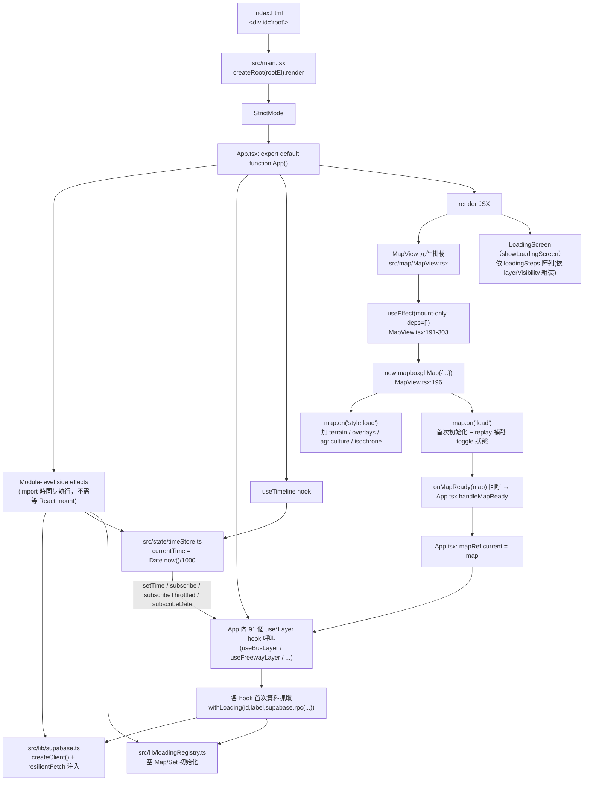
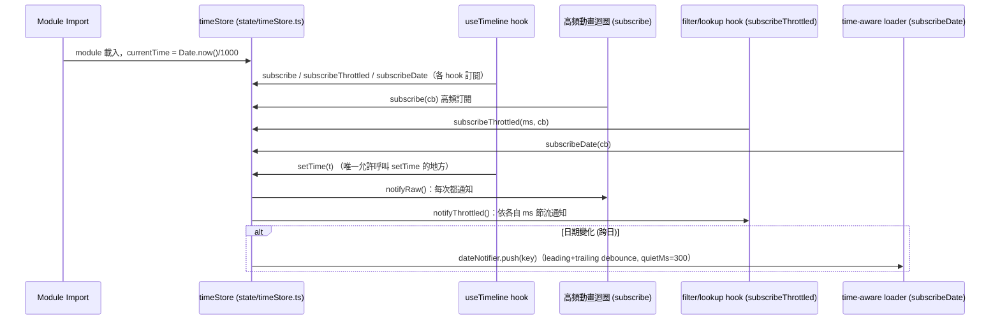

# Entry Points 追蹤 — Mini Taiwan Pulse

> 產出時間：2026-07-12 · 基於 `.trace/_context/recon.md` 的 Stage 1 偵察結果
> 範圍：程式啟動鏈路（`index.html` → `main.tsx` → `App.tsx`）、初始化順序、Vite 啟動設定、`App.tsx` 圖層接線模式

---

## 1. 啟動鏈路總覽

### 1.1 `index.html`（`/home/user/mini-taiwan-pulse/index.html`）

- `index.html:19` — 唯一掛載點 `<div id="root"></div>`。
- `index.html:20` — `<script type="module" src="/src/main.tsx"></script>`，Vite dev/build 皆以此為唯一 JS entrypoint（無其他 `<script>` 標籤，代表沒有額外的 polyfill / vendor bootstrap，一切初始化都在 React tree 內完成）。
- `index.html:9-16` — inline `<style>` 只處理 `#root` 全螢幕 + sidebar 捲軸樣式，非 CSS-in-JS，屬於「開頁瞬間必須生效、不可等 JS bundle 載入才套用」的樣式（避免 FOUC）。

### 1.2 `src/main.tsx`（`/home/user/mini-taiwan-pulse/src/main.tsx`，共 13 行）

```tsx
import { StrictMode } from "react";
import { createRoot } from "react-dom/client";
import App from "./App";

const rootEl = document.getElementById("root");
if (!rootEl) throw new Error("Root element not found");

createRoot(rootEl).render(
  <StrictMode>
    <App />
  </StrictMode>,
);
```

- `src/main.tsx:5-6` — 明確 fail-fast：找不到 `#root` 直接 `throw`，不做 fallback DOM 建立。
- `src/main.tsx:8-12` — React 19 `createRoot` API；**Provider 疊層只有一層 `<StrictMode>`**，`<App />` 下沒有任何 Context Provider（例如 Redux Provider、React Query Provider、Theme Provider 皆不存在）——⚠️ 已用 `Grep "Provider\|createContext"` 掃過 `App.tsx` 全檔無命中，確認全域狀態一律走本專案自訂的「外部 store（`timeStore.ts` / `dateNotifier.ts` / `chatStore.ts` / `satelliteConsoleStore.ts`）+ `useSyncExternalStore`」模式，而非 React Context。這與 CLAUDE.md 第 6 條「時間狀態外部化」的精神一致，並延伸到其他跨元件共享狀態。
- StrictMode 影響：dev 模式下所有 `useEffect` 會 mount→unmount→mount 兩次執行，這對 `MapView.tsx` 內建立 Mapbox `map` 實例的 `useEffect`（見 2.1）理論上有雙重建立風險，但該 effect 的 cleanup（`map.remove()`，見 `src/map/MapView.tsx:297-301`）已正確處理，可承受 StrictMode 的雙重呼叫。

### 1.3 `src/App.tsx`（`/home/user/mini-taiwan-pulse/src/App.tsx`，共 2870 行，`export default function App()` 於 `App.tsx:166`）

`App.tsx` 是整個應用的「單一巨型容器元件」——沒有拆成路由或子 App，所有 91 個 hook、38 個 CustomLayer 的接線都在這一個函式元件內用 `useXxxLayer(...)` 呼叫串起來。這印證了 recon.md 觀察到的「Layer-plugin 慣例架構：命名慣例 + 強制檢查清單，而非抽象基底類別」。

`App.tsx` render 出的 JSX 結構（`App.tsx:1693` 起）大致為：
```
<div class="app-root 全螢幕容器">
  {showLoadingScreen && <LoadingScreen />}
  {gatedNotice && <私人圖層提示 toast />}
  ... 其餘 loading / mode 相關條件渲染 ...
  <MapView ... />                      // App.tsx:1755
  {captureMode && <拍攝模式 vignette />}
  <LayerSidebar /> / <IconRailSidebar />  // 依 isMobile 切換
  <IntelPanel /> <MonitorPanel /> <SatelliteConsole />
  <ChatPanel />
  ... 其他 HUD/Modal 元件
</div>
```
⚠️ 未逐行核對完整 JSX 樹（2870 行過長，僅摘要主要結構；`MapView` 的 render 呼叫位置已核實在 `App.tsx:1755-1765`）。

---

## 2. 初始化流程細節

### 2.1 Mapbox GL Map 實例建立

位置：`src/map/MapView.tsx` 內的 `MapView` 元件（`MapView.tsx:166` 起）。

- `MapView.tsx:191-303` — 唯一一個「建立 map 實例」的 `useEffect`，deps 是空陣列 `[]`（`MapView.tsx:302-303` 註解 `eslint-disable-next-line react-hooks/exhaustive-deps`），代表 **map 只在元件首次 mount 時建立一次**，之後所有 prop 變動（preset、styleUrl、layerVisibility…）改用其他獨立 `useEffect` + `ref` 讀最新值處理，不重建 map。
- `MapView.tsx:194` — `mapboxgl.accessToken = import.meta.env.VITE_MAPBOX_TOKEN;`（Vite env 注入，build 時 inline）。
- `MapView.tsx:196-204` — `new mapboxgl.Map({...})`，初始 `center/zoom/pitch/bearing` 來自 `presetRef.current`（`cameraPresets.ts` 的 `DEFAULT_CAMERA`，見 import `App.tsx:118`）。
- `MapView.tsx:207-264` — `map.on("style.load", ...)`：**每次底圖切換都會重新觸發**（不只是首次），內容包含：
  - Pure Black 主題套用（`applyPureBlackTheme`，`MapView.tsx:209`）
  - `setupTerrain(map)`（`MapView.tsx:210`，加 `mapbox-dem` terrain source）
  - `registerPmtilesSourceTypeOnce()`（`MapView.tsx:213`，PMTiles custom source type 只註冊一次）
  - `resetOverlayHydration()`（`MapView.tsx:217`，因為底圖切換會讓 Mapbox 把所有 overlay source 重建成空 FeatureCollection，需清除「已 hydrate」記錄以便重新 fetch）
  - `addAllOverlays(map, OVERLAY_REGISTRY, ...)`（`MapView.tsx:220-226`，批量把 `overlayRegistry.ts` 中登記的所有靜態圖層一次性加入）
  - 逐一 `hydrateOverlayIfNeeded` 目前可見的 overlay（`MapView.tsx:229-231`）
  - 農業圖層群（`ensureAllAgricultureLayers` / `updateAllAgricultureLayers`，`MapView.tsx:251-252`）與等時圈圖層（fire / medical isochrone，`MapView.tsx:254-258`）等「不在 `OVERLAY_REGISTRY` 泛型機制內、需要專屬 ensure/update 函式」的圖層另外手動呼叫。
- `MapView.tsx:266-295` — `map.on("load", ...)`：**只在首次載入觸發一次**，內容與 `style.load` handler 高度重疊（H3 / demographics / agriculture / isochrone 圖層的 ensure），並額外：
  - `MapView.tsx:271-273` — dev 模式或 URL 帶 `?debug` 時，把 `map` 實例掛到 `window.__map`，供除錯 / E2E 直接操作。
  - `MapView.tsx:284-292` — **重播（replay）機制**：因為 production 首次 `load` 事件可能延遲到 ~30s 才觸發，期間若使用者已經切換過圖層 toggle，`layerVisibility`/`overlayParams` 的 `useEffect` 會因 `mapRef.current` 仍是 `null` 而 no-op；`load` handler 觸發後用 `layerVisibilityRef.current` 的最新值重放一次 visibility/hydrate，避免「toggle 開了但圖層沒出現」的競態 bug。
- `MapView.tsx:297-301` — cleanup：`map.remove()` + 重置 `mapRef`/`readyRef`，因應 StrictMode 雙重 mount。
- `MapView.tsx:305-418` — 後續 5 個獨立 `useEffect`（styleUrl 切換、Pure Black 切換、preset 平滑飛行、2D/3D render mode、showTrails、overlay 主題+params、overlay 可見性）皆用 `if (!map || !readyRef.current) return;` guard，確保只在 map 已 ready 後才生效，且**刻意不加 `map.isStyleLoaded()` guard**（`MapView.tsx:377-380` 註解說明：任何 tile 還在載入該方法就回 false，會導致更新被靜默丟棄且不重試；`setPaintProperty`/`setLayoutProperty` 對已存在 layer 任何時刻呼叫都安全）。

`onMapReady` callback（`MapView.tsx:97` prop、由 `App.tsx:1765` 傳入 `handleMapReady`）是 `MapView` 把已建立的 `map` 實例「交還」給 `App.tsx` 的橋樑，`App.tsx` 再把它塞進 `mapRef` 供其他 91 個 hook 使用（各 hook 收到的是同一個 `mapRef`，而非各自建立 map）。

### 2.2 Supabase Client 初始化

位置：`src/lib/supabase.ts`（module-level side effect，import 時就執行，非函式呼叫觸發）。

- `supabase.ts:3-4` — 讀 `VITE_SUPABASE_URL` / `VITE_SUPABASE_ANON_KEY`（fallback 到無 `VITE_` 前綴版本）。
- `supabase.ts:6-13` — `supabaseConfigured` 布林旗標；缺 env 時 `console.error` 但**不 throw**，改用 `createStubClient()`（`supabase.ts:19-38`）回傳一個 Proxy-based stub，所有 `.from()`/`.rpc()` 呼叫都 resolve 成 `{ data: null, error }`，避免 import 階段直接 crash 整個 app（開發者本地沒設 env 時仍可看到 UI，只是資料是空的）。
- `supabase.ts:143-147` — 真正的 client 建立：
  ```ts
  export const supabase: SupabaseClient = supabaseConfigured
    ? createClient(SUPABASE_URL!, SUPABASE_ANON_KEY!, { global: { fetch: resilientFetch } })
    : createStubClient();
  ```
  **關鍵設計**：注入自訂 `resilientFetch`（`supabase.ts:100-141`）取代預設 `fetch`，做到：
  - 全域併發上限 `MAX_CONCURRENT_REQUESTS = 8`（`supabase.ts:51`），FIFO queue（`supabase.ts:59-78`）
  - 每請求 30s timeout（`REQUEST_TIMEOUT_MS`，`supabase.ts:52`）
  - 5xx / 429 與網路層 `TypeError` 最多 retry 2 次，backoff 500ms/1500ms + jitter（`supabase.ts:53-54, 91-94`）
  - 寫入類 RPC denylist 不 retry（`WRITE_RPC_DENYLIST = ["log_session_events"]`，`supabase.ts:57`）
  這是 `import { supabase } from "./lib/supabase"` 在任何 `*Loader.ts` 第一次被 import 時就會執行的 module-level 初始化，**沒有顯式的「init」函式呼叫點**——初始化時機等同於「哪個 loader 檔案第一次被其他模組 import」，實務上會在 `App.tsx` 頂部一長串 `import { useXxxLayer } from "./hooks/useXxxLayer"` 展開時被間接觸發（因為 hook 內部 import loader，loader 內部 import `supabase.ts`）。

### 2.3 `timeStore.ts` 何時開始運作

位置：`src/state/timeStore.ts`（同樣是 module-level 初始化，非函式呼叫觸發）。

- `timeStore.ts:26-31` — module 頂層直接執行：
  ```ts
  let currentTime = Date.now() / 1000;
  let currentDateKey = toDateKey(currentTime);
  let currentRangeDays = 1;
  let currentWindowDateKeys: string[] = [currentDateKey];
  ```
  意味著 `timeStore` 從**第一次被 import 的當下**就已經有一個有效的「當前時間 = 開頁瞬間的 wall clock」，不需要等任何 React 元件 mount。
- 真正驅動時間往前走（tick）的是 `useTimeline` hook（`src/hooks/useTimeline.ts`，`App.tsx:10` import、`App.tsx` 內呼叫，⚠️ 未讀出 `useTimeline` 內部實作細節，僅由 `timeStore.ts:12` 註解「只有 useTimeline 應該呼叫 setTime」與 `App.tsx` 對 `useTimeline` 的呼叫位置佐證）——`timeStore` 本身不含 `setInterval`/RAF，純粹是一個被動的「讀寫 + 訂閱通知」容器，播放邏輯完全外部化到呼叫 `timeStore.setTime()` 的 hook。
- 訂閱行為分三種節奏（`timeStore.ts:81-182`）：
  - `subscribe(cb)`：每次 `setTime` 都通知，給高頻動畫迴圈（RAF）用。
  - `subscribeThrottled(ms, cb)`：距上次通知超過 `ms` 才觸發（trailing edge 保證最後一次會送），給 UI 顯示 / filter / lookup 用。
  - `subscribeDate(cb)`：只在「日期」變化時通知，且走 leading+trailing debounce（`dateNotifier.ts`，`quietMs: 300`），避免快速拖動 timeline scrub 跨多天時對每個中間日期都觸發資料載入。
- 另外 `wallClock`（`timeStore.ts:208-236`）是獨立於 `timeStore` 的「真實時間」1Hz-N Hz tick 共用 timer 池，給 `MonitorPanel`/`IntelCard` 顯示「幾分鐘前」用，與資料時間軸 `timeStore` 是兩條不同的時間線，容易混淆需留意（`timeStore.ts:186-200` 註解特別強調此區分）。

### 2.4 `loadingRegistry.ts` 何時開始註冊

位置：`src/lib/loadingRegistry.ts`。

- 本身無初始化步驟，是純粹的 in-memory `Map`（`active`/`labels`）+ `Set<Listener>`（`loadingRegistry.ts:14-16`），第一次被任何 loader import 時就存在，空狀態即代表「目前沒有任何 loading task」。
- 實際「開始運作」的第一個時間點，是任何一個 `*Loader.ts` 內第一次呼叫 `withLoading(id, label, promise)`（`loadingRegistry.ts:64-67`）或 `keepLoadingUntilMapIdle(...)`（`loadingRegistry.ts:80-116`）包住 Supabase RPC 呼叫的瞬間——依 CLAUDE.md 規則 3「所有 Supabase 非同步載入都必須註冊 loading task」，這代表**幾乎每個 `use*Layer` hook 首次 mount、觸發第一次資料抓取時，就會呼叫到 `loadingRegistry.start()`**。
- UI 端訂閱透過 `loadingRegistry.subscribe(l)`（`loadingRegistry.ts:57-60`），`App.tsx` 內應有 `useSyncExternalStore`-based hook 讀 `loadingRegistry.snapshot()` 來驅動開頁時的 `<LoadingScreen>`（`App.tsx:1695`：`{showLoadingScreen && <LoadingScreen steps={loadingSteps} />}`）——⚠️ 未逐行追蹤 `loadingSteps` 的組裝邏輯，僅由 `App.tsx:1500-1503` 觀察到的模式（`...(layerVisibility.flights ? [{ label: "空域 Airspace", done: !loading, count: allFlights.length }] : [])`）推斷：初次載入畫面的每一項 step 是各 hook 自己回傳的 `loading` 布林狀態組裝而成，並非直接讀 `loadingRegistry.snapshot()`，兩者是互補但不同的機制（`loadingRegistry` 偏向「全域 toast/進度條」，`loadingSteps` 偏向「開頁 splash screen 逐項打勾」）。

---

## 3. Vite 設定的啟動行為

位置：`vite.config.ts`（根目錄）。

- `vite.config.ts:30-32` — `server: { port: 3721, strictPort: true }`：固定 port，`strictPort: true` 代表 port 被佔用時**直接失敗**而非自動找下一個可用 port（CLAUDE.md 常用指令表也標明 dev server 固定 3721）。
- `vite.config.ts:33-37` — `proxy: { "/api": { target: "http://localhost:8000", changeOrigin: true } }`：dev 模式下把 `/api/*` 轉發到本地 8000 port（對應 recon.md 提到的 `pulse-api`，FastAPI 備援服務；⚠️ 未驗證該 proxy 目前是否仍被前端實際呼叫，或已完全轉向 Supabase）。
- `vite.config.ts:9-19` — 自訂 plugin `stripBuildAssets`，只在 `apply: "build"` 階段（`closeBundle` hook）執行：build 完成後從 `dist/` 刪除 `rail_bundle.json`（55MB，`bundle-rail-data.py` 的中間產物，只給 `upload-rail-to-s3.ts` 用，不該隨 app 上線）。這是唯一的自訂 build-time 行為，dev 模式不受影響。
- `vite.config.ts:29` — `assetsInclude: ["**/*.vert", "**/*.frag"]`：讓 Vite 把 GLSL shader 檔案（`src/three/shaders/`）當成靜態 asset 處理（否則會被誤判為原始碼嘗試解析）而非用 `?raw` import。
- `vite.config.ts:22-28` — plugin 清單只有 `@vitejs/plugin-react()` + 上述 `stripBuildAssets`，沒有額外的 PWA / bundle-analyzer / svgr 等 plugin。

### 3.1 `package.json` scripts（`/home/user/mini-taiwan-pulse/package.json`）

| Script | 指令 | 用途 |
|---|---|---|
| `dev` | `vite` | 啟動 dev server（port 3721，HMR） |
| `build` | `tsc -b && vite build` | **先跑 TypeScript project references 編譯驗證，成功才 build**（`tsc -b` 失敗會直接中止，不會產出可能型別錯誤的 dist） |
| `preview` | `vite preview` | 本地預覽 production build |
| `test` | `vitest run` | 一次性跑完 `src/**/*.test.ts`（17 個測試檔） |
| `test:watch` | `vitest` | watch 模式 |
| `fetch:flights` / `fetch:tracks` | `tsx scripts/fetch/*.ts` | 獨立於前端 app 的外部 API 抓取腳本入口 |
| `s3:upload*` | `tsx scripts/deploy/*.ts` | 大型靜態檔上傳 S3 |
| `rail:bundle` / `pillars:generate` | `python3 scripts/preprocess/*.py` | Python 前處理，產出前端消費的靜態 JSON |

`build` script 的 `tsc -b && vite build` 順序，直接對應 CLAUDE.md「commit 前必跑 `npx tsc -b`（禁用 `--noEmit`）」的規則——這代表 **CI（`.github/workflows/ci.yml`，見 recon.md）本質上就是跑一次 `npm run build`**，型別錯誤與 build 失敗是同一道關卡。

---

## 4. App.tsx 圖層接線模式

`App.tsx` 內對 `LayerVisibility`（型別定義於 `src/types/index.ts`）的消費方式，觀察到至少兩種主要模式：

### 模式 A：直接把 `layerVisibility.xxx` 當布林參數傳進 `use*Layer(...)` hook

Hook 內部自己依布林值決定要不要抓資料 / 顯示圖層，`App.tsx` 本身不做條件渲染，也不做條件呼叫（hook 呼叫本身不能被條件包住，違反 React hook 規則）：

- `App.tsx:486` —
  ```ts
  const { busCount, activeBusesRef, loadDay: loadBusTrailDay } =
    useBusLayer(layerVisibility.busLive, timeline.timeMode, transportParams.enabledBusCities);
  ```
- `App.tsx:1013` —
  ```ts
  useParkingLayer(mapRef, layerVisibility.parkingOnstreet, layerVisibility.parkingOffstreet, timeline.timeMode);
  ```
- `App.tsx:1206-1211` —
  ```ts
  useFreewayLayer(
    mapRef,
    layerVisibility.freewayCongestion,
    transportParams.overlayParams.freewayWidth ?? 1,
    isDarkTheme,
  );
  ```
- `App.tsx:1019` 起 — `useEarthquakeLayer(...)`（多參數版本，同樣把 `layerVisibility.earthquake`〔⚠️ 未逐一核對確切 key 名〕當第一批參數之一傳入）。

這是**最主流的模式**：91 個 `use*Layer` hook 大部分遵循「hook 內部自己 no-op if `!visible`」的慣例，讓 `App.tsx` 保持扁平（不需要巢狀 `{visible && <Component/>}` JSX 樹），也符合 React hooks 不可條件呼叫的限制。

### 模式 B：`LayerVisibility` 直接餵給泛型化的 `OVERLAY_REGISTRY` 機制（不個別呼叫 hook）

大量「靜態 GeoJSON 圖層」（農業、漁業、水利、汙染等）不是走 `use*Layer` hook 逐一接線，而是登記在 `src/map/overlayRegistry.ts`（6475 行的巨型設定檔），`MapView.tsx` 內部統一用 `layerVisibility[config.id]` 查表決定顯隱（`MapView.tsx:408-411`）：
```ts
for (const config of OVERLAY_REGISTRY) {
  const vis = layerVisibility[config.id];
  if (vis) void hydrateOverlayIfNeeded(map, config);
  setOverlayVisible(map, config, vis);
}
```
這代表 `App.tsx` 對這類圖層完全不需要 import 對應 hook，只要 `layerCatalog.ts` + `overlayRegistry.ts` + `types/index.ts` 的 `LayerVisibility` 三處保持 key 同步即可（對應 CLAUDE.md 第 5 條「新增 Layer 強制順序」第 4/5 步）。

### 模式 C：`layerVisibility.xxx` 當條件式 UI 渲染（非圖層本身，而是 HUD/圖例/計數文字）

- `App.tsx:2260-2265` — 狀態列文字用短路運算子附加計數：
  ```tsx
  {layerVisibility.ships && ` · ${shipSceneRef.current?.getVisibleCount() ?? 0} ships`}
  {layerVisibility.rail && ` · ${trainCount} trains`}
  {layerVisibility.busLive && ` · ${busCount} buses`}
  ```
- `App.tsx:2826, 2838` — AQI 相關 UI 元件（`AqiProductSwitcher`/`AqiLegend`/圖說 caption）依 `layerVisibility.aqiImagery` / `layerVisibility.aqiMicroSensors` 條件渲染。
- `App.tsx:1500-1503` — 開頁 `<LoadingScreen>` 的 `loadingSteps` 陣列用 spread + 三元運算子按 `layerVisibility` 動態組裝要顯示哪些「載入項目」：
  ```ts
  ...(layerVisibility.flights ? [{ label: "空域 Airspace", done: !loading, count: allFlights.length }] : []),
  ```

### 模式 D：`layerVisibility` 整包（非單一 key）傳給 batch 更新函式

`MapView.tsx` 內把整個 `LayerVisibility` 物件（而非單一布林）傳給像 `updateAllAgricultureLayers(map, layerVisibility, overlayParams)`（`MapView.tsx:72-84, 386, 413`）或 `updateMedicalIsochroneLayers(map, layerVisibility, overlayParams)`（`MapView.tsx:390, 417`）這類「一個函式管一組相關圖層」的 batch helper，內部再逐一解構 `vis.agriculture`、`vis.agriSoil` 等 key（`MapView.tsx:77-83`）。這與模式 A/B 的差異在於：模式 D 的 hook/函式簽名收整個 `LayerVisibility` 型別而非單一 `boolean`，通常用在「一組圖層共用同一批底層機制（例如同一個 PMTiles source、同一個 factory）」的情境。

---

## 5. 啟動流程 Mermaid 圖

### 5.1 App 啟動 flowchart



### 5.2 資料時間軸訂閱 sequence（timeStore）



---

## 6. 待確認 / ⚠️ 未驗證項目彙整

1. `useTimeline.ts` 內部驅動 `timeStore.setTime()` 的具體時機（是否含自動播放 RAF、使用者拖曳 timeline 的節流方式）— 本文件僅依 `timeStore.ts` 註解與呼叫慣例推斷，未讀該檔案原始碼。
2. `loadingSteps`（`App.tsx:1500` 起）與 `loadingRegistry.snapshot()` 兩套 loading 機制的實際關係（是否有一方最終彙整成另一方）未逐行追蹤，僅由旁證推斷為互補但獨立的兩套。
3. `vite.config.ts:33-37` 的 `/api` proxy 是否仍在生產環境路徑上被使用（`VITE_DATA_SOURCE=supabase` 是否已完全取代 `pulse-api`）未查證，僅依 recon.md 既有描述「`pulse-api` FastAPI 備援」引用。
4. `App.tsx` 完整 JSX 樹（2870 行）僅摘要主結構，中段大量 `useEffect`（sessionTracker、mapInteraction、featureInfo 等）未逐一列出，僅做啟動/圖層接線相關的代表性抽樣。

---

## 7. 相關文件連結

- [`CLAUDE.md`](../../CLAUDE.md) — 第 5/5a/6 條分別對應本文件第 4 章圖層接線模式、第 2.3 節 timeStore 規則
- [`docs/TIMELINE_ARCHITECTURE.md`](../../docs/TIMELINE_ARCHITECTURE.md) — timeStore / timeline UI 三層結構完整設計
- [`docs/development-rules.md`](../../docs/development-rules.md) — loading UI 規範、7 步流程檢查清單完整版
- `.trace/_context/recon.md` — Stage 1 偵察報告，本文件延伸自其「架構模式判定」與「目錄結構」章節
