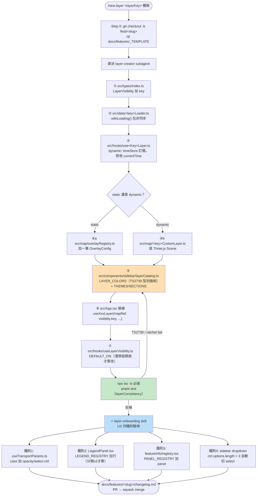

# Stage — Extension Points 追蹤：如何新增功能而不動核心

> 產出時間：2026-07-12 · 分支 `claude/codebase-trace-documentation-3ik4j3`（= master HEAD）
> 目的：追蹤 Mini Taiwan Pulse 唯一且高度規格化的擴充機制——「新增一個 Layer」，並用實際程式碼佐證 CLAUDE.md §5／§5a 定義的 7 步強制順序 + UX 四鐵則，說明工具鏈（slash command + skill + ratchet test）如何把「約定優於配置」變成可驗證的架構約束。本文件只讀不寫程式碼。

## 0. 總覽：這個專案的「擴充點」是什麼

Mini Taiwan Pulse 沒有傳統意義上的 plugin 介面（沒有抽象基底類別、沒有 `registerLayer()` 動態註冊 API）。它的擴充機制是**命名慣例 + 固定檔案接觸點 + 編譯期／測試期強制檢查**三層疊加：

1. **命名慣例**：`use<LayerKey>Layer.ts` / `<layerKey>Loader.ts` / `<layerKey>CustomLayer.ts`，讓 91 個 hook、75 個 loader、38 個 CustomLayer 檔案彼此可預測。
2. **固定接觸點**：新增一個 layer 必須碰 7 個檔案（CLAUDE.md §5），外加 UX 四鐵則涉及的另外 2-4 個檔案，共約 9-13 處。
3. **強制檢查**：
   - TypeScript：`LAYER_COLORS: Record<keyof LayerVisibility, string>` 型別強制窮舉，漏補 key 直接 `tsc` 報 `TS2739`。
   - Vitest：`layerConsistency.test.ts`、`featureInfo/__tests__/registry.test.ts` 兩支「ratchet 測試」用原始碼文字掃描（非型別系統）補上 TS 抓不到的漏洞（sidebar toggle / opacity slider / legend / popup panel）。

這種「型別系統做架構約束 + 測試做啟發式補強」的組合，是本專案用來在**沒有中央 plugin registry** 的情況下，仍讓 353 個原始檔保持一致性的核心手法。

---

## 1. Slash Command `/new-layer` 與 `layer-creator` Subagent

### 1.1 Command 定義

`.claude/commands/new-layer.md`：

- 參數：`$1`＝layer key（camelCase）、`--static|--dynamic`（擇一）、`--source=supabase|geojson|pmtiles`。
- **Step 0（開跑前）**：確認 feature slug → `git checkout -b feat/<slug>` → `cp -r docs/features/_TEMPLATE docs/features/<slug>` → 若涉資料契約先開 upstream handoff（`taipei-gis-analytics/docs/handoff/<slug>.md`）。
- **Step 1（產骨架）**：委派 `layer-creator` subagent。
- **Step 2（驗證）**：`npx tsc -b` + `pnpm test`（觸發 `layerConsistency`）。
- **Step 3（立即接續）**：強制銜接 `layer-onboarding` skill 做資料驗收 / UX baseline / 跨 repo 對齊 / 收尾——command 本身**只負責產骨架**，明確聲明「產完骨架不算完成」。
- **Step 4（收尾）**：更新 `docs/features/<slug>/changelog.md`、`backlog.md`，走 GitHub Flow PR。

`.claude/commands/new-layer.md:1-90`

### 1.2 `layer-creator` Subagent 產生的骨架檔案

`.claude/agents/layer-creator.md` 定義的強制順序（10 步，比 CLAUDE.md 7 步多了 Read 範本 + `tsc -b` 驗證兩個動作）：

| 步驟 | 動作 | 產生 / 修改檔案 |
|---|---|---|
| 1 | Edit | `src/types/index.ts`（`LayerVisibility` 加 `<layerKey>: boolean`） |
| 2-3 | Read 範本 + Write | `src/data/<layerKey>Loader.ts`（static 範本參考 `earthquakeLoader.ts`；dynamic 範本參考 `freewayLoader.ts`） |
| 4-5 | Read 範本 + Write | `src/hooks/use<LayerKey>Layer.ts`（static 參考 `useEarthquakeLayer.ts`；dynamic 參考 `useFreewayLayer.ts`） |
| 6 | Edit 或 Write | static → `src/map/overlayRegistry.ts` 加一筆 `OverlayConfig`；dynamic → `src/map/<layerKey>CustomLayer.ts`（參考 `cwaImageryLayer.ts`） |
| 7 | Edit | `src/components/sidebar/layerCatalog.ts`（`LAYER_COLORS` + `SECTIONS`／`THEMES`） |
| 8 | Edit | `src/App.tsx` 接線 |
| 9 | Edit | `src/hooks/useLayerVisibility.ts`（僅需預設開啟才加） |
| 10 | Bash | `npx tsc -b` 驗證 |

`.claude/agents/layer-creator.md:14-38`

subagent 完成後的回報格式明確要求列出「產生 / 修改檔案清單」「`tsc -b` 結果」「`LAYER_COLORS` 是否補上」「是否有需人工確認事項」，並**必須**提示主 agent 接著跑 `layer-onboarding` skill（`.claude/agents/layer-creator.md:53-58`）——顯示這是刻意設計的「骨架產生」與「驗收」兩階段分工，不是一次做完。

### 1.3 動態圖層的額外強制規則（2026-04-14 起）

`layer-creator.md:60-83` 明訂動態 / 時序圖層的 hook **禁止**收 `currentTime` 參數、**禁止**放進 `useEffect` deps，必須改走 `src/state/timeStore.ts` 訂閱（`subscribeThrottled` / `subscribeDate`），並給出節流 ms 建議表（news 200ms / earthquake 500ms / freeway 1000ms / cwa imagery 1000ms）。這對應 CLAUDE.md 強制規則第 6 條，也是本專案與一般 React SPA 最大的架構差異點（見 `recon.md` 觀察 3）。

---

## 2. 7 步強制順序的實際程式碼接點

以下逐步用**兩個真實 layer 案例**（`earthquakes` = static 範本、`freewayCongestion` = dynamic 範本）佐證。

### 步驟 1 — `src/types/index.ts`：`LayerVisibility` interface

`LayerVisibility` 是一個扁平的 `Record<string, boolean>` interface，目前已列舉 100+ 個 layer key，例如：

```ts
// src/types/index.ts:693-780（節錄）
export interface LayerVisibility {
  flights: boolean;
  ...
  freewayCongestion: boolean;   // :715
  ...
  earthquakes: boolean;         // :730
  earthquakesGlobal: boolean;   // USGS 全球地震（hourly）:732
  ...
}
```

`src/types/index.ts:693-780`

這個 interface 是整條擴充鏈的**單一型別來源**：`keyof LayerVisibility` 被用在 `LAYER_COLORS`（步驟 5）、`OverlayConfig.id`（步驟 4，`src/types/index.ts:588`）、`CameraPreset.layers?: Partial<LayerVisibility>`（`src/types/index.ts:39`）等多處，任何新增 key 都會被 TypeScript 結構化檢查連帶要求其他地方跟進補齊。

### 步驟 2 — `src/data/<layerKey>Loader.ts`

Dynamic 範本 `freewayLoader.ts`：

```ts
// src/data/freewayLoader.ts:1-3, 38-45
import { supabase } from "../lib/supabase";
import { withLoading } from "../lib/loadingRegistry";
import { cachedByKey } from "../lib/loaderCache";
...
export async function fetchFreewayDates(): Promise<FreewayDateInfo[]> {
  const { data, error } = await withLoading(
    "freeway:dates",
    "國道日期",
    supabase.rpc("get_freeway_dates"),
  );
  if (error) throw new Error(`get_freeway_dates: ${error.message}`);
  return (data ?? []) as FreewayDateInfo[];
}
```

`src/data/freewayLoader.ts:1-45`

所有非同步呼叫都必須包 `withLoading(id, label, promise)`（`src/lib/loadingRegistry.ts`），這是 CLAUDE.md §3「資料載入必須有 Loading UI」的強制點，也是唯一一個**沒有測試守備、只能靠 code review 抓**的規則（layerConsistency 測試不掃 loader 檔）。

### 步驟 3 — `src/hooks/use<LayerKey>Layer.ts`

`useFreewayLayer.ts` 展示動態 layer hook 的典型結構：自管 Mapbox source + `LINE_GLOW`/`LINE_LINE` 兩層、7 天 LRU cache、依賴 `timeStore`（見下）而非 `currentTime` prop：

```ts
// src/hooks/useFreewayLayer.ts:1-21
import { timeStore } from "../state/timeStore";
import { keepLoadingUntilMapIdle } from "../lib/loadingRegistry";
...
export function useFreewayLayer(
  mapRef: React.RefObject<MapboxMap | null>,
  visible: boolean,
  width: number,
  isDark: boolean,
) { ... }
```

`src/hooks/useFreewayLayer.ts:1-77`（hook 簽章刻意不含 `currentTime`）

### 步驟 4 — `src/map/overlayRegistry.ts`（static）或 `<layerKey>CustomLayer.ts`（dynamic）

`overlayRegistry.ts` 是一個 `OverlayConfig[]` 靜態表，每筆對應一個 static GeoJSON/PMTiles 圖層（`sourceUrl` / `sourceId` / `layers: OverlayLayerSpec[]` / 選用 `pmtiles` 或 `dynamicData` 旗標）：

```ts
// src/types/index.ts:588-605
id: keyof LayerVisibility;
sourceUrl: string;
sourceId: string;
layers: OverlayLayerSpec[];
...
pmtiles?: { sourceLayer: string; minzoom: number; maxzoom: number };
dynamicData?: boolean;
```

`freewayCongestion` 屬於 dynamic（走 CustomLayer 路線而非 overlayRegistry），`earthquakes` 也是自管 source（見 `useEarthquakeLayer.ts`），兩者皆**不在** `overlayRegistry.ts` 表內，而是各自在 hook 裡 `map.addSource`/`map.addLayer`——這說明 static/dynamic 兩條路徑在此步驟才真正分岔：overlayRegistry 適合「一次性 GeoJSON/PMTiles fill/line/circle」，動態時序圖層則自建 CustomLayer（可能是純 Mapbox layer 如 freeway，也可能是 `src/three/*Scene.ts` + `src/map/*CustomLayer.ts` 的 Three.js 組合，見 `three-3d-component` skill）。

`src/map/overlayRegistry.ts:1-40`、`src/types/index.ts:587-605`

### 步驟 5 — `src/components/sidebar/layerCatalog.ts`：`LAYER_COLORS` + `SECTIONS`/`THEMES`

這是**單一真實來源（Single Source of Truth）**的核心檔案，1175 行，分兩部分：

**(a) `LAYER_COLORS`** — 型別強制窮舉：

```ts
// src/components/sidebar/layerCatalog.ts:31-37
export const LAYER_COLORS: Record<keyof LayerVisibility, string> = {
  flights: "#64aaff",
  ...
  freewayCongestion: "#ef5350",
  roadCongestion: "#fb923c",
  ...
};
```

`src/components/sidebar/layerCatalog.ts:31-60`

因為型別標注是 `Record<keyof LayerVisibility, string>`，只要步驟 1 在 `LayerVisibility` 加了新 key、這裡沒補，`tsc -b` 會直接報 `TS2739`（Type is missing the following properties）——這是本專案「用型別系統做架構約束」的關鍵範例（見 `recon.md` 觀察 1）。

**(b) `THEMES`（新 SSOT，2026-06-27 重組）+ `SECTIONS`（derived flat，向後相容）**：

```ts
// src/components/sidebar/layerCatalog.ts:359-424（節錄）
export const THEMES: ThemeDef[] = [
  { title: "底圖 Base Map", defaultCollapsed: true, groups: [...] },
  {
    title: "交通 Move",
    groups: [
      { title: "即時運具", layers: [
        { key: "flights", label: "航班 Flight", expandable: true },
        ...
      ]},
    ],
  },
  ...
];

// :1128-1139
export const SECTIONS: SectionDef[] = THEMES.flatMap((theme) => ...);
```

`src/components/sidebar/layerCatalog.ts:351-424, 1128-1142`

檔頭註解明確標示：「LayerSidebar（手機版）與 IconRailSidebar（桌機版）共用此檔」、「THEMES：新 SSOT；新增 layer 把 key 放進對應 theme.groups[].layers」（`src/components/sidebar/layerCatalog.ts:1-20`）。

### 步驟 6 — `src/App.tsx` 接線

每個 layer hook 在 `App.tsx` 主體被呼叫一次，傳入 `mapRef`、`layerVisibility.<key>`、以及 `useTransportParams` 產出的參數：

```tsx
// src/App.tsx:1019-1024
useEarthquakeLayer(
  mapRef,
  layerVisibility.earthquakes,
  transportParams.eqOpacity,
  transportParams.eqShowHistory,
);

// src/App.tsx:1206-1211
useFreewayLayer(
  mapRef,
  layerVisibility.freewayCongestion,
  transportParams.overlayParams.freewayWidth ?? 1,
  isDarkTheme,
);
```

`src/App.tsx:1015-1219`

App.tsx 本身沒有任何「plugin loop」，就是把每個 hook 手動列出來呼叫——**接線量隨 layer 數量線性成長**，這是本專案有意識接受的權衡（CLAUDE.md §2 Simplicity First 的體現：沒有為了「優雅」去做動態 registry / reducer 抽象）。

### 步驟 7 — `src/hooks/useLayerVisibility.ts`：`DEFAULT_ON`

```ts
// src/hooks/useLayerVisibility.ts:8-18
// 全部預設關閉：訪客一進站不打任何 RPC；PMTiles 圖層也依使用者 toggle 才顯示。
const DEFAULT_ON: ReadonlySet<keyof LayerVisibility> = new Set<keyof LayerVisibility>([]);

function buildDefaults(): LayerVisibility {
  const keys = Object.keys(LAYER_COLORS) as (keyof LayerVisibility)[];
  return Object.fromEntries(
    keys.map((k) => [k, DEFAULT_ON.has(k)]),
  ) as unknown as LayerVisibility;
}
```

`src/hooks/useLayerVisibility.ts:1-29`

注意 `buildDefaults()` 的 key 全集是從 `LAYER_COLORS`（步驟 5 產物）**動態派生**，不是重複列一次 `LayerVisibility` 的 key——這代表步驟 7 通常**不需要改檔**，除非該 layer 要預設開啟（目前 `DEFAULT_ON` 是空集合，全部 layer 預設關閉，註解說明是為了「訪客一進站不打任何 RPC」的效能考量）。

---

## 3. Mermaid：新增 Layer 的 7 步流程



---

## 4. UX 四鐵則的程式碼接點

CLAUDE.md §5a 定義「任何新 layer 都必須過」的 4 條鐵則，以下逐條找到實際強制點。

### 鐵則 1 — 透明度 slider（`useTransportParams.ts`）

`src/hooks/useTransportParams.ts` 全檔 2422 行，核心是一個依 `layerKey` 分派的 `getParamsFor`-style `switch`，每個 case 回傳一組 `ctrl` 描述（slider / toggle / select）：

```ts
// src/hooks/useTransportParams.ts:1294-1296
case "freewayCongestion": return [
  { label: `Freeway ${freewayWidth.toFixed(1)}`, value: freewayWidth, min: 0.3, max: 3, step: 0.1, onChange: setFreewayWidth },
];

// :1492-1495
case "earthquakes": return [
  { label: `Opacity ${eqOpacity.toFixed(2)}`, value: eqOpacity, min: 0, max: 1, step: 0.05, onChange: setEqOpacity },
  { type: "select" as const, label: "Mode", value: eqShowHistory ? "history" : "timeline",
    options: [{ label: "Timeline", value: "timeline" }, { label: "History", value: "history" }],
    onChange: (v: string) => setEqShowHistory(v === "history") },
];
```

`src/hooks/useTransportParams.ts:1260-1499`（節錄）

`layerConsistency.test.ts` 用文字掃描 `paramsSource.includes(\`case "${key}"\`)` 判斷是否有接（`src/components/sidebar/__tests__/layerConsistency.test.ts:106-108`），不是型別檢查——因為 `useTransportParams` 的 return 型別是聯集的 union，TS 無法強制窮舉每個 `LayerVisibility` key 都有對應 case。

### 鐵則 2 — 圖例（`LegendPanel.tsx` + `LEGEND_REGISTRY`）

```tsx
// src/components/LegendPanel.tsx:160-192（節錄）
/**
 * Legend registry — 單一接線點：新 layer 要圖例就在這裡加一行
 * （元件寫在本檔下方）。layerConsistency 測試以本表為覆蓋依據。
 * 順序 = 面板顯示順序。
 */
export const LEGEND_REGISTRY: LegendEntry[] = [
  { keys: ["earthquakes"], render: () => <EarthquakeLegend /> },
  { keys: ["earthquakesGlobal"], render: () => <EarthquakeGlobalLegend /> },
  ...
  { keys: ["roadCongestion"], render: () => <RoadCongestionLegend /> },
  ...
];
```

`src/components/LegendPanel.tsx:160-230`

面板渲染邏輯依當前 `layerVisibility` 過濾出「已開啟且有圖例」的項目：

```tsx
// src/components/LegendPanel.tsx:292-293
const active = LEGEND_REGISTRY.filter((e) => e.keys.some((k) => visibility[k]));
if (active.length === 0) return null;
```

`src/components/LegendPanel.tsx:292-293`

`keys` 是陣列（不是單一 key）代表多個 layer 可以共用同一個圖例元件（例如 5 種災害警示共用 `DisasterAlertLegend`），對應 CLAUDE.md 鐵則 2「分類 ≥ 2 種才需要」——單色 POI（如 `flights`、`highways`）合法地不接圖例，這些例外被列在 `layerConsistency.test.ts` 的 `BASELINE_NO_LEGEND` 集合（`src/components/sidebar/__tests__/layerConsistency.test.ts:71-104`，目前約 95 個 key）。

### 鐵則 3 — click popup（`useMapInteraction.ts` + `featureInfo/registry.tsx`）

`useMapInteraction.ts` 的 `map.on("click", ...)` handler 依序嘗試：Three.js scene 專屬 picking（rail/bus/waste schedule，用場景自帶的 `pickTrain`/`pickBus` 方法，`src/hooks/useMapInteraction.ts:66-127`）→ 若都沒命中，再用 Mapbox `queryRenderedFeatures` 對照一個 `{ layers, type }` 陣列：

```ts
// src/hooks/useMapInteraction.ts:380-399（節錄）
{ layers: ["pollution-site-circle"], type: "pollutionSite" },
{ layers: ["aviation-restricted-fill", "aviation-restricted-line"], type: "aviationRestricted" },
{ layers: ["police-iso-substation-fill", "police-iso-substation-line"], type: "policeIsoSubstation" },
...
const features = map.queryRenderedFeatures(bbox, { layers: existingIds });
if (features.length > 0) {
  ...
  setFeatureInfo({ layerType: type, properties, coords });
  sessionTracker.log("feature_click", { layerType: type });
}
```

`src/hooks/useMapInteraction.ts:380-429`

`type` 對應到 `src/components/featureInfo/registry.tsx` 的 `PANEL_REGISTRY`：

```tsx
// src/components/featureInfo/registry.tsx:79
export const PANEL_REGISTRY: Partial<Record<FeatureInfo["layerType"], FC<PanelProps>>> = {
  ...
};
// :240
export const HEADER_LABELS: Record<FeatureInfo["layerType"], string> = { ... };
```

`src/components/featureInfo/registry.tsx:1-79, 240`

`HEADER_LABELS` 是 `Record<FeatureInfo["layerType"], string>`（型別強制窮舉，跟 `LAYER_COLORS` 同一招），`PANEL_REGISTRY` 則是 `Partial<...>`（允許漏），所以漏接 panel 不會 `tsc` fail，而是靠獨立的 `featureInfo/__tests__/registry.test.ts` ratchet 測試守備：

```ts
// src/components/featureInfo/__tests__/registry.test.ts:10-27（節錄）
const BASELINE_NO_PANEL = new Set([
  "groundwaterWell", "iotWraRiver", "iotWraStructure",
  "osmExpressway", "hillshade",
]);
const allTypes = Object.keys(HEADER_LABELS);
const missing = allTypes.filter((t) => !(t in PANEL_REGISTRY) && !BASELINE_NO_PANEL.has(t));
expect(missing, `...去對應 domain 檔寫 panel + registry 加一行`).toEqual([]);
```

`src/components/featureInfo/__tests__/registry.test.ts:1-40`

### 鐵則 4 — Select options ≥ 4 用原生 `<select>` dropdown

兩個 sidebar 元件各自（重複）實作同一條規則：

```tsx
// src/components/LayerSidebar.tsx:531-533
if (ctrl.type === "select") {
  // options ≥ 4 一律改用原生 <select> dropdown，避免橫向 button 超出 sidebar
  if (ctrl.options.length > 3) {
    return ( /* <select> ... */ );
  }
  return ( /* 橫向 button row ... */ );
}
```

`src/components/LayerSidebar.tsx:530-604`、`src/components/IconRailSidebar.tsx:1250-1288`（同邏輯複製一份）

這是四鐵則中**唯一沒有專屬 ratchet 測試守備**的一條——它是渲染邏輯的閾值判斷（`> 3`），不是「有沒有接」的存在性問題，所以測試框架的「文字掃描是否存在某 case/key」手法在此不適用；只能靠 `useTransportParams.ts` 裡對應 layer 的 `ctrl.options` 陣列長度自然觸發，沒有額外程式碼要寫。

---

## 5. `layerConsistency` 測試：如何擋漏接圖例（及其他 3 項）

`src/components/sidebar/__tests__/layerConsistency.test.ts` 是一支「ratchet 測試」（只進不退），檔頭註解說明背景：

> 新增 layer 要碰 ~13 個檔案接觸點，歷史上常漏接（圖層 UX 四鐵則：透明度 slider / 圖例 / popup / dropdown）。在 descriptor config-driven 架構落地前，先用本測試把「目前已知缺口」凍結成 baseline。

`src/components/sidebar/__tests__/layerConsistency.test.ts:1-14`

### 5.1 機制

1. **抓全集**：`Object.keys(LAYER_COLORS)` 作為所有 layer key 的權威列表（`:20`）。
2. **抓已接線集合**：
   - Sidebar toggle：`SECTIONS.flatMap((s) => s.layers.map((l) => l.key))`（`:21`）。
   - Params：直接 `readFileSync("src/hooks/useTransportParams.ts")` 讀原始碼字串，用 `.includes(\`case "${key}"\`)` 判斷（`:23, 106-108`）——**是文字比對，不是 AST 解析**，檔頭註解明確承認這是 heuristic，若未來改寫 `useTransportParams`/`LegendPanel` 結構要同步更新比對邏輯（`:11-13`）。
   - Legend：`LEGEND_REGISTRY.flatMap((e) => e.keys)` 轉成 Set（`:24`）。
3. **`ratchet()` 函式雙向檢查**（`:114-135`）：
   - `missingNotInBaseline`：key 沒接線、也不在已知例外白名單 → **fail**，訊息附「怎麼修」的具體指引（例如「在 `useTransportParams.ts` 的 `getParamsFor` 加 case」）。
   - `wiredButInBaseline`：key 已經接好線、但還留在白名單裡 → **也 fail**，要求把它從 baseline 移除。
   - 兩個方向都會 fail，確保 baseline 集合精確反映「目前真正沒接線的 key」，不會隨時間跟實際狀態脫鉤。

### 5.2 三個 `it()` 各自守備的鐵則

```ts
// src/components/sidebar/__tests__/layerConsistency.test.ts:137-171
it("每個 layer key 都有 sidebar toggle（或在 baseline）", () => {
  ratchet("sidebar toggle", allKeys, (k) => sidebarKeys.has(k), BASELINE_NOT_IN_SIDEBAR, "...");
});
it("sidebar 的每個 key 都存在於 LAYER_COLORS（防 typo）", () => { ... });
it("每個 layer 都有 useTransportParams 參數 case（或在 baseline）", () => {
  ratchet("透明度/參數 slider", allKeys, hasParamsCase, BASELINE_NO_PARAMS, "...（鐵則 1）");
});
it("每個 layer 都有 LegendPanel 圖例（或在 baseline）", () => {
  ratchet("圖例", allKeys, hasLegendRef, BASELINE_NO_LEGEND, "...（鐵則 2）");
});
```

`src/components/sidebar/__tests__/layerConsistency.test.ts:137-172`

**沒有測試守備鐵則 3（popup）**——那條規則由獨立檔案 `featureInfo/__tests__/registry.test.ts` 負責（見上節 4），機制完全相同（`HEADER_LABELS` 全集 vs `PANEL_REGISTRY` 覆蓋 + `BASELINE_NO_PANEL` 白名單），只是拆成兩支測試檔而非合併——推測是因為 popup 的全集來源（`FeatureInfo["layerType"]`）跟 layer 全集（`keyof LayerVisibility`）不是 1:1（一個 layer 可能沒有可點物件，一個 `layerType` 也可能對應到非 sidebar toggle 的內部圖層）。

### 5.3 白名單集合裡的「有意識決定」案例

三個 baseline 集合（`BASELINE_NOT_IN_SIDEBAR` / `BASELINE_NO_PARAMS` / `BASELINE_NO_LEGEND`）裡的每一條都附中文理由註解，例如：

- `wasteScheduleNote`：「Three.js ShaderMaterial 音符特效，opacity 需動 shader uniform，屬裝飾性圖層 → 有意識地不做（2026-06-10 決定）」（`:48-49`）
- `countyBoundary`/`townshipBoundary`/`villageBoundary`：「行政邊界 3 層皆單色灰...無分類 → 鐵則 2 不適用」（`:97-101`）
- `evChargingStations`：「充電站單色 POI — 鐵則 2 只要求分類 ≥ 2 才需圖例」（`:94-96`）

`src/components/sidebar/__tests__/layerConsistency.test.ts:31-104`

這種「白名單 + 理由」的模式，讓測試不只是機械式擋漏，也變成一份活的「哪些例外是刻意的」文件，避免日後有人誤以為漏接是 bug 去補一個不需要的圖例。

---

## 6. 雙 Sidebar「單一真實來源 + 雙消費端」模式

### 6.1 是否為本專案獨特擴充模式

**是**。這是本專案在「桌機／手機兩份 UI 但邏輯必須一致」問題上採用的具體解法，且與上述「型別強制 + ratchet 測試」的擴充哲學一脈相承。

### 6.2 程式碼證據

`src/components/sidebar/layerCatalog.ts` 檔頭明確聲明角色（`:1-20`）：

> LayerSidebar（手機版）與 IconRailSidebar（桌機版）共用此檔... LAYER_COLORS：型別強制 `Record<keyof LayerVisibility, string>`，缺 key 會 tsc 報錯 → 新增 layer 必補色。THEMES：新 SSOT；新增 layer 把 key 放進對應 theme.groups[].layers。

兩個消費端的 import 語句完全一致：

```tsx
// src/components/IconRailSidebar.tsx:41
import { LAYER_COLORS, TRANSPORT_LABELS, THEMES } from "./sidebar/layerCatalog";
// src/components/LayerSidebar.tsx:6
import { LAYER_COLORS, TRANSPORT_LABELS, THEMES } from "./sidebar/layerCatalog";
```

`src/components/IconRailSidebar.tsx:41`、`src/components/LayerSidebar.tsx:6`

**資料統一、渲染各自為政**：兩個元件各自用 `LAYER_COLORS[key]` 取色點綴 toggle（`IconRailSidebar.tsx:1143`、`LayerSidebar.tsx:108, 331`），也各自重複實作了「dropdown 閾值 `ctrl.options.length > 3`」的完整渲染邏輯（`LayerSidebar.tsx:530-604` vs `IconRailSidebar.tsx:1250-1288`，兩份 UI 程式碼結構高度相似但物理上是兩份，非共用元件抽出）。

### 6.3 這個模式的取捨（trade-off）分析

**優點**：
- 新增 layer 時只要改 `layerCatalog.ts` 一處，兩個 sidebar 自動看到新 key（`THEMES`/`SECTIONS` 是資料驅動的 `.map()` 渲染，不需要為新 layer 各寫一行 JSX）。
- `LAYER_COLORS` 的型別強制窮舉，加上兩邊都 `import` 同一個常數，杜絕「桌機有這個 layer、手機忘記加」的資料層級不一致。

**代價（本文件觀察到但非任務範圍，不主動修正）**：
- 渲染邏輯本身（dropdown 閾值判斷、slider/toggle/select 的 JSX 結構）在兩個檔案各自重複一份完整實作，未抽成共用元件——如果日後要改 dropdown 閾值（例如 `> 3` 改成 `> 4`）或改 slider 樣式，需要同步改兩處，且沒有測試守備這種「渲染邏輯是否同步」的一致性（ratchet 測試只守備「資料是否存在」，不守備「兩份渲染程式碼是否等價」）。
- 這與 CLAUDE.md §3 Surgical Changes「不重構未壞的東西」的原則吻合：專案選擇容忍兩份重複渲染邏輯，換取「資料層絕對單一來源」的簡單心智模型，而非投入時間做元件抽象化風險改動既有 UI。

### 6.4 與其他擴充點的共同模式

這個「SSOT 資料表 + 多消費端各自渲染／訂閱」的手法，其實貫穿整條擴充鏈：

| SSOT | 消費端 |
|---|---|
| `LayerVisibility`（`src/types/index.ts`） | `LAYER_COLORS`、`OverlayConfig.id`、`CameraPreset.layers`、App.tsx props |
| `LAYER_COLORS`（`layerCatalog.ts`） | `IconRailSidebar.tsx`、`LayerSidebar.tsx`、`useLayerVisibility.ts` 的 `buildDefaults()` |
| `LEGEND_REGISTRY`（`LegendPanel.tsx`） | `LegendPanel` 本身渲染 + `layerConsistency.test.ts` 的覆蓋檢查 |
| `HEADER_LABELS`（`featureInfo/registry.tsx`） | popup 標題渲染 + `registry.test.ts` 的全集來源 |

每一組「SSOT → 消費端」都靠 TypeScript 型別（`Record<K, V>` 強制窮舉）或 ratchet 測試（文字掃描）兩者之一把一致性焊死，這是本專案能在**沒有中央 plugin 系統**的前提下，讓 353 個原始檔長期保持互相同步的關鍵工程手法。

---

## 7. 與既有文件的交叉引用

- 完整 UX 四鐵則細節（type 抽檔策略 / dropdown 寬度閾值 / PMTiles keep_attrs 重出 SOP）：`docs/development-rules.md#4a-圖層-ux-標配四大鐵則`
- 動態圖層時間訂閱完整規則 + 節流表：`docs/development-rules.md#8-動態圖層時間訂閱external-time-store`
- `layer-onboarding` skill（`.claude/skills/layer-onboarding/`）：資料驗收 + UX baseline 表 + 跨 repo 對齊，與本文件的「骨架產生」互補，不重複展開。
- `three-3d-component` skill（`.claude/skills/three-3d-component/`）：dynamic layer 若走 Three.js CustomLayer 路線（步驟 4b）的元件選型與 checklist。
- Pre-aggregate pattern（若新 layer 的 Supabase RPC 響應 > 1s）：`docs/supabase-optimization.md`，對應 `supabase-optimize` skill。

---

## 8. 關鍵發現摘要

1. **型別系統 + ratchet 測試的雙層防護，而非傳統 plugin registry**：`LAYER_COLORS: Record<keyof LayerVisibility, string>` 讓漏改直接編譯期失敗（`TS2739`），涵蓋不了的「有沒有接 popup / slider / legend」則靠三支獨立 ratchet 測試（`layerConsistency.test.ts` 守備 sidebar/params/legend 三項，`featureInfo/__tests__/registry.test.ts` 守備 popup）用原始碼文字掃描 + 白名單雙向檢查（漏接會 fail，接好卻還留在白名單也會 fail）補強，且白名單裡每條例外都附「為何不需要」的理由註解，形成一份活文件。
2. **`/new-layer` command 與 `layer-creator` subagent 明確拆成「產骨架」與「驗收」兩階段**，command 完成後強制提示必須接續 `layer-onboarding` skill，避免「骨架完成」被誤當成「layer 上線完成」；動態圖層另有 2026-04-14 起的強制規則（hook 禁收 `currentTime`，改走 `timeStore.subscribeThrottled`/`subscribeDate`）。
3. **雙 Sidebar（`IconRailSidebar` 桌機／`LayerSidebar` 手機）是「單一資料真實來源 + 各自獨立渲染」模式**：兩者共用 `layerCatalog.ts` 的 `LAYER_COLORS`/`THEMES`/`SECTIONS`，新增 layer 一次改動兩端自動同步；但 UX 渲染邏輯（含鐵則 4 的 dropdown 閾值 `ctrl.options.length > 3`）在兩個檔案各自重複實作一份，沒有測試守備兩份渲染邏輯是否等價——這是專案在 CLAUDE.md §3「Surgical Changes / 不重構未壞的東西」原則下刻意容忍的技術債，換取資料層絕對一致的簡單心智模型。
